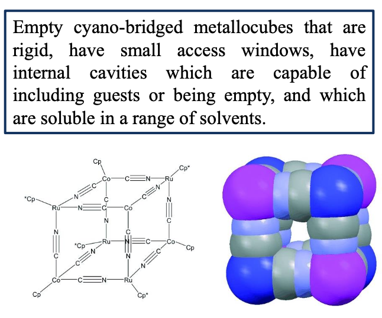
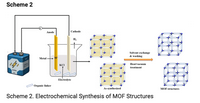

# VO 1

> The definition of functional materials represents a material's capacity to execute a "function" in response to a certain stimuli. 

## Ceramics - one of the oldest functional material

> "Ceramic" is the technical term for a variety of inorganic non-metallic materials. They are almost non-soluble in water and with at least of 30 % crystallinity

Ceramic materials are brittle, hard strong in compression and weak in shearing and tension. They can withstand the chemical erosion, may be subjected to acidic or caustic enviroment. Furthermore ceramics can withstand very high temperatures raging from 1.000 - 1.600 °C

**Synthesis**

Normally the raw materials are formed at $RT%$ for example:

+ Silicates
+ Oxides
+ SiC
+ BN
+ $B_4C$
+ WC
+ AlN

and then via a synthering process converted into ceramics

**Bonding Situation and Properties**

+ Large range of possible structures and compositions
+ almost all elements
+ almost all type of bonds (mainly ionic and covalent)
+ various levels of crystallinity

**Classification**

+ Oxides: Alumina, Zirconia, Ceria
+ Non-Oxides: Carbides, Silicides, Borides, Nitrides
+ Composites

**Mechanical Properties**

+ Poor toughness due to bond type
+ Pores as stress concentrators

**Electrical Properties**

+ Semiconductors
+ Superconductors
+ Ferroelectricity & supersets
+ Positive Thermal coefficient

**Optical Properties**

+ Transmition of light in vis and IR Range
+ Translucent Alumina

**Some Technical Ceramics**

> For the resulting properties of ceramic materials, not only the raw materials but even more the synthesis processes are of outmost importance

Ceramics have several advantages over metals for practical applications, including low density, high compressive strength (hardness) and resistance to corrosion. However, they have a fatal weakness when used as engineering materials - **they fracture after undergoing a very small deformation**

## Metals -old but gold

> Metals are designated as materials that show a lustrous appearance, and high electrical and thermal conductivitiy. Furher they are ductile and malleable

### Bonding Models

#### Electron Sea Model

> Positively Charged Atomic bodies surrouded by freely mobile negatively charged valence electrons

#### Electronic Band Structure

> Describes the range of energy levels that electrons may have within it, as well as the ranges of energy that they may not have.

Band theory derives these bands and band gaps by examining the allowed quantum mechanical wave functions for a electron in a large periodic lattice of atoms or molecules

This results in the properties:

+ Lustrous
+ Malleable
+ Ductile
+ Good conductors for electricity and heat

### Applications of Metals

> Pure metals are used ro wires because of their high electric conductivity. In further applications, metals are applied as alloys or intermetallic phases

## Alloys - better together

> An alloy is a combination of chemical elements possessing the characteristic properties of an metal. The production of alloys is of great importance, as it is one of the main processes used to modify the properties of pure metallic elements

Example would be gold:

+ Pure gold is 24 karat
+ Ag, Cu and Au all have fcc structure and almost same radii

### Different types of alloys

#### Substitutional Solid Solution Alloy

+ Solute atoms replace solvent atoms in crystal lattice
+ Requires similar atomic sizes and chemical properties
+ Properties like conductivity and strength are intermediate

#### Interstitial Solid solution alloy

+ Smaller solute atooms fit into the gaps of the solvent's lattice
+ Solute atoms are typically much smaller
+ Often increases hardness and strength due to lattice distortion

#### Heterogenous Alloys

+ Non-uniform mixtures where components are not fully dissolved
+ Examples include cast iron (Fe-C)
+ Properties vary locally

#### Intermetallic Compounds

+ Ordered compounds with fixed stochiometry and distinct crystal structures
+ Exhibit high melting points, strength and brittleness due to strong ionic/covalent bonds

### Example Steel

> Steel is an alloy of iron and carbon with improved strength and fracture resistance compared to other forms of iron

Normally a steel is a alloy of max 2.14 % carbon with additional elemental doping resulting in defined properties. The metal lattice becomes harder stronger and less ductile

**Stainless Steel with 0.4 % carbon 18% chromium and 1% nickel**

### Note on Intermetallic Compounds

> Intermetallic Compounds are solid phases with $\geq$ 2 metallic elements posessing an ordered structure with well defined stochiometry

## Pyrochlore Magnets - No thermal expansion

>  A pyrochlore magnet is a alloy of the four metals $Zr,Nb,Fe$ and $Co$ which expands only 0,0001% over a 400 °C temperature range

The reason behind this zero thermal expansion is the heterogenous lattice structure. Parts within the structure react thermally and magnetically different.

**Thermal treatment** partial contraction and repulsion with net-balance zero

## Amorphous Metals Metallic Glasses

Amorphous metals or metallic glasses are alloys with a disordered atomic structure (no long-range crystalline order) achieved by rapid cooling to prevent crystallization

High viscosity in molten state which prevents the atoms to form an ordered lattice

**Formation**

+ extremely rapid cooling
+ Mechanical alloying
+ Ion radiation

**Properties**

+ Low shrinkage when cooling
+ Wear resistance
+ Less corrosion due to missing grain boundaries
+ Great hardness
+ Best magnetic soft materials

## Glasses

 > A glass is a non-crystalline solid formed by rapit melt quenching. It is an amourphous solid and can be understood a s supercooled liquid. Glasses are arbitrarily shapeable

+ $SiO_2$ can also occure as a non-crystalline solid
+ Other oxides such as $B_2O_3$ or $GeO_2$ can also form glasses
+ These materials are called network formers
+ Most common glasses are silicate glasses, additional oxides such as $CaO$ or $Na_2O$ are added
+ Cations are incorporated into a tetrahedral network, altering its properties. These cations are called network modifiers
+ Other oxides such as $TiO_2$ or $Al_2O_3$ can replace $Si$ in the network and stabilize it
  

## Excursion Organic Glasses

>  For a substance to become glass, a melt must cool down quickly enough to avoid crystallization upon solidification and instead retain an amorphous structure. This requires a significant temperature difference from the surroundings.

# VO 2

## Polymers

> Polymers are chemical compounds, which are build up from repetitively connected macromolecules. They are divided into biopolymers and synthetic polymers

**Homopolymer**

Made up only of one type of monomer with a simple uniform structure. Properties depend on the single monomer used

+ Polyethylene (PE)
+ Polypropylene (PP)
+ Polystryene (PS)

**Copolymer**

Made from two or more different types of monomers, have a more complex structure leading to varied properties

### Basic Polymer Structures

**Linear**

+ Van der Waals or H-Bonding
+ Material can be remolded by heating
+ thermoplasics

**Branched**

+ Shorter chains
+ Less dense than linear polymer
+ material can be remolded by heating
+ thermoplastics

**Cross-Linkes**

+ Resemble ladders with linked chains
+ covalent bonds
+ thermosets

**Network**

+ heavily linkes
+ nearly impossible to soften → degradation
+ Thermosets

## Biopolymers

> Biopolymers are polymers produced by living organisms. Three main classes of biopolymers include: Polynucleotides, Polypeptides and Polysaccharides

## Classification and Synthesis

> Synthesis of polymers is done via three ways: polymerization, addition polymerization and condensation polymerization of (different) monomers

### Chain growth mechanism

An initiator adds to a carbon-carbon double bond of an unsaturated substrate to yield a reactive intermediate (initiation). Intermediate reacts with a second molecule (propagation). Chain termination occurs by reaction with another reactive species

### Step Growth mechanism

Here each bond is formed step-wise, independently of the others. Most step-growth polymers are formed by the reaction of two difunctional reactants

## Thermoplastics, Elastomers and Thermosets

### Thermoplastic

**Structure**

Linear or branched polymer with weak intermolecular for forces.

**Behaviour on heating**

Reversible melting soften when heated and harden when cooled. Can be recycled and remolded multiple times

Examples:

+ Polyethylene
+ Polypropylene
+ Polystyrene
+ PVC

### Elastomers

**Structure**

Polymers with cross-linked but flexible chains allowing for high elasticity

**Behaviour on heating**

+ Thermoplastic Elastomers: Can be melted and reshaped
+ Thermoset Elastomers: Cannot be remelted

Examples:

+ Styrene-butadiene copolymer (SBR)
+ Thermoplastic Polyurethane (TPU)

### Thermosets

**Structure**

Highly cross-linked 3D network (strong covalent bonds)

**Behaviour on heating**

Irreversible curing: Harden permanetly when heated cannot be remelted and degrade upon heating

Very rigid, strong and brittle with low elasticity

Examples:

+ Epoxy
+ Phenolic resins
+ Cross-linked Polyurethane
+ Bakelite

## Fibres

> Polymer fibres can be drawn into long filaments with a length-to-diameter of 100:1. Heavily used in the textile industry

+ Stretching, twisting, shearing and abrasion must meet high standards of textile industry
+ High tensile strength, elastic modulus & abrasion resitance
+ Molecular weight of polymer must be relatively high
+ Tensile strength increases with crystallinity so highly crystalline polymers are preferred

Some examples of where to find polymer fibers:

+ Polyester, Polyamide and Elasthane
+ Polyacryl
+ Aramid
+ Polypropylene

## Coatings Lacquers

**Important Properties**

+ Liquid or powdery
+ Chemical or physicall processes lead to thin coating
+ Consists of binders, such es resins, dispersions or emulsions, fillers, pigments, solvents and additives

Coatings are applied to surfaces with the purpose of:

+ Protection
+ Decoration
+ Function

## Adhesives

There are two types of bonding mechanisms when it comes to adhesives

**Mechanical/Physical**

+ Adhesive penetrates pores and crevices of the surface
+ Interlocking on a microscopic level
+ Drying, cooling, gel formation

**Chemical**

+ Intermolecular forces between the surface and the adhesive
+ Includes both covalent bonds & van der waals forces
+ Polymerization, polycondensation or polyaddition

**Some key properties of adhesives**

+ Low viscosity liquids → uniform and fully wetted surfaces
+ Bonding occurs when liquid solidifies through: Crystallization, Solvent Evaporation, chemical process

**Natural Adhesives**

+ Bone Glue
+ Casein
+ Starch
+ Resin

**Synthetic Adhesives**

Advantages: Different materials can be bonded together such as metals, ceramics, polymers, composites, leather and combinations of these

**Selection factor of adhesives**

+ Type of materials to be bonded
+ Expected adhesive properties (permanent or temporary)
+ Max and min operating temperatures
+ Processing conditions

**Primary Characteristics of a Strong Adhesive Bond**

High shear strength, peel resistance & fracture resistance

+ Lower weight
+ Ability to bond thin components
+ Precise positioning
+ Fast application

BIG DISADVANTAGE → TEMPERATURE SENSITIVE max 300 °C

## Conductive Polymers

> Conductive Polymers are a special class of organic materials that can conduct electricity, unlike most plastics which are insulators. These were discovered by Heeger, Shirkawa ...

+ Conductive Polymers have conjugated double bonds along their backbone
+ When doped with iodine they gain mobile charge carriers, allowing for electricity flow

**Problem**

Linear ballistic transport along polymer chains - not between layers or strands due to missing or weak intermolecular ordering and coupling

**Solution**

Multilayer-stacked polyaniline with columnar $\pi$ arrays with an interlayer distance of 3.59 angstrom

## Composites

> Composites are enginereed materials made by combining two or more distinct components to achieve superior properties that neither material can provide alone

**Key components**

+ Matrix (polymer, metal, ceramic) - binds everything together
+ Reinforcement (fibers, particles) - provides strenght\stiffness

**Particulate composite**

+ Grinding wheel (ceramic, polymer/glass)
+  Cemented carbide (WC, cobalt)
+  Concrete (aggreagte, fluid cement)

**Fibre-reinforced composite**

+ Fibre cement
+ Ceramic matrix composite

**Structural Composite**

+ Plywood
+ Sandwitch panel (aluminium and polymer/porous mineral)
+ Bimetall

## Photoelectric effect

> Photoelectic effect is the phenomenon where light (photons) striking a material (usually a metal) ejects electrons from its surface

**Threshhold frequency** Light must have a minimum frequency to eject electrons

**Instanteneous emmision** Electrons are ejected immediatly if the light frequency is sufficient

**Kinetic Energy** of the ejected electrons depends on the light frequency

$E = h \nu$ 

# VO 3

## Photodiodes

Photodiodes are typically built up from Si, Ge

**n-doping** (Phosphor) conductivity originates from free negative electrons

**p-doping** (Bor) doped semiconductors, whose conductivity originates from the presence of positive holes

### p-n junction

If n-doped and  p-doped semiconductor meet, electrons go from the n-region into the p-region. On the junction → recombination

**In the p-n junction there are no electron carriers!!**

### Forward and Backward Bias

**Forward Bias**

I bin zu dumm:

+ Minuspol ist in n-zone, Pluspol in p-Zone.
+ Ladungsträger werden von Polen abgestoßen und in die Raumladungszone gedrängt, diese kann sich je nach Spannung verkleinern oder ganz abbauen

**Backward Bias**

+ Pluspol liegt an n-Zone, Minuspol an p-zone
+ Die Ladungsträger werden in den Polen gezogen die Raumladungsschicht vergößert sich

### Working Principle of a LED

When applying voltage in forward direction, the charge carriers move towards each other, e- from n to the p-n junction. There is a recombination in the depletion zone which leads to light emission

### Working Priniple of Solar Cells

> Solar cells are built up like photodiodes, except that they are not operated as a radiation detector, but as a power source

+ Photons separate electron hole pairs in the depletion zone
+ $e^-$ travel to n-layer, holes to p-layer
+ Recombination in the depletion zone

## Overview Charaterization Methods

> Various methods to determine the average and the local structure exists: Mainly diffraction and spectroscopic methods

**Diffraction** no change in electronic structure

+ X-Ray Diffraction
+ Neutron Diffraction
+ Pair Distribution Function

**Photoelectric Effect**

+ XAS, XPS, UPS

**Vibrations and Rotations**

+ IR and Raman

**Electronic nuclear transitions**

+ UV/Vis spectroscopy
+ NMR spectroscopy

## X-Ray Diffraction

> X-RAY Diffra ction is a analytical technique used to study the atomic and molecular structure of crystals and powders

Wavelength of X-Rays produced by various materials:

+ $Cu,K_\alpha$ = 1.54 $\AA$
+ $Mo,K_\alpha$ = 0.70 $\AA$

**Key Principles**

Braggs Law $n\lambda = 2d\sin(\theta)$

+ When X-Ray hits crystal, scatter of atomic planes
+ Diffraction pattern is produced with peaks corresponding to different crystal planes
+ Used to determine crystal structure, lattice parameters and phase composition

**How this shit works**

1. monochromatic X-Ray beam strikes the sample
2. diffracted X-Rays are detected at various angles
3. The resulting pattern is analyzed to extract structural data

**Challenges**

One requires long-range order in the samples

+ Determination of proton positions is difficult
+ Differentiation of atoms with the same or similar number of electrons is hardly possible

## Neutron Diffraction

### Generation of Neutrons

> Neutron radiation is generated in two ways: Either a nuclear reactor or spallation sources are used

**Nuclear Reactors**

+ Fission of Uranium-235 produces fast neutrons
+ Neutrons are slowed to thermal energies using moderators
+ Neutrons are guided through waveguides (Ni mirrored glass tubes) / monochromators also applied
+ Example ILL or NIST

**Spallation Sources (Pulsed Neutron Sources)**

+ High-energy proton beam hits a heavy metal targed (tungsten mercury)
+ Proton collisions eject 20-30 neutrons per impact
+ Example ISI, SNS

### Principles

Neutrons interact with atomic nuclei, and are scattered by the strong nuclear force. The scattering intensity depends on the nuclear scattering length

+ Penetrate deeply (cm) scale due to weak interaction with matter
+ Detect light atoms like (H,Li,O)
+ Sense magnetic moments

**Problems and challenges in neutron diffraction**

+ light and heavy elements have comparable scattering force
+ Different b-lengths of elements with similar atomic number
+ Slow decrease of $b$ → measurements at high resolutions

> Neutron diffraction provides core density maps

#### Differing between ferroelectric and antiferroelectric material

**Ferromagnetic material**

+ Magnetic Bragg peaks atthe same position as nuclear peaks
+ $\theta$ is dependent of magnetic structure

**Antiferromagnetic material**

+ Magnetic Bragg peaks between nuclear peaks
+ formation of magnetic superstructure

### Summary Neutron and X-Ray Diffraction

### Poblem with Local structure and PDF 

> Average crystallographic structure is obtained via X-ray or neutron scattering - no statments on the local structure can be made

Both Bragg scattering and the diffuse scattering are determined. The arrangement in the long range can be inferred from the Bragg peaks in an X-RAY diffraction pattern

The short range arrangement / local atomic structure is visible in the broadness of less well defined features. The local structure is described by the pair distribution function

+ Pair distribution function corresponds to a histogramm of interatomic distances

**Peak Positions**

Peak positions in the PDF correspond to the distances between pairs of atoms in the material. This reveals the bond lengths and spacing between atoms in the structure

**Peak Width**

The broadening of peaks can indicate structural disorders such as thermal vibrations, static displacements, or amorphous regions in the matieral. Wider peaks suggest greater disorder or variability in atomic positions

**Integrals**

Area under the peaks (integrals) relates to the number of atom pairs at a given distance, providing insights into the coordination number and the average local enviroment of atoms

**Cut-Off in PDF**

The point where the PDF decas to zero can indicate the finite size of nanoparticles or crystallites. Shorter cut-off suggests smaller particle sizes or limited long range order

# VO 4

## XAS  (XRay - Absorption Spectroscopy)

> Generic term for several X-Ray spectroscopic measurement methods: XANES or NEXAFS (X-RAY absorption near-edge structure) and EXAFS (extended X-RAY absorption fine structure)

**Principle**

X-Ray quantum of sufficient energy can eject electron from near-nuclear orbital → Absorption increases (absorption edge)

**Absorbing electron emits spherical photoelectron wave**

+ Single scattering processes (EXAFS)
+ Multiple scattering processes (NEXAFS/XANES)

**Two Main Regions**

+ XANES ± 50 eV, senstative to oxidation state, coordination chemistry, valence, electronic structure
+ EXAFS > 50 eV provides bond distances, coordination numbers and disorder, chemical enviroment, coordination

**Sample Requirements** Gas, Liquid or Solid State

## XPS (X-RAY Photoelectron SPectroscopy)

> XPS is a surface sensitive technique that measures the elemental composition, chemical state and electronic structure of materials by detecting photoelectrons ejected by X-Ray radiation

**Sample requirements** Solid state, conductive and thin film

Principle is again the photoelectric effect $E_{binding} = h\nu - E_{kinetic} - \theta$

+ incident photon ejects an electron which leaves the solid body
+ the higher the photon energy or lower the binding energy, the higher is the kinetic energy of electrons

**We obtain information about oxidation state, composition and chemical enviroment**

The image shows a survey spectrum. This is a fast scan with low resolution, where the electron count is plotted against the binding energy, one can see in this plot which elements are present or absent

## UPS (Ultraviolet Photoelectron Spectroscopy)

**Same Principle as XPS but**

+ UV Light is used only capable of releasing VE
+ Serves to determine the valence band structure
+ Kinetic energy of the photoelectrons gives the density of states
+ Minimal energy differences of MOs or even physical surfaces are resolved

**Sample Requirements** Solid state, conductive and thin film

### Differences between XPS and UPS

**XPS**

+ Ejects electrons from inner orbitals
+ X-RAYS are used

**UPS**

+ Serves to determine valence band structure
+ UV light is used

## IR Spectroscopy

**Vibration in which the dipole moments changes are IR active**

+ Hookes law + involement of the anharmonic oscillator
+ The stronger the bond the higher the frequency
+ The higher the red. mass the lower the frequency

→ Symmetry is important as symmetric invariant vibrations are not IR-active

**Information from the IR spectrum**

+ functional groups
+ bond types / bond strength
+ atomic distances

## Raman Spectroscopy

> Raman spectroscopy is a spectroscopic technique typically used to determine vibrational modes of molecules.

+ Raman spectroscopy relies upon inelastic scattering of photons known of Raman scattering
+ Usually a laser in the visible near infrared or near ultraviolet range is used, although X-rays can also be used
+ Magnitude of Raman effect correlates with polarizability of the electrons n a molecule.
+ Difference in energy between incident and scattered light is the raman shift
+ Shift corresponds to vibrational, rotational or phonon modes in material

## What can the Human eye see

> We can only perceive a portion of electromagnetic light. We call this the visible or VIS range between 400-800 nm

## Origin of color

**Organic compounds** The reason for the colorfulness are electronic transitions between occupied and unoccupied molecular orbitals - MO theory!

+ Single bonds $\sigma \to \sigma^*$
+ Double or triple bonds $\pi \to \pi^*$
+ Non-bonding MO: $n \to \pi^*$

## UV/VIS spectroscopy

> Fundamental process is the absorption of a specific part of electromagenetic radiation. What is measured, is the non-absorbed part $I$ of the initial light $I_0$

+ Transmittance is defined as the ratio of the transmitted intensity $I$ over the incident intensity $I_0$

$T = (\frac{I}{I_0})$

**Lambert-Beer Law**

Describes the linear relationship between absorbance $A$ the concentration $c$ the molar absorption coefficient $\epsilon$ and the optial path length $l$. Further it is related to the negative log of transmission:

$A = \epsilon * c * l = - \log(T) = - \log(\frac{I_0}{I})$

# VO 5

## NMR Spectroscopy

> In NMR Spectroscopy the magnetic properties of atomic nuclei are used to obtain information on the structure of molecules and compounds

+ $^1H$ has a angular momentum P
+ Rotating nucleus induces a magnetic field and has a magnetic moment $\mu$ proportional to the spin

**When is a nucleus magnetic?**

+ Sum of number of protons + number of protons and neutrons is even → no magnetic moment
+ Sum of number of protons + number of protons and neutrons is odd → magnetic moment

**Only nuclei with magnetic moment $\mu$ are NMR active!**

Angular momentum $P$ is a quantum mechanical property

$P = \sqrt{I (I + 1)} \frac{\hbar}{2\pi}$

The magnitude of the magnetic moment generated by a nucleus with a spin is proportional to the angular momentum of the nucleus

$\mu = \gamma P = \gamma \sqrt{I(I+1)}\frac{h}{2\pi}$

**In absence of a external magnetic field:**

+ All nuclei have same magnetic energy in the ground state
+ Magnetic energy state is $2I + 1$ times degenrate

**In presence of an external magnetic field $B_0$**

+ Degeneration is cancelled
+ Splitting of the magnetic energy states $2I + 1$ → Zeemann effect

### Lamor Frequency $\omega_0$

> Precession around $z$ direction has a specific frequency, it is called the Lamor frequency with the unit $\omega_0$

Lamor frequency rises with $B_0$ by the gyromagnetic factor $\gamma$

$\omega_0 = \gamma \cdot B_0$

This is then connected to $\Delta E$

$\Delta E = h \cdot v_0 = \frac{h}{2\pi}\omega_0 = \gamma \hbar B_0$

### Application of a Radio frequence pulse

In an NMR experiment, the transition of the nuclei from one spin state to the other is induced by another magnetic field $B_1$, which has a frequency in the region of radio waves

+ If frequency of $B_1$ is Lamor frequency → Resonance
+ If the absorption is plottet against frequency of $B_1$ a peak occurs which corresponds to $\omega_0$ of the studied nucleus
+ Resonance is dependend of $\gamma$ and of chemical enviroment → chemical shift

### Differences between liquid and solid state NMR

> Essence: In solid state the spins are oriented and not randomly distributed: broad signals as a result of nuclear spin interactions (dipolar coupling, chemical shift anisotropy)

## Mass Spectrometry

**Key Principles**

1. Ionization: Sample molecules are converted into gas-phase ions
2. Mass Separation: Ions are separated based on m/z using a electric/magnetic field, quadropole, TOF
3. Detection: Ions are counted producing a mass spectrum

**Common Ionization Methods**

+ Electron Ionization: Hard method, fragments molecules
+ Electronspray Ionization (ESI) softr method, preserves large biomolecules
+ MALDI (Matric assited laser desorptions)

## DSC / TGA

> DSC measures heat flow into or out of a sample as it is heated, cooled or held at a constant temperature, revealing thermal transitions like melting crystallization or glass transitions

**Differential Measurement**

+ Compares heat flow between sample and inert reference under controlled temperature programs
+ Endothermic and exothermic processes and events can be detected

## Energy Dispersive X-Ray Spectroscopy

> By energy-dispersive X-ray spectroscopy (EDX), the elemental composition of a sample is determined via detection of emitted X-rays of this probe

Similar to X-RAY but → fluoroescent X-RAY generation

+ Sample is irridiated with X-rays or electrons
+ X-rays cause generation of "unique" X-Rays, which are emitted from the sample
+ These fluorescent X-RAYS are characteristic for each element

**Moseleys law** Relation of wavelength of $K_\alpha$ and atomic number $Z$

$\frac{1}{\lambda K_{\alpha}} = (Z-1)^2 \cdot R_\infty \cdot \frac{3}{4}$

## BET Brunauer, Emmett and Teller

BET Method is a procedure for determining the specific surface are ($m^2/g$) of powders and porous adsorbents, developed by S. Brunauer, P.H Emmett and E. Teller in 1938. In this method, a measuring gas ($N_2,Ar$ or $Kr$) is gradually introduced to the adsorbent at a constant temperature. The amount of gas adsorbed, $mm$ is determined by weighting, while the equilibrium pressure is measured

### Sorption Isotherms

**Type I**

+ Sharp uptake at low pressure, then plateau (Langmuir-type)
+ reverisble (no hysteresis)
+ Narrow micropores (≤ 1nm): Strong adsorbate-adsorbent interactions
+ Mechanism → Monolayer micropore filling

**Type I**

+ Reversible S-shaped curve
+ B point → monolayer completion → multilayer adsorption
+ Nonporous or macroporous (> 50nm)

**Type III**

+ No monolayer formation
+ Convex curve due to weak adsorbate-adsorbence interaction
+ Cooperative adsorption → clusters/multilayers

**Type IV** (Mesoporous 2-50 nm)

+ Monolayer → multilayer → hysteresis loop due to pore condensation

**Type V** Hydrophobic (Micro/Mesopores)

+ Similar to Type III but with pores
+ Weak interaction, sudden rise
+ MOFS, hydrophobic carbons

**Type VI** (Layer by Layer)

+ Stepwise isotherm (distinct layers)
+ Rare, requires highly uniform nonporous surfaces (graphite)

And just as a general reminder

+ Micropores $≤ 2nm$
+ Mesopores $2-50nm$
+ Macropores $> 50nm$

## Porous Materials

### Clays

> Clay is a type of natural soil containing clay minerals, which are hydrous aluminium phyllosilicates, e.g. palygorskite or attapulgite

### Definition of Zeolites

+ Crystallized hydrated aluminosilicates
+ can be synthetic or natural
+ rigi framework structrues made of $SiO_4$ and $AlO_4$ tetrahedra
+ Defined perioidic cavities and/or channels
+ Cavities contain chemically exchangeable metal cations, alkali er earth metal ions
+ Cavities can also contain water or other gas molecules

**General Composition**

Derived from $SiO_2$ with partial replacement of $Si^{4+}$ by $Al^{3+}$

→ Creates an excess charges which are compensated by incorporated metal ions

$M_{x/n}[(AlO_2)-x(SiO_2)y] * m H_2O$

> Zeolites basically are aluminosilicates with open 3-dimensional framework structures composed of corner-seharing $TO_4$ tetrahedra, where $T$ is Al or Si

#### Classification of Zeolites

1. Zeolites with one-dimensional channels (fiber zeolites)
2. Zeolites with two-dimensional channel systems (lamellar zeolites)
3. Zeolites with three-dimensional channel sytems (cube zeolites, pentasils)

**Fiber Zeolites** most well known examples are Natrolite/Skolezite group

#### Synthesis and Applications

**Most common synthesis strategies used in industry**

1. Slow crystallization of silica-alumina gel in the presence of alkalis and organic templates
2. Sol-gel processing

**common applications of Zeolites**

+ Application in organic synthesis and in catalysis
+ Ion exchange in laundry & washing devices
+ Self-cooling beer barrel
+ Drying agent for double windows
+ Absorption material in cat litter

### COFs

> Covalent Organic Frameworks are porous organic materials, which are ingeniously constructed with organic building blocks via strong covalent bonds

**Condensation reactions of boronic acids and HHTP lead to strong covalent bonds**

#### Chemical Structure and configuration of COFs

> Recticular synthesis: Control of topology through selection of precursors that result in characteristic bondings for the final network formation

 

### Synthesis strategies of COFs

**Solvothermal synthesis**

+ High temperature and organic solvent as reaction medium

**Microwave-assited synthesis**

+ Rapid heating of reaction mixtures using microwave energy

**Mechanochemical synthesis**

+ Uses mechanical force to stimulate chemical reactions

**Ultrasonic synthesis**

+ Uses ultrasonic mechanical vibrations

**Photochemical synthesis**

+ Chemical reactions under light

**Room Temperature synthesis**

+ chemical reactions at relatively low temperatures

**Plasma-assisted synthesis**

+ Using high-voltage plasma discharge

**Electric field mediated synthesis**

+ uses external electric fields to promote chemical reactions

### Applications of COFs

+ Gas storage and seperation
+ Catalysis
+ Semiconduction and photoconduction
+ Energy storage
+ sensing
+ small molecule adsorption
+ drug delivery

# VO 7

## Porous Liquids

First described by Stuart and co-workers in 2007:

"In contrast to the small, transient cavities that exist between the molecules of any liquid (here called "extrinsic" porosity), we suggest that a truly microporous liquid could exist if it had empty pores within the molecules of the liquid ("intrinsic" porosity)"

> Microporous liquids are a new class of materials that exhibit acessible and permanent porosity of a porous solid and fluid like properties

### Type I

Neat porous liquids, the molecules themselves form permanent pores in the liquid state

**Structure of permethyl $\beta$-cyclodextrin (CD)**

+ Cavidies are largely filled in both an inter-and intramolecular fasion

### Type II 

Solutions of molecular porous species in pore-exluded solvents, consit of discrete porous molecules dissolved in a solvent that is to large to enter the pores

### Type III

DIspersions of microporous solids in pore excluded liquids. The liquid is to bulky to enter the pores of the dispersed solid

### Type IV

Meltable microporous extended frameworks, these frameworks maintain their porosity in the liquid state due to strong physical interactions

**MOF-Liquid**

+ Loquid formed from melting a MOF
+ Retenton of chemical configuration
+ Coordinative Bonding modes between the solid and liquid phases.
+ Retention of porosity in liquid state
+ ZIF-4 is a rare example of an intrinsically porous liquid

### Characterisation of porous liquids

### Applications of porous liquids

**Gas uptake and selective gas separation:**

+ Porous liquids can be an alternative absorbend for carbon capture
+ Uptake of $CO_2$ by these systems has been reportes

**Molecular separation of non-gaseous molecules**

**Absorption of volatile organic compounds**

**Introduction of catalytic compounds**

## Combining organic and inorganic parts

**Definition Coordination Polymer**

A coordination polymer is a compound with repeating coordination entities extending in 1,2 or 3 dimensions

**Definition Coordination Network**

A coordination compound extending through repeating coordination entities, in one dimension but with cross links between two or more individual chains, loops or spiro like links

### MOF - Metal Organic Framework

> A Metal organic framework, abbreviated to MOF, is a coordination network with organic ligands containing potential voids

A combination of a metal-salt and any at least bifunctional organic molecules gives a MOF

+ Extremely high surface ares
+ tunable properties
+ Used for gas storage, separation, catalysis and drug deliver
+  Exeptionally porous
+  Can be systematically functionalized and therefore modified for targeted applications

#### Systematic structure assembly

#### Construction of a Moth in General

Metal node and shape of linker molecule direct the structure of the SBU and the MOF scaffold

#### Synthesis Methods

**Microwave assisted method**

With the help of microwave process, small metal and oxide particles are produced. Microwave converts electromagnetic energy into thermal energy, permanent dipole moment of molecules is connected with an apllied electric field, which rapidliy heats the liquid mixture. Applying right frequency will cause molecules to collide it is efficient.

**Electrochemical methods**

Electrochemical method uses electrons as a source of metal ions that are passed through a reaction mixture, which contains the dissolved organic linker and an electrolyte via aniodic dissolution as the metal source instead of metal salt.

**Solvothermal Method**

Widely used for the preparation of MOFS. Metal Salts and organic ligands are stirred in protic or aprotic organic solvents which contain formamide functionality.

**Mechanochemical Method**

Concentrates on responses between solids usually for the most part started just using mechanical energy. Combination of metal salt and organic ligand is ground in a ball mill or pestle and mortar approach (Very science)

**Sonochemical Method**

Rapid synthesis of MOFS, decreases the time for crystallization through ultraradioation. A cyclic mechanical vibration is used for the synthesis of the MOF

# VO 8

Start of with some naming conventions:

+ **MOF-N:** Metal-Organic Framework
+ **ZIF-N** Zeolitic Imidazolate Framework
+ **MIL-N** Matriaux de I' Institut Lavoisier
+ **HKUST-1** Honk Kong University of Science and Technology
+ **UiO-N** Universitetet i Oslo
+ **DMOF-N** Dabaco-Mof

## Connectors and Linker

> Coordination polymers contain two central components connectors and linkers. These are defined as starting reagents with which the principal framework of the coordinaton polymer is constructed

### Difference MOF Generation

**1st Generation**

+ Structurally Rigid, Non Flexible
+ Collabses under guest  removal
+ Early Proof of Gas Storage

**2nd Generation**

+ Permanently Porous, Stable after activation
+ Retain structure after guest removal

**3rd Generation**

+ Stimuli-responsive "smart" MOFS
+ Change structure in respone to external triggers

#### Example Crystalline MOFS 2nd generation

In the diffraction pattern we can  see that the surface area increases upon guest removal. Because changes in simply the electron density leads to modulations in reflection intensities. 

**Here no change in position is seen**

#### Example Flexible MOFS 3rd Generation

What do we expect regarding the electron density?

+ Changes in electron density upon removal of guest: Intensity modulations of reflection
+ Changes in position of framework components: Changes in Overall diffraction pattern

For flexible MOFS we have three states:

1. as: as synthesized (residual solvent + linker)
2. lt: low temperature (water)
3. ht: high temperature totally empty

These states are traceable via changes in diffraction pattern and free volume

#### Processing MOF THIN Films

**Problem**

MOFS are usually obtained as polycrystalline powders with low processability → moving to thin films

Thin films enable integration into devices, offering better control over thickness, orientation and functionality

**Layer-By-Layer Methods**

+ SURMOF approach
    + Sequential deposition of MOF layers onto a substrate
    + LbL: Alternating exposure to metal ions and organic linkers
    + SAM: (Self Assembled Monolyer): Functionalized substrates to guide MOF growth

**Electrically Drven Synthesis**

Uses electrochemical setups to grow MOF films

+ Two/Three Electrode Systems and conductive substrates
+ Cyclic processes: Alternating voltage/current pulses to deposit MOF layers
+ Rotation/Vacuum: Enhances uniformity

**Casting of MOF Powder**

+ MOF powders are dispersed in a solution and cast onto a substrate
+ Vacuum or rotation aids in film formation

### Glassy MOFs

**Motivation of glassy MOFs**

Formation of LDA (low density amorphous) states. Increase processability

**Temperature Quenching**

Heating MOF crystals to their melting point → cooling the liquid MOF to RT in inert conditions

**Mechanochemical transformation**

Milling at room temperature to transform MOF crystals into amorphous phases

## Potential Application of MOFs

**Problem**

Most MOFs are thermally and chemically not stable enough to be used in everyday processes

## Responsive Materials

### Prof Dr Makoto Fujita

Stilbene is a responsive molecule, in particular light responsive

Utilizing a porous compound (MOF) to enable photoswithcing processes in the solid state by dye encapsulaton - first hybrid switch@MOF material

### Molecular motors inspired by nature

We can use for example ATPase as a role model to construct artificial molecular motors

One such system could be the controlled conversion of energy in unidirectional motion in the molecular motor

(3R,3'R)-(P,P)-trans-1,1',2,2',3,3',4,4'-octahydro-3,3'-dimethyl-4,4-biphenylanthyrylidene

## Different Stimuli to introduce change

> Nature of stimulus is highly variable. The same is true for the response and the type of responsive species, which can be of inorganic or organic nature

Some examples of Stimuli:

+ Current
+ pH
+ Magnetic Field
+ Metal Cations
+ Temperature
+ Light
+ Pressure
+ Polarity

## Different Responses

## Different Types of Chromism

### Thermochromism

> Thermochromic effects are cause either by structural changes of dyes or by a change in the lattice arrangement of periodic structures

Note that both organic and inorganic materials can exhibit thermochromism

### Solvatochromism

> Used to describe the pronounced change in positon of a UV/Vis absorption band that accompanies a change in the polarity of the surrounding solvent molecules

Alteration n the absorption spectra are a result of solute-solvent interactions such as:

+ dipole-dipole interactions
+ hydrogen bonding

The occuring interaction forces modify the energy gap between the ground and excited state of the chromophore

#### Bathochromic and Hypsochromic shift

**Shift to higher wavelengths → red shift / bathochromic shift**

**Shift to lower wavelengths: blue-shift or hypsochromic shift**

+ Batchochromic shift: positive solvatochromism
+ Hypsochromic shift: negative solvatochromism

#### Which compounds exhibit solvatochromism?

The effect on spectra is dependent on the dye and type of transition:

+ $\sigma \to \sigma^*$
+ $n \to \sigma^*$
+ $\pi \to \pi^*$
+ $n \to \pi^*$
+ charge transfer

Meropolymethines have a:

+ Electron donating group A
+ linkes by a conjugated system B
+ and a electron accepting group C

#### Influence of the Solvent on a dipolar solute

**Non-Polar Solvent:**

+ No significant dipole moment, eg. benzene, toluene, chloroform
+ Solvation forces are:
    + Dipole induced dipoles
    + Dispersion forces
+ Dipole moment increases: red-shift
+ Dipole moment decreases: blue shift

**Polar solvent**

+ Solvation forces: Dipole interactions
+ Oriented solvent cage is formed in ground state
+ For better stabilization, solvent molecules change orientation in the excited state
+ Dipole moment increases: Better stabilization: red shift
+ Dipole moment decreases: red shift

### Electrochromism

> Electrochromism is the reversible and visible change in transmittance and/or reflectance that is associated with an electrochemically induced oxiaton-reducton mechanism

### Tribochromism

> Tribochromic matericals change theri optical properties under mechanical stress or friction due to changes in their stacking types

### Piezochromism

> A material which chnages its color with application of pressure is called piezochromic. Here the electronic band gap is changed.

### Halochromism

> Halochromic materials are often used as pH indicators and play therefore an important role in many enviromental studies such as stell corrosion and cell behaviour

Example would be Bromthymolblau

# VO 9

> Nature of stimulis is highly variable. The same is true forthe response and the type of responsive species, which can be of inorganic or organic nature

Different stimuli:

+ Current
+ pH
+ Magnetic Field
+ Metal Cations
+ Temperature
+ Light
+ Pressure
+ Polarity

Different Responses:

+ Structure
+ Optial Properties
+ Electric Properties
+ Magnetic Properties
+ Molecular Motion
+ Acidity

## Photochromism

> Photochromism is defined as the reversible transformation of a molecule between its two or more photoisomers upon irradiation with light of a specific wavelength, which show different absorption properties

**Diarylethenes and Diethylenethenes are one of the rare examples showing photochromism in solid state**

## General Definitions and Concepts

 In this example A is the thermodynamically stable form, B is less stable

One can see that iradiation with light can change from configuration A to B, the reogranization into the ground state happens either via:

+ Solely by light (P-type photochromism)
+ Or by heat supply (T-type photochromism)

**Positive Photochromism**

$\lambda_{max}(A) < \lambda_{max}(B)$

**Negative Photochromism**

$\lambda_{max}(A) > \lambda_{max}(B)$

### One Photon and Two photon systems

Most photochromic proceses involve one photon mechanism:

+ B is formed from the singled $(^1A^*)$ or triplet $(^3 A^*)$ excited states or both

But B can also be formed from an upper excited state populated by the absorption of two photons

+ Simultaneous (3D memory systems)
+ Step wise: excite written molecules that emit fluoresence

### Families of organic photochromic compounds

## E-to-Z isomerization

> E-to-Z isomerization is described as a change in the absolute stereochemistry of double bonds in organic molecules

## Stilbenes

Stilbene = $1,2$-diphenylethene, present in two photoisomers!

## Azobenzene

Azobenzene = Diphenyldiazene, present in two photoisomers!

Origin of color:

+ $\pi \to \pi^*$ (phenylrings)
+ $n \to \pi^*$ (lone pair N and phenylring)

Plain AZB has drawbacks because tha absorption bands of E/Z isomer overlap and hinder quantitative photoswitching

### Solution Fluorated Derivatives

> Introduction of ortho-fluorine atoms lowers energy of n-orbital of Z-isomer. Change in $n \to \pi^*$ transitions when irridated with light

## Ring Opening /Closing Reactions

> Pericyclic reactions these can be of concerted or non-concerted nature take place in various photochromic compounds including

+ fulgides or diarylethenes for ring closing
+ spiropyrans and spirooxazines for ring opening

**Concerted Reaction**

Bond breaking and bond formation occure in a single step

**Non-concerted reactions**

Both bond breaking and bond frmation occure in distinct steps

### Fulgies and Fulgimides

> Fulgides can only be switched by light, and are therefore thermally stable -P type chromophors

Origin of color

+ Formation of a planar, conjugated molecule $\pi \to \pi^*$ transition

### Diarylethenes/Dithienylethenes

> Simplest representative: Stilbene! Replacement of hydrogens ortho to the carbon-carbon double bond by groups that can not be removed during the oxidation, thiophene rings

**Ideal Photoswitches**

+ Solid state photoswitching enabled
+ Thermally irreversible
+ High fatigue resistance
+ Distinct absorption bands enable quantitative switching

## How to follow photochromic reaction?

> Utilizing changes in the absorption properties and structure to trace photochromic reaction: UV/Vis spectroscopy and IR spectroscopy

# VO 10

## Luminescence

> Jablonski diagram is a graphical representation of the electronic states of a molecule and the transitions between them, including the processes of absorption, emission and non-radiative decay. Here is how the diagram in your image works

**Electronic states**

+ Ground state ($S_o$) is the lowest energy state
+ Excitdeds Singlet States ($S_1,S_2$) higher states where electron remain paired
+ Excited Triplett States ($T_1,T_2$) Higher energy states where electrons are unpaired (opposite spin)

**Processes**

+ Absorption: A photon is absorpted promoting an electron from $S_0$ to $S_1,S_2$
+ Internal Conversion (IC): Non radiative transition from a higher to a lower energy state ($S_2 \to S_1$) with energy lost as heat
+ Vibrational Relaxation: Loss of excess vibrational nergy within the same electronic state ($S_1 \to S_1$)
+ Intersystem Crossing (ISC) Transition from a singlet state $(S_1$) to a Triplet state ($T_1$)
+ Fluoresence: Radiactive Decay from $S_1$ to $S_0$ emitting a photon (typically fast,nanoseconds)
+ Phosphorescence: Radiactive Decay from $T_1$ to $S_0$ emitting a photon (slow, miliseconds to seconds)

## Term Symbols

> Term symbols are used to characterize energy levels in atoms and/or molecules/compounds

We know orbitals are described by $4$ quantum numbers $(n,l,m$ and $s$)

**Molecular Term Symbol**

1. Multiplicity

Sum of all Spins $S = \sum_i S_i$ and is calculated via $2S+ 1$

2. Total orbital angular momentum

Sum of all angular momenta of all $e^-$: $\sum \Lambda = \sum |m|$

3. Parity

$g \times g = g, u \times u = g$ and $g \times u  = u$

Even orbitals: s and d, Odd orbitals: p and f

4. Symmetry (+ or -)

Sign change at mirror plane of wavefunction of MO

## Organic Phosphors

> Organic Phosphors (Fluorophors) can be of intrinsic or extrinsic nature

**Intrinsic natural fluorophors**

Originates from the aromaticv aminoacids tryptophan, tyrosine and phenylalanine

**Extrinsic Fluorophors**

Molecules of interest which are non- or rarely fluorescent are labelled with extrinsic probes

Example would be GFP

## Fluorescence quenching

> Intensity of fluorescence of organic fluorophors can be decreased by a wide variety of processes. Such as decreases are called quenching

A series of effects can lead to quenching such as:

+ Complex formation
+ Internal conversion
+ Energy transfer to other molecules, the quenchers

### Switch@MOF Sytems

> "Switch@MOF systems" refer to hybrid materials that combine photochromic molecules (the "switch") with metal-organic frameworks (MOFs). These systems are designed to exhibit dynamic, reversible changes in properties (e.g., optical, electronic, or structural) upon external stimuli like light, heat, or pressure.

Different ways to synthesize:

+ One-pot synthesis
+ Diffusion/Melting
+ Gas-phase loading
+ Pressure

