# Protein Degradation

Abbau von Proteinen:

+ degenerierte Proteine (Misfold, Damaged)
+ Regulation: hemmt Aktivität des Proteins

**Cell-Cycle-Checkpoint**

Zelle muss an diesen Checkpoints beim Zellzyklus vorbei → Checkpoints werden durch Proteine, Kinasen die nur in diesem Moment vorhanden sind abgebaut

**Physiologische Bedingungen (Stress)**

Zelle will sich adaptieren, Proteine werden abgebaut, 

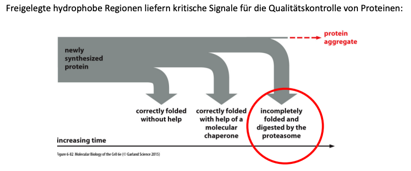

### Protein Stability

**A degron is a specific amino acid sequence, which indicates that a protein has to be degraded. The half life of a cytoplasmic protein is largely determined by its N-terminal residue**

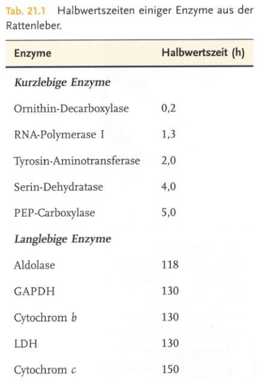

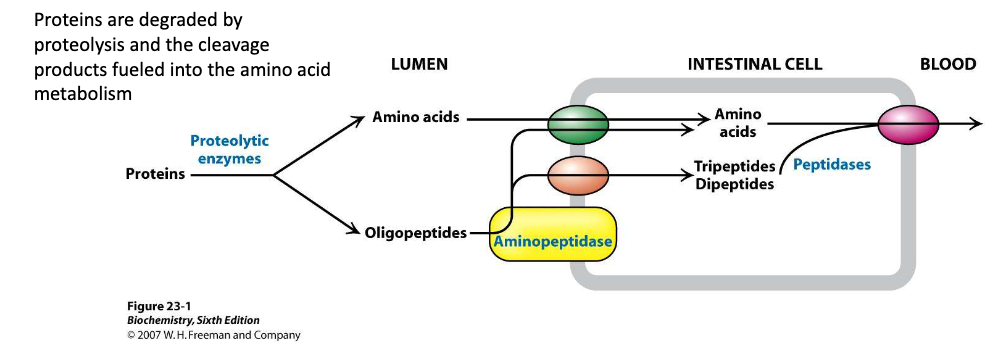

### Das Proteasome

> Proteasome sind Proteinkomplexe, die nicht benötigte oder beschädigte Proteine durch Proteolyse abbauen, eine chemische Reaktion, bei der Peptidbindungen aufgebrochen werden. Enzyme die solche Reaktionen unterstützen werden Proteasen genannt

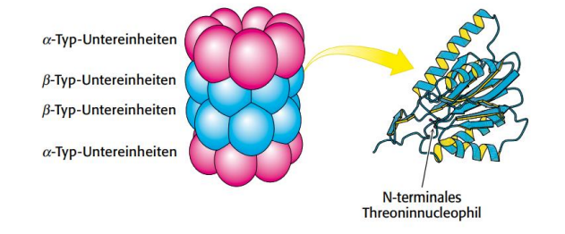

Besteht aus 28 homologen Untereinheiten ($\alpha$ und $\beta$ Typ) → zu vier Ringen aus 7 Untereinheiten angeordnet.

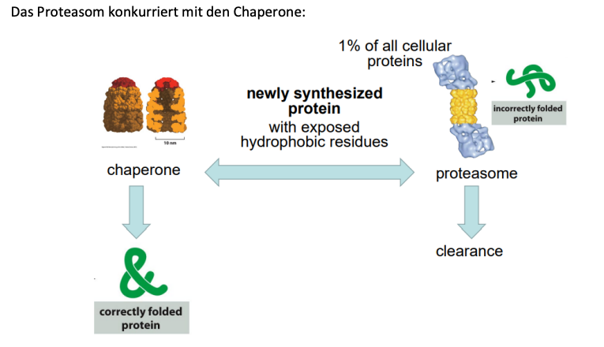

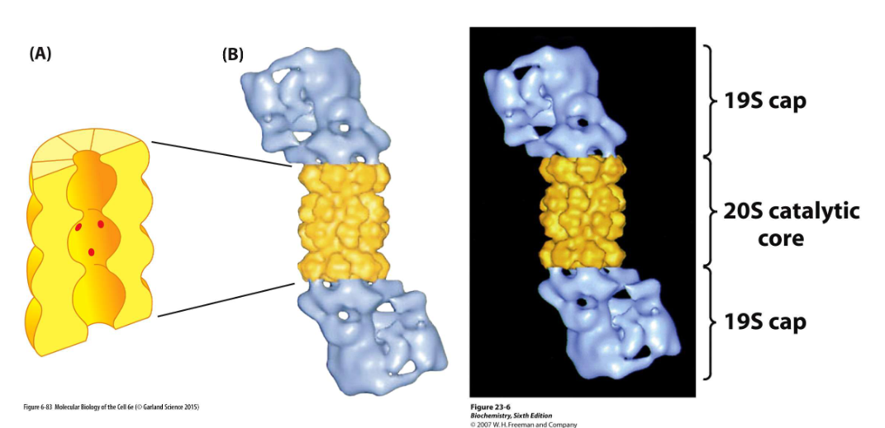

Beispiel das 26S Proteasome

#### Prozessive Proteinverdauung durch das Proteasom

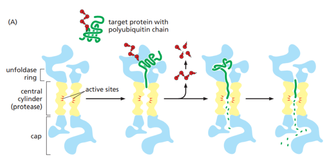

+ Proteasomkappen erkennt Proteine, die durch Polykette gekennzeichnet sind → verlagert sie in Proteasomkern → wird dort verdaut.

  **Die Proteasom-Kappe**

  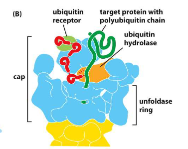

  + Hat einen Ubiquitinrezeptor der ein ubiquityliertes Protein an Ort und Stelle hält, während es in den Proteasomkern gezogen wird, und einer Ubiquitinhydrolase die Ubiquitin von dem abzubauenden Protein spaltet
 
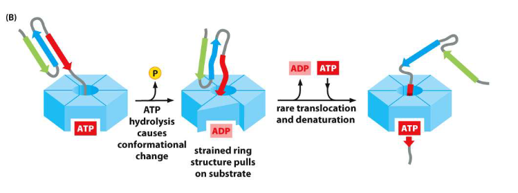

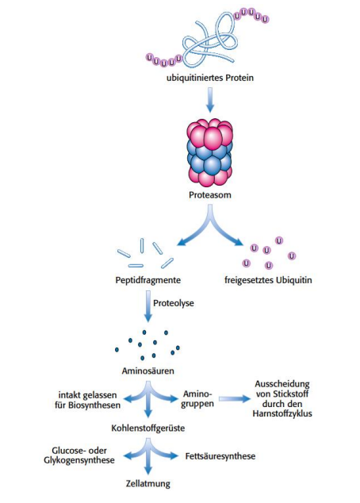

+ Proteine mit Ubiquitin werden zu Peptidfragmenten verarbeitet
+ Ubiquitin wird wieder entfernt und wiederverwertet
+ Peptidfragmente können weiter zu Aminosäuren abgebaut werden
+ In den Metabolismus gelangen
+ Kohlenstoffgerüste können Kohlenhydrate synthetisieren oder zu Fetten verarbeitet werden

#### Proteasome inhibitors

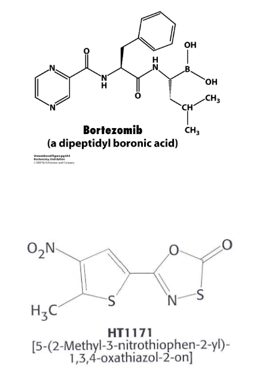

> Bortezombin is an approved proteasome inhibitor and used for melanoma therapy which underlines the important role of the ubiquitin-proteasome system for the regulation of gene expression

### Struktur von Ubiquitin

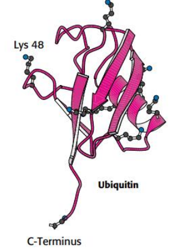

+ Polyubiquitylierung ist das Signal für proteasomalen Zerfall

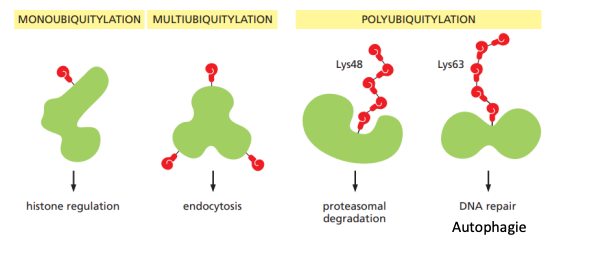

### Autophagozytose

> Membranbasiertes Abbausystem -> Autophagie "sich selbst verzehrend"

**Autophagy is a self-cannibalistic lysosomal degradation pathway that is essential for survival, differentiation, development, and homeostasis. Autophagy pricipally serves an adaptive role to protect organisms against diverse pathologies including infections, cancer neurodegenration, aging and heart disease**

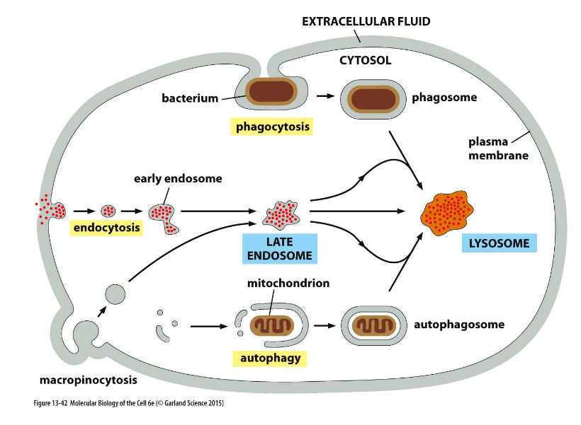
