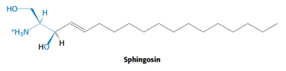

# Allgemeines zu Proteinen

> Proteine sind lineare Polymere die aus Aminosäuren zusammengesetzt sind

Übersicht über die Strukturebenen:

1. Primärstruktur: Abfolge der Aminosäuren
2. Sekundärstruktur: Faltungen (Helix, Faltblatt)
3. Tertiärstruktur: Stabilisierung durch nicht kovalente Kräfte
4. Quatärstruktur: Anordnung in mehreren Domänen

#### Protein DNA Komplex

> Beispiel ist der DNA Replikationsapparatur, hier umschließt ein Protein die DNA Doppelhelix, beispielsweise die Helicase

#### Proteine Ionen Komplexe

> Lactoferrin bindet an Eisen, es kommt zu einer Konformationsänderung

+ Lactoferrin is a globular gylcoprotein with 80 kDa represented in secretory fluids
+ Lactoferrin can reversible bind two ions of iron, zinc, copper or other materials

## Struktur von Proteine

> Aminosäuren sind optische Isomere: L-Isomer und D-Isomer

+ Das L-Isomer kommt in der Natur vor und hat S-Konfiguration
+ Mittlere Molekülmasse einer Aminosäure ist $M_r = 110$ g/mol

### Basic Amino-Acids

+ Lysine
+ Arginine
+ Histidine

### Acidic Amino Acids

+ Aspartic Acid
+ Glutamic Acid

### Uncharged Polar Amino Acids

+ Asparagine
+ Glutamine
+ Serine
+ Threonine
+ Tyrosine

### Nonpolar Amino Acids

+ Alanine
+ Valine
+ Methionine
+ Trypthophan
+ Leucine
+ Isoleucine
+ Glycine
+ Cystein
+ Proline
+ Phenylalanine

### Grundgerüst für viele Metaboliten

> Aminosäruen sind oftmals Vorstufen vieler kleiner Moleküle mit wichtigen biologischen Funktionen. Teile der Purine und Pyrimidine stammen aus Aminosäuren

1. Sphingosin: Enthält Serine als Aminosäure (für Membranlipide)

2. Melanine: Spezielle Gruppe an Biomolekülen welche Pigmente in vielen Organismen sind

3. Nicodamin von NAD+: Enthält Beispielsweise Trypthophan

### Phenylketonuria (PKU)

> Angeborene Stoffweechselstörung die autosomal-rezissiv mit einer Inzidenz von 1:8000 an Neugeborene vererbt wird.

+ Aminosäure Phenylalanin kann nicht abgebaut werden und reichert sich im Körper an
+ Entstehung von Phenylpyruvat, Phenylacetat oder Phenylacetat
+ Dies führt zu schwerer geistiger Entwicklungstörung mit Epilepsie

## Amino Acid Analysis

> Amino Acid Analysis refers to methods used to identify, quantify and charaterize amino acids

1. Chromophores and UV Absorption:
    1. Most Amino acids do not have strong chromophores, which absorb UV light
    2. Most Amino Acids have weak absorption
2. Derivatizaton:
    1. Derivatization is a chemical process to improve the detection and analysis of amino acids
    2. **Pre-Column-Derivatization:** Modification of Amino Acids before they are seperated
        1. **Ninhydrine** produces color or fluorescent
        2. **Dansyl Chloride or O-Phtalaldeyhd** React with Primary amines to create fluorescent derivatives
3. Derivization Free Analysis:
    1. Liquid Chromatography Mass Spectrometry
    2. Direct UV or Fluorescence detection

Some common analytical techniques:

+ Liquid Chromatography (Reverse Phase or Ion-Exchange chromatography)
+ LC-UV (Fluorescence Detection)
+ LC-MS: Both Qualitative and Quantitative Analysis

