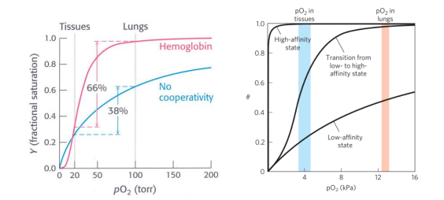
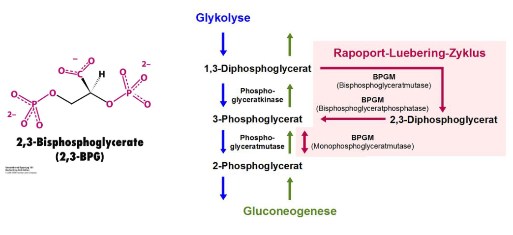

# Allosetrische Proteine

**Definition**

Ligand interagiert mit Protein → Konformationsänderung bei Bindung eines Liganden (Dieser muss nicht unbeding im aktiven Zentrum binden)

+ Protein wird dadurch aktiviert oder inaktiviert

## Exkurs Myoglobin:

> Myoglobin ist ein Sauerstoff und Eisen bindendes Protein welches in Muskelgewebe gefundenwird.

+ Im Vergleich zu Hämoglobin zeigt Myoglobin eine höhere Affinität zu Sauerstoff
+ Besteht nur aus einer Polypeptidkette mit prosthetischer Gruppe (Häm + Eisen)
+ **Kein allosterisches Protein im Vergleich zu Hämoglobin**

### Prosthetische Häm Gruppe

> Zentrales Eisenion mit vier miteinander verknüpften Pyrolringen, mit Seitenketten Propionat-, Methal- und Vinylgruppen. Gleich wie im Hamoglobin

### Sauerstoffbindung durch Myoglobin

**Es handelt sich um eine nicht-kooperative Bindung**

+ Eine BIndung ist kooperativ → Wenn eine Bindung Konformationsänderungen bewirkt und so für nachfolgende Liganden aktiviert oder erschwerrt
+ Chemisches Gleichgewicht je höher der Druck, besser die Sätting, Halbsättigung bei 2 Torr → Hohe Affinität

## Exkurs Hämoglobin

> Hämoglobin Hb ist ein eisenhaltiger Proteinkomplex, der als Blutfarbstoff in den roten Blutkörperchen von Wirbeltieren enthalten ist, Sauerstoff reversibel bindet und diesen so im Blutkreislauf transportiert.

+ Besitzt 4 Untereinheiten → Quaträrstruktur
+ 4 Polypeptidketten mit jeweils prosthetischer Gruppe (Häm)
+ Allosterisches Protein

+ Zwei extreme Quartärstrukturen abhängig wei viel Sauerstoff vorhanden ist
+ **a) mit großem Hohlraum, b) Hohlraum geschlossen**
+ T-Form → tense gespannte form mit Hohlraum
+ R-Form → relaxed ohne Hohlraum

### Bindung von Sauerstoff durch Hämoglobin im Vergleich zu Myoglobin

+ Sigmaoidaler Verlauf der Sauerstoffsättigungskurve
+ Charakteristisch für allosterische Proteine → synergistischer Effekt für Aktivitä
+  Halbsättigung hier bei cirka 26 Torr

**Generell gehorchen Enzyme eher der Michaelis-Menten Kinetik → hyperbolische Bindungskurven außer allosterische Proteine**

### Bindung von Sauerstoff an Eisen

+ Ein Distales Histidine stabilisiert diese Sauerstoffbindung dann und forciert einen Bindungswinkel von 120 °

Sauerstoff ist gegunden an zweiwertigen Eisen → Wechselwirkung ist eine Resonanzstruktur zwischen $Fe^{2+}$ und $Fe^{3+}$ mit einen Superoxidanion

### Visuelle Erklärung der Sauerstoffbindung im Hämoglobin

+ Blaue Kurve → Keine Konformationsänderung, flachere Kurve keine Effiziente Bindung, hoher Partialdruck
+ In der Lunge, hoher Partialdruck → Kooperative Bindung und sehr schnelle Sättigung von Hämoglobin
+ Im Gewebe niedriger Partialdruck → Effizientere Abgabe

#### Hill Plot für Sauerstoffbindung an Myoglobin und Hämoglobin

> Kooperative Bindungseffekte können in diesem Plot direkt beobachtet werden

+ x-Achse → $\log(pO_2)$ gibt den Partialdruck von Sauerstoff an
+ y-Achse $\log(\theta/(1-\theta))$ wobei $\theta$ die Saturation ist (Fraction of hemoglobin molecules bound to oxigen)
+ Myoglobin $n = 1%$ nur eine Bindungstelle nicht kooperativ

**Generelle Beobachtungen**

+ $n_H = 1$ Nicht kooperativ, one-to-one Binding
+ $n_H >1$ positiv kooperativ, (Binding of oxygen makes it easier for additonal oxygen
+ $n_H <1$ negative cooperativity (oxygen binding makes it harder)

**Für Hämoglobin**

+ Low Affinity State with $n_H=1$ non cooperative oxygen concentrations
+ High Affinity State with $n_H= 3$ strong positive binding, affinity increases

### Änderung der Quatanärstruktur

→ Sauerstoffbindung ändert die Konformation, $\alpha,\beta$ Dimer verdreht sich um 15 ° → Konformationsänderung

+ Sauerstoff wird in R-Form besser gebunden → zweiter Sauerstoff kann leichter gebunden werden (→ Kooperativität)
+ Bindung von weiteren Sauerstoffen wird durch Konformationsänderung erleichtert

#### Salzbrücken Stabilisieren T-Form

T-FOrm wird bei geringen Sauerstoffpartialdruck eingenommen (im Gewebe) → Salzbrücken binden sich an terminalen Polypeptidketten

#### 2-3 Bisphosphoglycerat  in Erythrozyten

> Metabolit der sich aus der Glykolyse ableitet und ein Derivat von Glycerin, zweifach Phosphorylierte Carboxylfunktion, hohe negative Ladungsdichte → Interagiert stark mit T-Form

+ Problem → Für eine Effiziente Funktion von Hb muss die T-Form stabil bleiben bis es zur R-Form nach $O_2$ bindung umgewandelt wird.
+ Gleichgewicht liegt bei R Form → 2,3 BPG ist ein allosterischer Effector.

#### Funktion von $CO_2$

entsteht bei aerober Verwertung von Gluclose

Transport von peripheren Gewebe zur Lunge $H_2CO_3$ Bestandteil von Bicarbonatpuffer. Geringer Teil kann auch direkt ans Hämoglobin binden → Setzt Affinität zu Sauerstoff herab

**Allosterische Effektoren für das Hämoglobin**

+ Sauerstoffbindung → Partialdruck
+ Protonkenkonzentration → pH Wert
+ Kohlendioxid
+ 2,3 BPG

#### Der Bohr Effekt

Regulation der Sauerstoffbindung durch $H^+$ und $CO_2$

Affinität wird gesenkt wenn der pH-Wert sinkt oder die $CO_2$Konzentration steigt.

Gleichgewicht von Wasser und $CO_2$ Senkung des pH Wert

$H_2O + CO_2 \to H2CO_3 \to HCO_3^- + H^+$

+ Peripheres Gewebe hohe $CO_2$ und Protonen Konzentration
+ In der Lunge hohe $O_2$-Konzentration und geringe Protonenkonzentration → Sauerstoff wird kooperativ aufgenommen

### Regulierung der Pyrimidine Biosynthese

## Generelle Möglichkeiten zur Regulaton von Enzymaktivität

+ **Allosterische Kontrolle**: Bindung an regulatorischen Stellen steuert die Aktivität der Proteine,
    + Beispiel Aspartat-Transcarbamoylase, erster Schritt in der Pyrimidinbiosynthese d urch Cytidintriphosphate gehemmt → Rückkopplung letzter Schritt 

