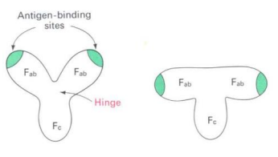

# Immune Sytem Proteins

> Antikörper (= Immunglobine) sind Proteine des Immunsystems → Eigenschaft spezifisch an andere Moleküle zu binden

Aufgaben des Immunsystems:

+ Körperfremde Moleküle erkennen
+ laufend potenziell schädliche Moleküle konfrontiert

+ 4 Polypeptidketten mit charakteristischen Domänen
+ Immunoglobulin Fold

> Das Immunsystem besteht aus einem angeborenen (nativen) und einen adaptiven (erworbenen) Teil

**Angeborenes Immunsystem**

Evolutionsgeschichtlich altes Abwehrsystem, Besteht aus physikalischer Barriere (Epithelschichten), toxischen Molekülen und Phagozyten (Fresszellen)

**Adaptives Immunsystem**

Schutz vor Bakterien, Viren, Pilzen, Parasiten, die alle potenzielle Krankheitserreger sind. Besteht aus humoraler und zellulärer Immunantword

+ Humorale Immunantwort:
    + Lösliche Proteine (Antikörper) als Erkennungselement, binden an körperfremde Moleküle, Kennzeichnen diese als Eindringlinge
    + Antikörper werden von Plasmazellen sezeniert, → gehen aus B Lymphocyten (B-Zellen) hervor
+ Zelluläre Immunantwort:
    + Cytotoxische T-Lymphozyten (T-Killerzellen), zerstören Zellen die von Krankheitserregern befallen sind
 
> T-Helferzellen sind sowohl bei der humoralen als auch bei der zellulären Immunantwort beteiligt: Stimulieren die Differenzierung und Vermerhung geeigneter B-Zellen und cytotoxischer T-Zellen

Das adaptive Immunsystem kann $10^{8}$ verschiedene Proteine Bilden, $10^{12}$ T-Zell Rezeptoren können gebildet werden eigentlich ein Organ

## Das angeborene Immunsystem

> Evolutionsgeschichtlich altes Abwehrsystem

+ Phagozyten, speziallisierte Zellen, die ohne das adaptive System Krankheitserreger aufnehmen und zerstören können

**Toll-Like-Rezeptoren** Sind Transmembranproteine, große Extrazelluläre Domäne aus wiederholenden Aminosäuresequenzen

Es gibt dann **Phatogenassozierte-molekulare-Muster (PAMPS)**, zb Lipopolysacheride werden von Toll-Like Rezeptoren erkannt

**Definition Immunsystem: Netzwerk von Molekülen und Zellen, die die Aufabe haben EIgenes und Fremdes zu unterscheiden**

## Antikörper

### Stuktur von Antikörper

4 Polypeptidketten, zwei schwere und zwei leichte, weisen intra- als auch intermolekulare Disulfidbrücken auf. diese Disulfidbrücken sind wichtig für den Immunoglobulin Fold

Regionen mit $C$ → Konstante Domäne → Aminosäuresequenz ist konserviert in alen Antikörpern

Regionen mit $V$ Variable Domäne → Antikörper unterscheiden sich hier

Jede Leichte kette hat eine konstante Region, schwere Kette 3

+ Leichte Ketten haben eine Größe von 214 Aminosäuren, schwere Ketten von 446 Aminosäuren. Damit $2*214 + 2*446 \to 1320$ Aminosäuren gesamt
+ Papain ist eine Cysteinprotease, kann den Antikörper spalten die Ketten trennen
+ Antikörper erkennen antigene Determinanten (Epitope oder Haptene) eines Moleküls

### Bindung an Antigene

+ Zwei Bindestellen für Antigen, Präzpipitate (Aggregationen) verstärken Immunantwort
+ Carboxyl-terminus $F_C$ domäne wichtig für das Immunsystem

## Lymphatische Organe des Menschen

Lymphozyten entwickeln sich aus lymphoiden Vorläuferzellen in Thymus und Knochenmark → weiter zu peripheren lymphoiden Organen

+ Thymus, Knochenmark im Oberschenkelknochen
+ Milz, Blinddarm, Regionen im Dünndarm
+ Lymphknoten in Mandeln
+ An Oberfläche die Lymphgefäße

## Die Wichtigkeit von Immunglobolin G

+ wird IgG mit Protease Papin Behandelt kommt es zur SPaltung in drei Fragmente

### Immunglobulinklassen

Jede Klasse hat eine leichte Kette (immer in gelb) mit schweren ketten, diese Klassen unterscheiden sich durch unterschiedliche Ketten in der Konstanten Region

+ Alle Immunglobulinklassen können gleiches Antigen binden, IgA liegt als Dimer, IgM als Pentamer vor

**IgM**

Erste Antikörperklasse die nach dem Kontakt mit Antigen im Serum auftaucht. Hat 10 Bindungstellen kann gut an Antigenem it meheren gleichartigen Epitopen binden

**IgG**

Primärer Antikörper im Blutserum, IgG aktiviert auch das Komplement

**IgA**

Antikörper bildet sich in äußeren Sekreten wie Speichel, Tränen und dem Schleim von Bronchien und Darm, erste Verteidigungslinie

**IgE**

Bedeutung für den Schutz gegen Parasiten. Verursacht außerdem allergische Reaktionen, Histamin Ausschüttung durch irgendwelche Komplexe 

**IgD**

Unbekannte Funktion, top

### Antibody variety

+ Embryonale Zelle = Vorläuferzelle, besitzt Gene die die Variable und konstante Domäne Codieren
+ Werden durch DNA Rekombination Fusioniert
+ Es gibt mehere hunder $V_K$, Variable Region, die mit den Variablen Regionen der Schweren ketten Verknüpft werden

**Expression der leichten Kette**

+ Rearrangement → Transkription → Prä-mRNA → Splicing → Die Sequenzen, zwischen V,J, C werden entfernt

+ Genom hat 25000 Gene damit nur begrenzte Bausteine für Antikörper

+ Kombinatorische Verknüpfung unterschiedlicher DNA Regionen führt jedoch zu mehr Protein Kodierenden Regionen die davor noch nicht im Genom waren

safe logisch

## Humorale Immunantwort

1. Erster Kontakt mit Antigen IgM bindet
2. IgM zunächst noch an Zellmembran von B-Zelle verankert
3. Bindet Antigen an Variabler Region → Signal wird in die B Zelle weitergeleitet → Co-Rezeptoren $Ig-\alpha,Ig-\beta$ wird benötigt

### Komplementsystem

> IgG hat die Aufabe das Komplementsystem zu Aktivieren

**Komplementsystem ist ein System aus löslichen Proteinen zur Lyse von Mikroorganismen und infizierten Zellen**

Dazu wird Effektor Funktion $F_C$ von IgG benötigt → wie eine proteolytische Kaskade → eine Komponente aktiviert die nächste bis zur Zielzelle lysiert wird

## Zelluläre Immunantwort

+ Humorales System: Lösliche Antikörper in Körperflüssigkeiten
+ Zelluläres System: Zellen, Antikörperähnliche Moleküle in Zellmembran verankert (Mikroorganismen)

### MHC (Major Histocompatibility complex) Protein

Rezeptorproteine → Befinden sich an der Zelloberfläche

Zellgebundene T-Zell-Rezeptoren → Schutz vor intrazellulären Pathogenen

+ T-Zellen durchsuchen Zelloberfläche kontinuierlich nach fremden Markerpeptiden, Peptide aus abgebauten Proteinen werden durch integrale Membranproteine auf der Zelloberlfäche präsentiert