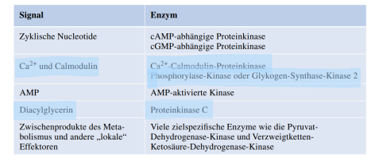

# Enzymatische Katalyse

**Wir haben folgende Möglichkeiten enzymatische Aktivitäten zu regulieren**

+ Allosterische Regulation
+ Verschiedene Enzymformen
+ Reversible Kovalente Modifikation
+ Proteolytische Aktivierung
+ Regulation der vorhandenen Enzymmenge

**Definition: Kovalente Modifikation**

> Kovalente Anhänge eines anderen Moleküls kann die Aktivität des Enzyms modifizieren. Hierbei stellt ein SPendermolekül einen funktionellen Teil, der dann die Eigenschaften eines Enzyms verändert. Die meisten Modifikationen sind reversibel

**Prominente Beispiele**

+ Phosphorylierung: ATP als Donormolekül, zb Glykogen Phosphorylase
+ Acetylierung: Acetyl-CoA → entsteht beim Fettsäureabbau, wird im Citratzyklus benötigt, Schnittstelle zwischne Fettsäure und Kohlenhydratmetabolismus, **Beispiel Acetyliertes Lysin**
+ Myristylierung: mit Myristyl-CoA, Aus Myristinsäure (Fettsäure)

### Beispiele für Serin- und Threoninkinasen und ihre Aktivierungsignale

+ Enzyme die Serin- als auch Threoninreste Phosphorylieren können werden als ST Kinasen Zusammengefasst.

#### Beispiel Calmodulin

> Calmodulin (Calium Modulated Protein) is a multifunctional intermediate calcium-binding messenger protein expressed in all eukaryotic cells. It is a intracellular target of the secondary messenger $Ca^{2+}$. Is part of the Signal Pathway

+ Highly Konserved with 148 Aminoacids

+ Es werden pro Einheit je zwei Calciumionen komplexiert
+ Dies führt zu einer Strukturveränderung
+ Calmodulin-abhängige Protein Kinase bindet
+ Leitet die Phosphorylierung ein

**Hat EF-Hand Struktur**, kombination aus zwei $\alpha$-Helices und einem $\beta$ Faltblatt → $Ca^{2+}$ in der Schleife 

**Ablauf:**

1. Bindung von $4Ca^{2+}$ an Apo-Calmodulin → Strukturveränderung (Ausbildung von EF-Domäne)
2. Nun können CaM Kinase I binden → SAtruktur wird nochmals verändert
3. Tasche bildet sich und Aktivierung. der CaM Kinase 1

## Enzymatische Katalyse

> Enzyme sind effiziente Biokatalysatoren → Setzen die Aktivierungsenergie von chemischen Reaktionen herab → Beschleunigen Einstellung eines bestimmten chemischen Gleichgewichts

Genereller Ablauf:

1. Wechselwirkung zwischen Enzym und Substrat
2. Enzym-Substrat Komplex
3. Enzym-Produkt Komplex → Produkt wird freigesetzt
4. Enzym wird regeneriert

**Modell des Schlüssel Schloss Modell der Enzym Substrat Bindung**

+ aktives Zentrum des Enzyms besitzt eine komplementäre Gestalt zum Substrat

**Modell des induced fit der Enzym-Substrat Bindung:** Enzym verändert die Form bei der Substratbildung, aktives Zentrum formt sich erst bei der Bindung

### Michaelis-Menten-Kinetik

> Die Reaktionsgeschwindigkeit der meisten enzymatischen Reaktionen hängt von der Substratkonzentration $[S]$ ab

+ $V_{max}$ ist die maximale Geschwindigkeit die asymptotisch erreicht wird
+ $K_M$ ist die Michaelis-Menten Konstante → $V = V_{max}/2$

> Allosteric Enzymes do not obey the Michaelis-Menten kinetics and have a sigmoid instead of a hyperbolic reaction curve. The binding of the substrate becomes more cooperative

**Beispiel ATCase. (Aspartat-Transcarbamoylase)**

+ wird in der Pyrimidinbiosynthese benötigt
+ Enzym wird durch das Endprodukt (CTP) der Reaktionsfolge inhibiert
+ Bis zu 6 CTP Nukleotide binden an eine Region außerhalb, kooperativ
+ Diese Bindung verursacht eine Konformationsänderung
+ Substrate Carbamoylphosphat und Aspartat werden nicht mehr so stark gebunden
+ Reduktion der Reaktionsrate

### Many enzymes share fundamental catalytic mechanisms

Spezifisches Binden des Substrats: Bindungsenergie definiert die Substratspezifität und erhöht katalytische Efizienz, verringern die Aktivierungsenergie

**Kovalente Katalyse**

Aktives Zentrum hat reaktive Gruppe, die im Verlauf der Katalyse temporär kovalent an einen Teil des Substrats gebunden wird (Cymotrypsin)

**Allgemeine Säure-Basen-Katalyse**

Ein Molekül bestitzt die Funktion eines Protonendonators oder Akzeptor

(Carboanhydrase) Histidinrest erleichtert die Entfernung eines $H^+$-Ions von einem zinkgebundenden Wasser

**Katalyse durch Annäherung**

Reaktionsgeschwindigkeit lässt sich erhöhen wenn beide Substrate einander auf Oberfläche nähern

**Metallionenkatalyse**

1. Metallionen erleichtern durch Koordination die Bildung von Nucleophilen
2. Metallion kann elektrophil wirken, stabilisiert Ladungen im Zwischenprodukt
3. Metallion kann Bücke zwischen Enzym und Substrat ausbilden

## Proteasen

> Proteasen haben die Aufgabe die Peptidbindung zu spalten

+ Sehr viel Energie wird benötigt (stabile Bindung)

### Trypsin und Thrombin

### Zymogene

Sind inaktive Vorstufen von Enzymen → nach der Proteolytischen Spaltung eines Polypeptids wird ein Zymogen zum aktiven Enzym → Aktivität wird kontroliert

Meist durch Suffix / Präfix gekennzeichnet: Pepsinogen, Proelastase

→ Außer Pepsin wird jedes Enzym bei niedrigen pH denaturiert

+ Aktive Form des Proteins wird in der Pankreas hergestellt
+ Enzyme werden in den Dünndarm sezerniert → können Nahrungsproteine Spalten

#### Freisetzung von Zymogenen in Acinuszelle

> Zymogene werden an den Ribosomen synthetisiert, im Golgi Apprat verarbeitet, im Zymogengranula verpackt, bei einen Signal verschmelzen diese mit der Plasmamembran,  entladen den Inhalt im Lumen der Pankreasgänge

### Serinprotasen

#### Beispiel Chymotrypsinogen

Ist ein Zymogen Polypeptid aus 245 Aminosäuren welches durch Trypsin aktiviert wird

+ Trypsin aktiviert Chymotrypsinogen
+ Dies zeigt an das Verdauung im Gange ist
+ Mehr Verdauungsenzyme werden benötigt
+ Polypeptid wird an Arigin 15, Isoleucin 16 gespalten, entstandenes $\pi$ Chymotrypsin wirkt hydrolytisch auf anderes $\pi$ Chymotrypsin ein. Abspaltung von zwei Dipeptiden

##### Spezifität vn Chymotrypsin:

> Spaltet am C-Terminalen Ende von aromatischen oder hydrophoben Resten (Phe, Met)

##### Peptid Hydrolyse durch Chymotrypsin

Es liegt folgende Katalytische Triade vor

Der Mechanismus der Reaktion ist dann wie folgt:

1.  Bindung des Substats
2.  Nukleophiler Angrif des Serins auf die Carbonylgruppe
3.  Zerfall des Tetrahedralen Intermediats
4.  Abspaltung der Aminkomponente
5.  Anlagerung von Wasser
6.  Nukleophiler Angriff der Wassers auf die Acyl-Enzym Komponente (Histidin unterstützt)
7.  Zerfall des Tetrahedralen intermediats
8. Freisetzung der Carbonsäure, Regenerierung des Katalysators

### Generelles zu katalytische Triaden

> Katalytische Triaden sind auch in anderen Enzymen zu finden (Trypsin, Elastase)

### Cystein Proteasen

> Besitzen Cystein statt Serin im katalytischen Zentrum

+ Papain ist eine pflanzliche Protease
+ Cysteinrest im katalytischen Zentrum
+ Aktiviert durch Histidin, erhöht die Reaktivität

+ Da Schwefelatom stärker Nucleophil als Sauerstoff ist, brauchen Cystein Proteasen keine katalytische Triade → Histidinrest reicht aus

**Definition Apoptose**

Ist der programmierte Zelltod, zelluläres Programm, Proteasen spielen hier eine Rolle, Wichtig in Entwicklung wenn spezifisch Zellen abgebaut werden müssen.

+ Wichtig in der Entwicklung der Hand, Zwischenraum wird abgebaut und Finger entstehen

### Aspartylproteasen

> Aktives Zentrum besitzt ein Paar von Aspartatresten → Saure Seitenkette → Saure Protease

+ Renin ist beteiligt an der Regulation des Blutvolumens → Blutdruckregulation

+ Aspartatreste wirken zusammen um das Wasser für den Nukleophilen Angriff zu aktivieren

### Weitere Beispiele

**HIV Protase** 

HIV = Human Immunodeficiency Virus

+ Humanes Retrovirus
+ Vermehrt sich auf Kosten des Wirtes
+ HIV Virus benötigt HIV Protease zum Vermehren spaltet wichtige Proteine

### Metalloproteasen

> Besitzen Metallionen im katalytischen Zentrum $(Zn^{2+})$

+ Metallion aktiviert hier das Wassermolekül, kann dann an Carbonyl angreifen und spaltet die Peptidbindung

  

#### Carboxypeptidase A:

Spaltung am C-Terminalen Rest, Vorraussetzung, aromatische oder Voluminöse Seitenkette

Es kommt hier zu einen Induced Fit, die Konformation des Enzyms ändert sich bei Substratbindung

### Zusammenfassung

## Carboanhydrase

**Lyase (Katalysiert eine Molekülspaltung)**

> Ein Enzym das die Hydratisierung von Kohlenstoffdioxid zu Kohlensärue und umgekehrt katalysiert. Carboanhydrase enthält ein Zink-Ion mit 4 Liganden koordiniert im katalytischen Zentrum

+ $CO_2$ ist das Hauptprodukt des aeorben Stoffwechsels und in Erythrozyten vorhanden. Transportation von Blut zur Lunge erfolgt im Form von Bicarbonat.
+ Spontante Hydratisierung wäreh ier sehr langsam

### Auswirkung des pH Werts

> Sehr effizientes Enzym, die Veränderung des pH Werts beinflusst die Geschwindigkeit, maximale Aktivität bei sehr hohem pH-Wert

## Glycosidasen

### Lysosyme

> Spaltet Glycosidische Bindungen zwischen zwei Zuckermolekülen, diese sind in der $\beta$ Konformation gebunden

+ Ein Antibiotic, welches die Glykosidischen BIndungen von Polysacharide in Bakterien Spaltet
+ Antibiotika = Stoffe welche mit dem Bakterienzellwachstum inferieren
+ Penicilin → Hemmt Zellwandsynthese
+ Lysozym: Auch Antibiotika → Kann bestehende Zellwand abbauen

## Nukleasen

> Enzym das die Phosphodiesterbindung zwischen Nukleotiden von Nukleinsäuren spalten kann → Hydrolyse wird durch Nukleasen katalysiert

### Ribonukleasen

> Spaltung von Ribonukleinsäuren durch RNase

+ Verdauungsenzym besteht aus 124 Aminosäuren
+ Sehr Stabil besteht sogar nach Autoklavieren
+ Katalysiert die RNA-Hydrolyse

+ Bildet sich ein zyklisches Phosphat mit pentakovalenten Überganszustand
+ Angriff von Wasser
+ Spaltet immer Nach Pyrimidinresten, keine Purine
+ Spaltet keine DNA, hier fehlt die Hydroxylgruppe an der 2 wichtig diese brauchts fürs zyklische Phosphat
+ pH-Optimum: 7 → Histidin im katalytischen Zentrum

## Restriktionsenzyme

> Katalysieren hochspezifische Spaltungsreaktionen der DNA → Sequenzspezifisch

+ Schützen Bakterien und Archaea vor viralen INfektionen
+ Restriktionsenzyme erkennen fremde DNA von Bakteriophagen → Spaltung der fremden DNA
+ Schutz der eigenen DNA durch Methylierung

### Hydrolyse einer Phosphodiesterbindung

> Aktives Zentrum eines Restiktionsenzyms enthält Magnesiumionen (Co-Faktoren)

