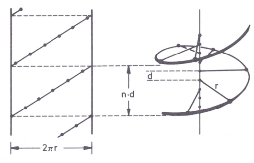

# Protein Conformation

[[Allgemeines_Proteine]] Allgemeines_Proteine

Definitionen:

+ Constitution:

> The description of the identitiy and connectivity of the atoms in a molecular entity (omitting distinctions from spatial arrangement)

+ Configuration

> In the context of stereochemistry, term is restricted to the arrangements of atoms in a space that distinguishes sterioismers

+ Conformation:

  > Spatial arrangement of the atoms, rotational bonds
  
  Kategorisierung:

  + 10 Aminosäuren: Oligopeptide
  + $> 10$ Aminosäuren: Polypeptide
  + $>50$ Aminosäuren: Proteine

## Notes zur Peptidbindung

+ Aminosäuren sind über Carboxygruppe und Aminogruppe verbinden
+ Peptidbindung ist planar $(sp^2)$ da diese zwischen einfach und Doppelbindung wechselt, **Rotation Verhindert**

### Bindungsdistanz

+ C-N Einfachbindung: 1.46 å
+ C-N Peptidbindung 1.32 å
+ C=N Doppelbindung: 1.27 å

### Torsion Angles

> A Torsion Angle / DIhedral Angle is the twist along a bond

+ Angle Between $N-C_\alpha$, $\varphi$
+ Angle Between $C_\alpha-C$, $\psi$
+ Angle Between $C'-N$ Peptidbindung $\omega$

> The capacity to form defined structures in case of biological polymers such as proteins is remarkable with regards to thermodynamics. There is a balance between unfolded (U) and folded (F) $U \Leftrightarrow F$

+ U: Mischung zwischen vielen möglichen Konformationen (hohe Entropie)
+ F: Definierte Konformation (Niedrige Entropie, Niedrige Freue Energie)
+ The rigidity of the peptide units and limited amount of possible $\varphi$ and $\psi$ angles constraint the possible conformations in protein folding

### Geometrie in der Peptidbindung

Zwei klassiche Konformationen:

+ Trans: beide $\alpha-C$ auf entgegengesetzen Seiten
+ Cis: Beide $\alpha-C$ sind auf der gleichen Seite

> Nahezu alle Peptidbindungen sind in der trans-Konfiguration

> Ausnahme für diesen Trend sind X-Proline Bindungen ,diese haven afground des Rings of die Cis Konfiguration

### Faltung der Polypeptidketten:

Drei Arten von nicht kovalenten Bindungen sind bei der Proteinfaltung beteiligt:

+ Wasserstoffbrückenbindung
+ Elektrostatische Wechselwirkung
+ VWD Anziehungen

### Sekundärstruktur

#### $\alpha$ Helix

+ Periodischen Aufbau, **Schraubenförmige Anordnung der Seitenkette nach Außen**
+ Wasserstoffbrücken zwischen NH und CO-Gruppen der Hauptkette stabilisieren die $\alpha$ Helix
+ Pro Aminosäure gibt es eine Verschiebung von 0.15 entlang der Achse, 100 ° → **Volle Umdrehung braucht 3,6** Aminosäurereste
+ Die Ganghöhe (vollständige Windung) entspricht 0.54 nm
+ Helix kann rechts oder linksgängig sein, jedoch rechtsgängig energetisch günstiger, weniger Kollision mit Seitenketten

**Geometrische Darstellung**

+ n = Anzahl der Aminosäurereste pro Turn
+ d = Axialer Shift pro Rest
+ $n \times d$ Ganghöhe
+ Helix ist eine Kurve im Dreidimensionalen Raum $x(t)=\cos(t),y(t) = \sin(t), z(t)=t$

#### Kollagen-Tripelhelix

> Kollagen Tripelhelix findet sich in Kollagen, Strukturproteine in Bindegewebe, Sehnen, Knochen und Haut

+ Drei Seperate Polypetidketten, die sich umeinander winden und eine **rechtsgängige Superhelix** bilden
+ Jede Polypeptidkette selbst ist linksgängig
+ Die drei Ketten werden durch Wasserstoffbrückenbindungen und collagen-spezifischen Crosslinks stabilisiert

**Spezifisch ist eine GLYCIN-X-Y Sequenz (X Prolin, Y Hydroxyprolin)**

**Special Features**

+ Helical Conformation
+ Steric Repulsion of Pyrrolidone Rings
+ Intermolecular H-bonds
+ 3 residues / winding
+ Left handed orientation, right handed superhelix
+ Dermis, connectiv tissue

#### $\beta$-Faltplatt

+ Polypeptidketten liegen fast völlig ausgestreckt for
+ Intermolekulare Wassterstoffbrückenbindungen zwischen den Strängen
+ Benachbarte Stränge können in dieselbe Richtung (paralleles $\beta$-Faltblatt) oder entgegengesetzt (antiparalleles $\beta$ Faltblatt)

##### Antiparalleles $\beta$ Faltblatt

+ Stränge verläufen entgegengesetzt
+ Wasserstoffbrücken zwischen NH und CO verbinden jede Aminosäure mit anderen Strang

##### Paralleles $\beta$ Faltblatt

> Jede Aminosäure macht Wasserstoffbrückenbindung mit NH und CO im benachbarten Strang

#### $\beta$ Turn

> Meisten Proteine haben eine kompakte, globuläre Gestalt → Richtungsänderung im Verlauf der Polypeptidkette vorausgesetzt

**Proline und Glycine haben oft $\beta$ Turns, da die zyklische Struktur von Prolin Ideal für $\beta$ Turns ist** 

### Ramachandran Plot

> A Ramachandran Plot is a technique to plot $\psi$ and $\varphi$ angles and show the allowed regions for the protein backbone dihedral angles

→ Beispiel Struktur rechts nicht begünstigt

+ Linksgängige und Rechtsänige Helixes beide erlaubt
+ Jedoch trotzdem fast immer rechtsgängig

**Günstige Winkel für die $\alpha$-Helix**

+ $\varphi = ± 60 °$
+ $\psi = ± 60 °$

Folgende Aminosäuren stören die Bildung von $\alpha$ Helices

+ Threonine
+ Valine
+ Isoleucine
+ Serine
+ Aspartate
+ Asparagine
+ Proline

### Anfinsen-Experiment

**Anfinsen Dogma**

> For small globular protein in its standard physiological enviroment, the native structure of the protein is only determined by the amino-acid sequence

Three conditions for a formation of a unique protein structure:

+ Uniqueness - Sequence has not any other configuration with comparable free energy, energy minimum must be unchallanged
+ Stability - Small changes in the enviroment cannot give rise to a change in the minimum configuration (free energy surface looks like funnel)
+ Kinetical acessability - Path in the free energy surface from the unfolded to the folded state must be reasonably smooth, or in other words that the folding doesnt involve highly complex changes in shape

#### Ribonuclease A

> Ribonucleases are nucleases that catalyze the degradation of RNA, has about 127 amino acids and no prosthetic groups

+ 8 Cystein Residues that can form Disulfide Bonds, very important for Tertiary Structure
+ RNAses extremly stabil, even after autoklave shit

#### Ablauf des Experiments

**Zerstörung der Tertiärstruktur**

+ Ribonuclease in Lösung, chaotropes Reagenz (Harnstoff oder Guanidiumchlorid) → Stark Wasser ziehen
+ Hydrathülle die das Protein stabilisiert wird entfernt → Faltung geht verloren
+ Random Coil Protein ohne Funktion

+ Zugabe von $\beta$ Mercaptoethanol entfernt die Disulfidbrücken

+ Nun Entfernen der Chaotropen Reagenzien durch Dialyse
+ Usprüngliche Konformation und enzymatische Aktivität wird wiederhergestellt → **Proteinfaltung bestimmt Tertiärstruktur**

