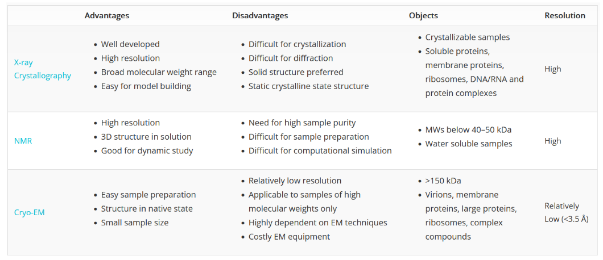
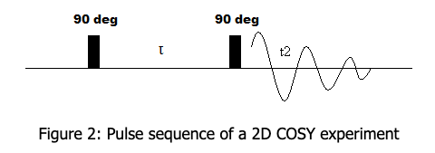

# Protein Structure Analysis

> Bestimmung der Sturktur von Proteinen und Proteinanalytik

+ Proteinkristall für Analysenmethode (Röngtenstruktur), braucht ein gereinigtes Protein → Protein Purification
+ Quelle der Proteine: Gewebe oder Zellen wo das Protein stark angereichert ist oder Rekombinant herstellen

Bereiche der Sichtbarkeit:

1. < 1.7 $\AA$ most atoms clearly seen
2. $1.7 - 2.2 \AA$ many atoms clearly seen
3. $2.2 - 2.7 \AA$ Shapes of Larger sidchains seen
4. $2.8-3.5 \AA$ Secondary structure and bulky groups seen (Atoms unclear)
5. $3.5 - 4 \AA$ Most chains traceable
6. $4-6 \AA$ Some chains Traceable
7. $> 8$ only large Features

> Medium in the PDB is 2.05 å

## Principle of X-Ray Diffraction

**X-Ray Source** Electrons are accelerated in a synchrotron, they then collide with copper anode, releasing monochromatic X-Rays

**X-Ray Diffraction** Some X-Rays go through the Crystal while the rest is scattered, the scattering is based on interactions with Electrons

> Note that the Wavelength of the X-Rays is comparable to the bond lengths in molecules

+ Intensity of the Electromagnetic radiation is proportional to the square of the wave ampltitude → Structure factor
+ If Electromagnetic Wave hits crystal every atom in the crystal scatters light and becomes the origin of a new wave

  

> Optical Recombination of the Diffracted X-Rays not possible → Fourier Transformation to detect planes, reciprocal atomic coordinates

+ 3 Dimensional distribution of Electrons (electron)
   density can be determines → which then gives the coordinates

  

  

## Principle of NMR Spectroscopy

> In NMR Spectroscopy, magnetically active nuclei are measured, in a magnetic field, the neergy levels of the nuclear spin split into several states, the energy for this depends on the enviroment of the nucleus

### Indirect Scalar Coupling

> IN Indirect or scalar spin-spin coupling, the magnetic interactions are transferred via the electrons involved in the bonds

### Karplus Relationship

> The Karplus Equation describes the correlaton between $^3J$ Coupling constants and dihedral torsion angles in NMR Spectroscopy

$J(\phi) = A \cos(2\phi) + B \cos(\phi) +C$

+ A,B,C are constants and $\phi$ is the dihedral angle

**Strength of the coupling constant depends on the torsion angle between protons, this makes it possible to derive the geometry of the molecule. For proteins torsion angle of the backbone $HN-N-C-H$ Can be determined

### Intro into 2D NMR Spectroscopy

+ In a traditional 1D FT-NMR the sample is hit with a series of RF Pules, and the FT of the outgoing signal results in 1D spectra as a function of chemical shift

#### COSY Correlation Spectroscopy

+ 90° RF puls followed by an evolution time and an additional 90° RF Pulse

 

 + Protons with over 2-3 Bonds are Visible in COSY, provides Information about the Karplus Relation

#### TOCSY Total Correlated Spectroscopy

> Magnetisation is distributed over the entire spin system of an aminoacid by a multistage transfer via J-coupling. In TOCSY all protons of an amino acid correlate with each other

#### NOESY (Nuclear Overhauser Enhancement Spectroscopy)

+ Essential for structure determination
+ Bases on Interactions betweeen coupling nuclear dipoles which are directly transmitted through space
+ Signal strength in first approximation $1/r^{6}$
+ Transfer of magnetization typically observed over a distance of $< 5A$

## Principle of Cyro-EM

> Cryogenic electron miscroscopy is a technique applied on samples cooled to crygoenic temperatures. For biological specimens the structure is preserved via embedding in a enviroment of vitreus ice.

+ Median of structures determined by Cryo-EM are at a lower resolution of $3-4$ $A$. 