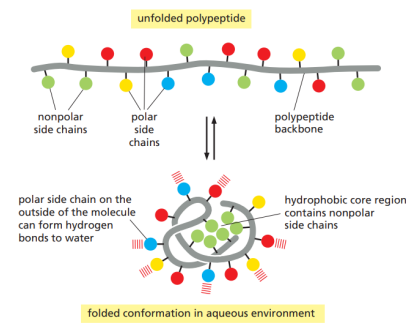
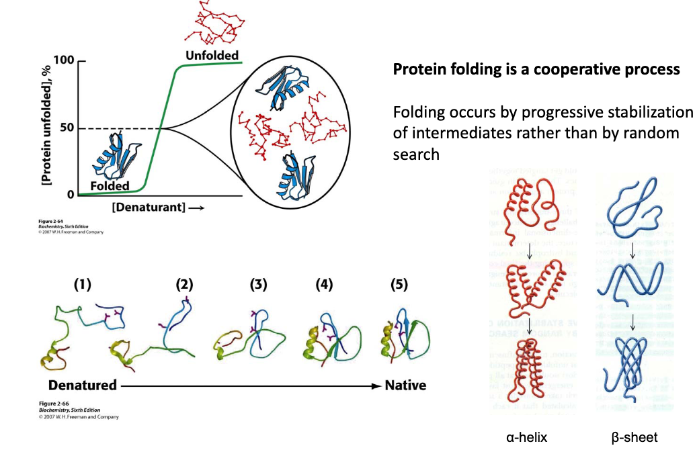
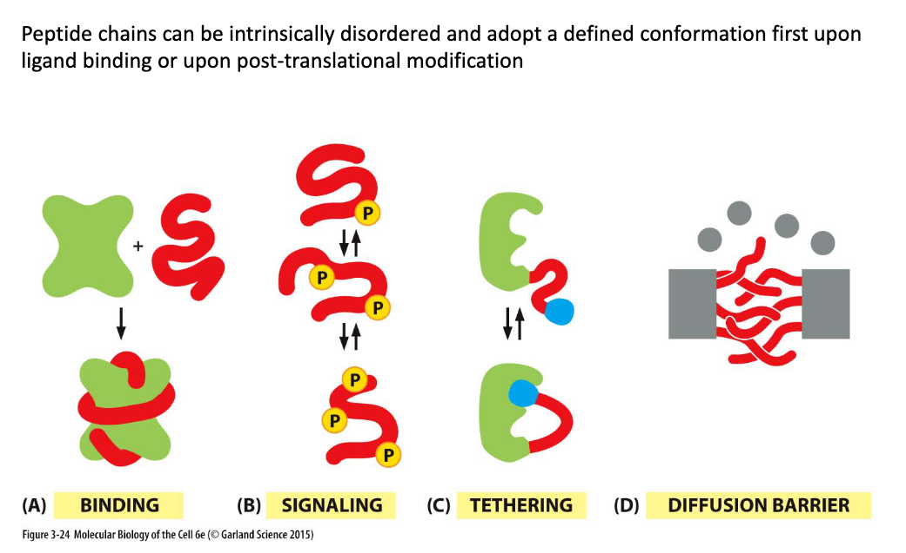
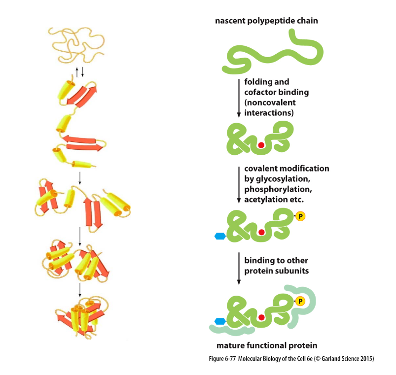
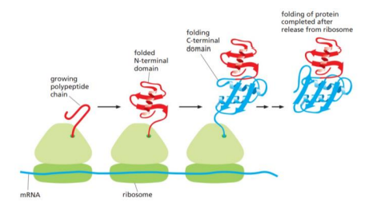
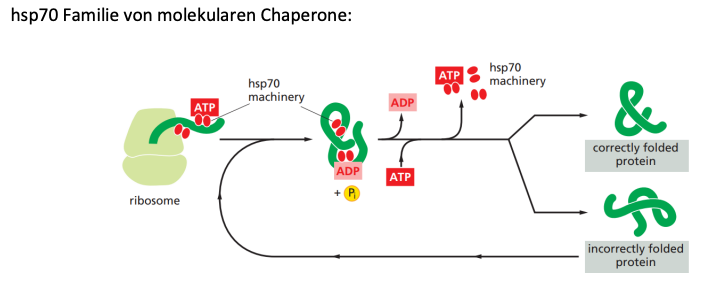
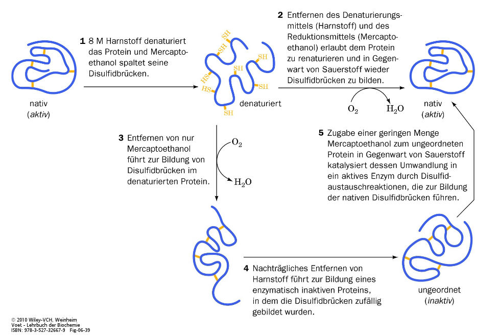

# Proteinfaltung

> Die Dreidimensionale Struktur eines Proteins ist definiert durch die Aminosäuresequenz

**Hydrophober Effekt**

+ Bei einem ungefaltenen Protein liegen hydrophobe Seitenketten vor diese lagern sich in das innere Zusammen
+ Hydrophile Seitenketten zeigen nach außen mit hydrophobem Kern

+ In der Zellmembran herrscht eine hydrophobe Umgebung vor
+ Transmembranproteine genau umgekehrt, müssen bei Translation direkt in die Zellmembran des ER einbebaut werden.

**Übliche Faltungsmuster**

+ Alpha Helix, Beta sheet durch Wasserstoffbrücken zwischen N-H und C=O
+ Coiled Coil: Miteinander umwundene $\alpha$-Helices

## How long does it take a protein to fold

Highlight **Levinthal's Paradox** 

**Protein Folding**

+ A 50 Amino Acid Protein can have $10^{60}$ non-native configurations
+ Assuming it takes $10^{-11} s$ to switch between configuration it would take $10^{49}$ s aka lot lot of years to search all configurations randomly

**Typing on a Typewriter**

> Yeah it takes less keystrokes if i cant use 56923054 and the other 100 random letters on the keyboard

> Proteins fold in a cooperative manner using stable intermediate structures which become retained during folding occurs in micro/milli seconds

+ Cofactors, glycosylation, phosphorylation, acetylation can help the folding

### Co Translationale Proteinfaltung

> Proteine werdem am ER translatiert und währenddessen in ER transportiert → im ER Proteinfaltung auch im Cytoplasma kommt es oft zur proteinfaltung

+ N Terminus Faltet sich zuerst während der C-Termminus noch synthetisiert wird

### Chaperone

> Chaperone helfen dass sich Proteine richtig falten können

+ viele verschiedene Typen von Chaperone, die alle nach dem gleichen Prinzip funktionieren

### Anfinsen Experiment Klappe die 2te

