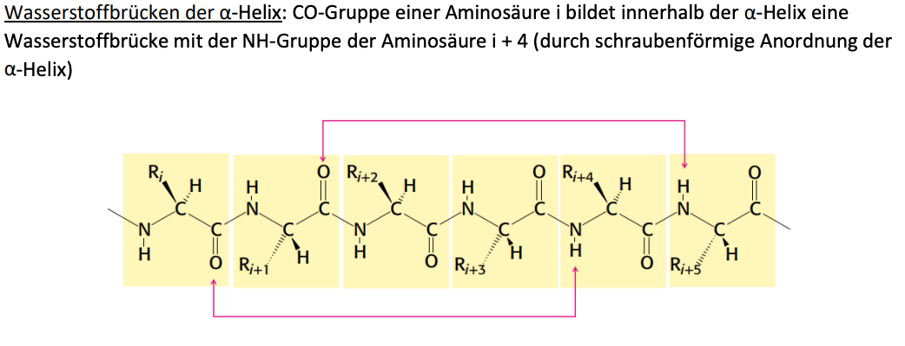
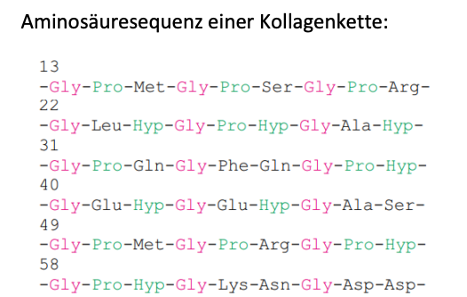
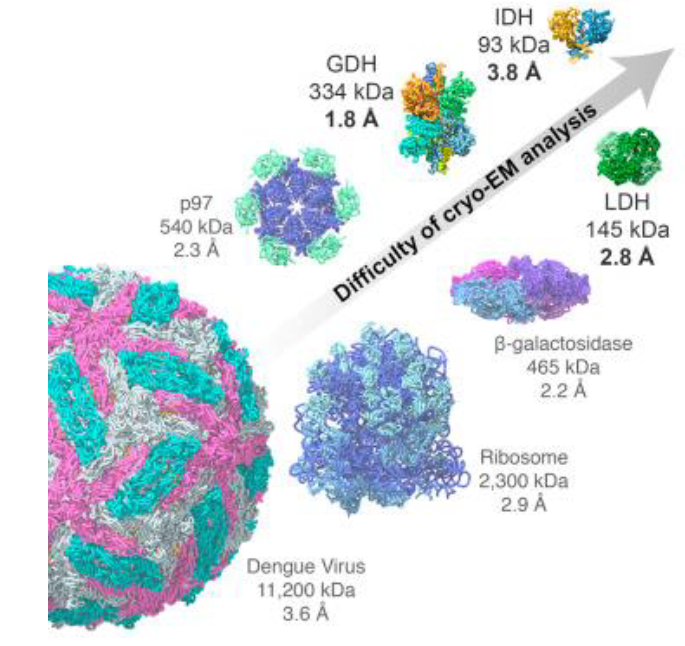
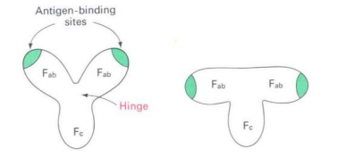
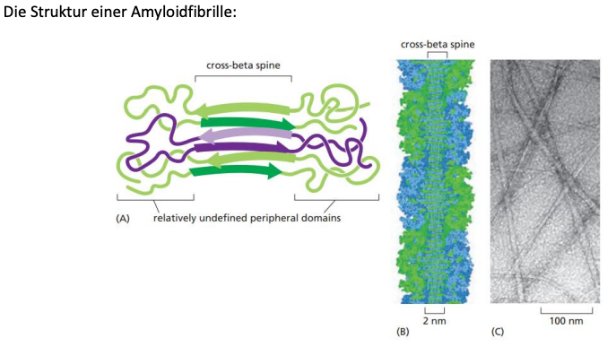
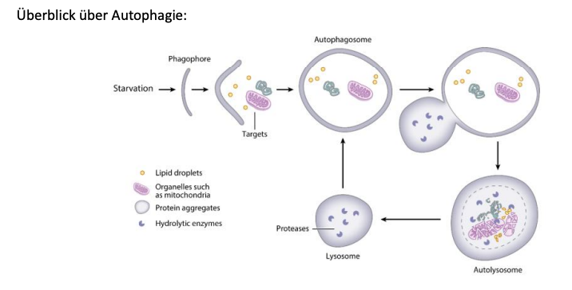

# Biochemistry Advanced

"It always seems impossible until it's done" - Nelson Mandela

# Chapter 2 Protein Konformation

> Abfolge der Aminosäuren in der (Primärstruktur) enthält die gesamte Information für die Tertiärstruktur

**Konstitution** Identität und Konnektivität der Atome; Menge und Art der Bindungen zwischen den Atomen des Moleküls

**Konfiguration** Räumliche Anordnung von Atomen eines Moleküls (Steriochemie)

**Konformation** Räumliche ANordnung der drehbaren Bindungen an den Kohlenstoffatomen

+ Peptidbindung is planar → sp2 substitution
+ Osszilliert zwischen einfach und doppelbindung

+ C-N Einfachbindung = 0.149 nm
+ C=N Doppelbindung = 0.127 nm
+ C-N Distanz im Peptid = 0.132 nm

## Geometrie der Peptidbindung

+ Trans beide $\alpha-C$ auf der entgegengesetzten Seite der Peptidbindung
+ CIs: beide $\alpha$ C auf der gleichen Seite der Peptidbindung

Nahezu alle Peptidbindungen sind trans konfiguration, aufgrund sterischer Kollisionen der Ketten, **AUSNAHME SCHEI? PROLIN**

## Sekundärstrukturen

### Alpha Helix

+ periodischer Aufbau, Schraubenförmige Anordnung, Seitenketten nach außen
+ von oben betrachtet ist Hohlraum sichtbrar
+ Jede Aminosäure hat Verschiebung von 0,15 nm entlang dfer Helixachse
+ Volle Umdrehung hat 3,6 Aminosäurereste
+ Ganghöhe der $\alpha$ Helix ist 0.54 nm
+ Helix kann links oder rechtsgängig sein, jedoch rechtsgägngig normal

**Ferritin** Eisenspeicherprtoein in ein Bündel von $\alpha$ Helices

**Coiled Coil** zwei oder mehere rechtsgängige $\alpha$ helices ineinander umwunden. Insgsamt dann linksgängige Superhelix

**Leucin-Zipper** In vielen DNA-Bindeproteinen, dient der Dimerisierung von Proteinen, jede siebte Aminosäure ist ein Leucin

### Kollagen-Tripelhelix

> Andere Aminosäuren zusammensetzuung jeder dritte Rest is Glycin, Prolin und Hydroxyprolin

+ Helicale Konformation
+ Helix wird durch sterische Abstoßung der Pyrrolidinringe der Prolin und Hydroxyprolinreste stabilisiert
+ INtermolekulare Wasserstoffbrückenbindungen zwischen den Strängen der Superhelix
+ Linksgängige Helices und Rechtsgängige Superhelix
+ Zu finden in Lederhaut und Bindegewebe
+ Elastin ist ein Strukturprotein im Bindegewebe das St

## Ramachandran Plot

Generell sind Valin, Threonin und Isoleucin durch Verzweigungen am $\beta$ Kohlenstoff schlecht für helices

# Chapter 3 Protein Structure Analysis

**Folgende Methoden stehen zur Proteinanalyse zur Verfügung:**

+ X-Ray
+ Small angle scattering Techniques (SAXS, SANS)
+ NMR
+ Electrone Microscopy
+ Mass Spec
+ IR Spectroscopy
+ CD Spectroscopy

## Atomic Resolution

+ < 1.7 A most atoms clearly seen
+ 1.7 - 2.2 A many atoms clearly seen
+ 2.2 - 2.8 A shapes of larger sidechains seen
+ 2.8 -3.5 A, Secondary structure + bulky groups atoms unclear

> In general atomic resolution is in the range of 1.5-1.7 A the median in the PDB is 2.05 A

## Principle of X-Ray Diffraction:

+ X-Ray Source: Electons are accelerated in an electron synchrotron. They collide with a copper anode releasing monochromatic X-Rays
+ X-Ray Diffraction: Some X-Rays go through the Crystal, while the rest is scattered, scattering is based on an interaction with electrons which are excited. Are then emitted in all direcitons
+ Wavelength of X-Rays is comparable to the bond
+ Intensity of Radiation I is proportional to the square of the wave amplitude $I \sim F^2$
+ Optical recombination of the X-RAYS is not possible, but diffracted rays can be mathematically recombined by Fourier synthesis
+ Miller Indices represent the reciprocal atomic coordinates in the crystal lattice
+ X-Rays are scattered by electron shells of atoms show 3D electron distributions from which one can infer the atomic coordinates

> The resolution in general is determined by the number of scattered intensities that entered the Fourier synthesis

## NMR Spectroscopy

> Magnetically active nuclei are measured in a homogeneous magnetic field, the energy levels of the nuclear spin split into several states. The energy required for this depends, among other things on the chemical enviroment of the nucleus

**Indirect or scalar spin-spin coupling:** Magnetic interactions are transfered via the electrons involed in the bonds

+ Homonuclear coupling is between protons, heteronuclear coupling between proton and acceptor

### Karplus Relation

> The strength of the coupling constant depends on the torsion angle between the two protons, which is described by the semi-empirical "Karplus" relationship. This makes it possible to derive the geometry of the molecules from the values of J

### 2D NMR Spectroscopy

+ Spins can process freely for a fiex time (t1) after the preparation
+ Magnetization is marked together with the chemical shift of the first nucleus
+ Mixing period: Detection of magnetization, transfer of magnetization onto other nucleus (hetero / homonuclear)
+ (t2) data acquisition

**COSY** Correlation Spectroscopy where similar nuclei are correletaed with different nuclei, you can see protons with 2-3 bonds distance

**TOCSY** Magnetisation is distributed over the entire spin system → all protons correlate with each other

**Nuclear Overhauser Enhancement Spectroscopy:** Essential for structure determination → important information to solve protein structures by NMR

+ Interaction between coupling dipoles which are transmitted through space
+ Signal strengh is propotional to $1/r^6$
+ Usually observed over a distance < 5A

## Cryo EM

> Median Achieved by Cryo EM is 3-4 A, there are experiments which have been recorded at 1.22 A

# Chapter 4 Allosteric Proteins

**Allosterie** Ligand interagiert mit Protein es kommt zu einer Konformationsänderung bei Bindung eines Liganden, Protein wird aktiver oder Inaktiver .

## Sauerstoffbindende Proteine

### Myoglobin

+ Muskelprotein
+ besteht nur aus einer Polypeptidkette und prosthetischer Gruppe (Häm und Eisen)
+ Kein allosterisches Protein

#### Bindung von Sauerstoff durch Myoglobin

+ Eine nicht kooperative Bindung
+ Sauerstoffbindungskurve zeigt hyperbolischen Verlauf
+ Hohe Affinität zu Myoglobin, halbsättigung bei $P_{50}$

### Hämoglobin

+ Besitzt vier Untereinheiten ud Prosthetische Hämgruppe
+ Bindet den Sauerstoff und übernimmt den Transport im Blutkreislauf
+ Zwei Formen T-Form → gespannte Form; R-FOrm → relaxierte Form ohne Hohlraum

### Sauerstoffbindung vergleich Myoglobin und Hämoglobin

+ Hämoglobin hat kooperative Bindung und einen Sigmaoidalen Kurvenverlauf
+ Halbsättigung bei 256 Torr

Der Hill Plot kann verwendet werden um den Kooperationsgrad der Bindung zu bestimmen. Hier können kooperative Effekte direkt beobachtet werden.

+ Myoglobin n = 1 (nicht kooperativ nur eine Bindungstelle)
+ Hämoglobin n= 1 keine kooperation, n=4 Maximale kooperatin

> Die Sauerstoffbindung an Myoglobin führt zu einer Veränderung der Konformation von T- zur R-Form

+ T-Form wird von Salzbrücken von pehirpheren Molekülresten stabilisiert
+ Sauerstoff wird in der R form Besser gebunden → Kooperativer effekt

**2,3-Bisphosphoglycerat in den Erythrozyten ist entscheident für die Sauerstoffafinität von Hymoglobin**

+ Ein Metabolit aus der Glykolyse
+ Hat hohe negative Ladungsdichte und interagiert stark mit der T-Form
+ Effiziente Funktion von Hämoglobin → T-Form muss bis zur Sauerstoffbindung stabil bleiben dadurch wird die T-FOrm durch 2,3-BPG stabilisiert
+ Für den Übergang von T nach R muss die Bindung zwischen Hämoglobin und 2,3 BPG gelöst werden ,mehr Sauerstoffbindungstellen müssen dazu besetzt sein → Hämoglobin bleibt in T form bis höhere Sauerstoffkonzentrationen erreicht sind

**Fetales Hämoglobin hat zwei $\alpha$ keteen und zwei $\gamma$ Ketten die Affinität von fetalem Hämoglobin für 2,3 BPG reduziert → Sauerstoffbindungsaffinität hoher effektiver Übertrag von Mutter auf Fötus**

### Auswirkung des pH Wertes

Unterschiedliche pH Werte in Lunge und Gewebe, höhere Protonenkonzentrationen in Gewebe durch Stoffwechselprodukt

+ Protonen wirken negativ auf die Bindungsaffinität von Hämoglobin --> Saurer pH bewirkt das $O_2$ leichter dissoziert wird
+ Sauerstoff wird in Muskelzellen für aeroben Stoffwechsel benötigt

**Funktion von $CO_2$** Entsteht bei aerober Verwertung von Glucose, wird als $H_2CO_3$ von periphären Gewebe zur Lunge Transportiert, bindet an Hämoglobin und setzt Affinität herab

**Summe an Allosterischen Effektoren für Hämoglobin**
+ Sauestoffbindung → Partialdruck
+ Protonenkonzentration → niedriger pH schlechtere Affinität
+ Kohlendioxid → Mehr CO2 schlechtere Affinität
+ 2,3 BPG → Schlechtere Bindung zu Sauerstoff

**Bohr Effekt** Regulation der Sauerstoffbindung durch $H^+$ und $CO_2$. Affinität wird gesenkt wenn pH wert sinkt oder $CO_2$ konzentration steigt

In Lunge wird Sauerstoff kooperativ Aufgenommen in Gewebe abgegeben

## Moglichkeiten zur Regulation der Enzymaktivität

+ Allosterische Kontrolle → Regulatorische Stellen steuern die Aktivität der Proteine → ATCase als Beispiel
+ Verschiedene Enzymformen (Isoenzyme) → Lactatdehydrogenase
+ Reversible Covalente Modifikation – Histone oder Glykogenabbau (Glykogenphosphorylase)
+ Proteolytische Aktivierung → Zymogene, Verdauungsenzyme
+ Regulation der vorhandenen Enzymmengen → Latose Operaon in Bakterien

## ATCase

**Herstellung von Nucleotiden mit De-novo oder Salvage Pathways**

**Reaktion der Aspartat Transcarbamoylase**

+ ATCase wird durch CTP allosterisch gehemmt
+ Endprodukt hemmt die Schlüsselreaktion um zu verhidnern das energieaufwendige Reaktionsweg unnötig weiter eingeschlagen wird

+ Cysteinrest ist Bestandteil einer Proteindomäne die Zinkionen binden kann → Regulatorische Domäne (r-Kette) binden Zink
+ Wird Cystein blockiert so kann Zink nicht mehr binden → keine Interaktion mit katalytischer Domäne
+ CTP bindet an regulatorische DOmäne → Konformationsänderung zwischen R und T Form

+ T-Form → weniger Aktiv wird durch CTP Bindung begünstigt
+ R-Form → Aktiv wird durch Substratbindung begünstigt

  

# Chapter 6 Enzymatic Catalysis

Generelle Möglichkeiten die enzymatische Aktivität zu regulieren

+ Allosterische Regulation
+ Verschiedene Enzymformen
+ Reversible kovalente Modifikation
+ Proteolytische Aktivierung
+ Regulation der vorhandenen Enzymmenge

## Covalente Modifikationen

Wichtige Beispiele

+ Phosphorylierung bei Glykogen Phosphorylase wird benötigt um Glucose freizusetzen
+ Acetylierung bei Histone, beispielsweise Lysine wird Acetyliert → Chromatin wird aufgelockert
+ Myristylierung bei Src

### Beispiele für Serin und Threoninkinasen 

+ Proteinkinase C bei Zellproliferation → Phosphoryliert weitere Proteine
+ Calmodulin: Ein Protein, das als Calciumsensor bezeichnet wird → Aktiviert Calmodulinabhängige Proteinkinase

> Calmodulin ist sehr konserviert und besteht aus 148 Aminosäuren., und einer Polypeptidkette mit zwei identischen Einheiten.

**Ablauf**

1. 4 $Ca^{2+}$ Ionen zugegeben, pro Einheit werden zwei komplexiert pro Enheit
2. Strukturveränderung von Calmodulin
3. Ermöglicht das Calmodulin-abhängige Proteinkinase bindet
4. Phosphorylierung kann in die Wege geleitet werden

**EF-HAND**

Klassische Struktur aus zwei $\alpha$-Helices und einem kurzen $\beta$ Faltblatt. Calciumion wird koordinativ an Aminosäure und ein Wasser gebunden

## Wechselwirkung zwischen Enzym und Substrat

Zwei bekannte Mechanismen:

**Schlüssel-Schloss-Modell**

**Modell des Induced Fit**

## Übersicht über die Enzymklassen

## Michaelis Menten Kinetik

> Reaktionsgeschwindigkeit der meisten enzymatischen Reaktion hängt von der Substratkonzentration ab

**Allosterische Enzyme gehorchen nicht der Michaelis Menten Kinetik sondern haben einen sigmaoidalen Kurvenverlauf**

## Fundamentale Katalytische Mechanismen

1. Covalente Katalyse (zb Chymotrypsin): Aktives Zentrum hat eine Reaktive Nukleophile Gruppe
2. Säure-Basen Katalyse: Nucleophiler Charakter einer Gruppe wird erhöht
3. Katalyse durch Räumliche Annäherung
4. Katalyse durch Metallionen (Carboanhydrase mit Zn2+)

## Proteasen

> Proteasen haben die Aufgabe Peptidbindungen zu spalten

**Spaltung durch Trypsin und Thrombine**

### Zymogene

> Zmogene sind inaktive Vorstufen von Enzymen → Diese werden nach Proteolytischen Spaltung zum aktiven Enzym

+ Die Aktiven Formen dieser jeweiligen Verdauungsenzyme werden meist in der Bauchspeicheldrüse (Pankreas) hergestellt
+ Dannach werden diese in den Dünndarm sezeniert

### Serinprotasen

#### Proteolytische Aktivierung von Chymotrypsinogen:

+ Trpsin spalten 245 Aminosäuren Peptid Chymotrypsinogen
+ Spaltet zwischen Arginin 15 und Isoleucin 16
+ $\pi$-Chymotrypsin wirkt hydrolytisch auf anderes $\pi$ Chymotrypsin ein
+ Es kommt zur aktiven Form mit drei Polypeptidketten

**Struktur von Chymotrypsin**

> Besteht aus 3 Polypeptidkettten (orange, blau, grün) die über Disulfidbrücken zusammengehalten werden

**Katalytische Triade in Trypsin**

Serin ist nicht allein sonder im Kontekt von drei anderen Aminosäuren über H-Brücken miteinander verbunden. Serin hat hohen pKA es ist also schwer ein Proton zu abstrahieren → Schwach Azide

Es gibt in Chymotrypsin eine Oxianiontasche welche das Tetraedrische Zwischenprodukt stabilisiert.

+ Chymotrypsin hat eine tiefe hydrophobe Bindungstasche, es können also nur hydrophobe Aminosäuren mit langen Ketten beispielsweise Phenylalanin binden

**Unterschiede zwischen Chymotrypsin, Trypsin und Elastase**

+ Trypsin spaltet Arginin und Lysin hat negative Ladung in Bindungstasche
+ Elastase spaltet Alanin und Serin hat Valin in der Bindungstasche

### Cysteinprotease

> Diese haben einen Cysteinrest im aktiven Zentrum aktiviert durch Histidin wirkt als Nukleophil

**Bekannte Beispiele**

+ Papain
+ Cathepsine (im  Immunsystem)
+ Caspasen (bei der Apoptose)

### Aspartylproteasen

> Saure Proteasen da sie ein Paar von Aspartatreste im aktiven Zentrum haben

**Bekannte Beispiele**

+ Renin (Blutdruckregulation)
+ Pepsin (liegt im Magen bie sehr saurer Umgebung)
+ HIV Protase (Besteht aus zwei identischen Monomeren mit je 99 Aminosäuren)

#### Indavir als Inhibitor der HIV-Protease

Ist ein Strukturanalogon und passt in die Bindungstasche → Inhibitor wird nicht gespalten und blockiert so das katalytische Zentrum

### Metalloproteasen

> Besitzen Metallionen im katalytischen Zentrum

**Bekannte Beispiele**

+ Thermolysin (in Bakterien)
+ Carboxypeptidase → Spaltet C-terminale Amminosäuren
+ Collagenase → hydrolysiert Kollagen
+ Angiotensin Coverting Enzyme

**Reaktion der Carboxypeptidase**

+ Spaltet C-terminalen Rest
+ Vorraussetzung aromatische oder voluminöse Seitenkette
+ Polpypetidkette mit 307 Aminosäuren
+ Zink Ion im aktiven Zentrum

##  Carboanhydrase

Eine Lyase welche eine Molekülspaltung induziert. Es kommt zur Hydratisierung von $CO_2$ zu Kohlensäure mit Zn-Ion im aktiven Zentrum

Reaktion $CO_2 + H_2O \to H_2CO_3 \to HCO_3 + H^+$ 

**Auswirkung des pH-Wertes auf die Aktivität der Carboanhydrase**

> Sehr effizientes Enzym mit hohen Turn-Over Wert, jedoch maximale Aktivität bei hohen pH Wert

## Glycosidasen

Sind Lysozyme welche glycosidische Bindungen spaltet. Das Lysozyme hat die Möglichkeit Zucker welche in der $\beta$ Konformation sind zu spalten.

+ Bakterien haben eine Zellwand welche mechanische Stabilität gibvt
+ Hoher osmotischer Druck ohne Zellwand platzen Zellen
+ Antibiotika greifen die Zellwand an
+ Penicilin hemmt die Zellwandsynthese
+ Lysozym kann die bestehende Zellwand abbauen

**Lysozyme spalte wenn NAM links und NAG rechts ist!**

**Glutamat 35 und Aspartat 52 sind für die Spaltung verantwortlich es kommt zu einer azidischen Katalyse, Glutamat überträgt ein Proton es entsteht ein Carbokation-Intermediat**

## Nukleasen

> Ein Enzym das die Phosphordiesterbindung zwischen Nukleotiden von Nukleinsäuren spalten kann → Hydrolyse wird durch Nukleasen katalysiert

### Ribonukleasen

RNase ist ein Verdauungsenzym besteht aus 124 Aminosäuren → relativ klein und sehr stabil

**OH Gruppe an 2' wird benötgit um ein Phosphat mit Pentakovalenten Übergangszustand auszubilden. Die RNase spaltet immer nach Pyrimidinresten, keine Purine**

+ pH Optimum ist hier 7 liegt ein Histidin im aktiven Zentrum

### Restriktionsenzyme

**Katalysieren hochspezifische Spaltungsreaktionen der DNA → Sequenzspezifsch**

+ Im Immunsystem von Bakterien sehr wichtig
+ Bakteriophagen → Restriktionsenzyme erkennen und schneiden
+ Alle haben $Mg^{2+}$ im aktiven Zentrum

# Chapter 7 Immunproteins

**Immunsystem Bakterien:** Restriktionsenzyme agieren als Immunsystem → Hemmen / Schneiden fremde Moleküle

**Immunsystem von Wirbeltiere:** Produktion eines Rezeptorsystems für Pathogene und unterscheidung zwischen Körpereigen / Körperfremd

**Angeborenes Immmmunsystem** äußere Abwehrschicht gegen Krankheitszellen beispielsweise die Haut.

**Adaptives Immunsystem:** Schutz vor Bakterien, Viren, Pilzen, Parasiten die alle potenzielle Krankheitserrger sind

+ Humorale Immunantwort: Lösliche Porteine (Antikörper) als Erkennungselement → binden an körperfremde Moleküle → Kennzeichnung

+ Zelluläre Immunantwort: Cytotoxische T-Lymphocyten zerstören Zellen die von Krankheitserrger befallen sind

**Leucocyten** weiße Blutzellen sind im Blut, Knochenmark und den lymphatischen Organe zu finden.

**Selektionsprinzip** Für jede mögliche antigene Determinante exestiert in der frühen Entwicklung eine B-Zelle die den Antikörper produzieren kann.

## Angeborenes Immunsystem

> Phygozyten sind speziallisierte Zellen die ohne Unterstüzung durch das adaptive System Krankheitserreger aufnehmen und zerstören können

+ Beispiel TOLL-LIKE Rezeptoren, erkennen Pathogenassozierte molekulare Muster (PAMPs)

## Struktur des Antikörpers:

+ 4 Polypeptidketten: 2 schwere und 2 leichte mit intra und intermolekularen Disulfidbrücken
+ C → Konstante Domäne, sehr konserviert
+ V → Variable Domäne, Antikörper unterscheiden sich hier
+ An den Aminotermini finden interaktionen statt.
+ Antikörper kann an den Disulfidbrücken der Heavy chain gespalten werden in 3 Fragmente

### Flexibilität der Antigen-Bindestelle

+ Zwei Binding-Sites, nach Kontakt mit Antigen können sich Präzipitate bilden
+ Carboxyl-Terminus ist Effektor Domäne $F_c$ welche das Komplement aktiviert

  

  + Erste Immunisierung und IgM als ersten Antikörper
  + Nach einer Woche IgG
  + Nach vier WOchen erneuter Antigen boost

### Lymphatische Organe des Menschen

+ Vorläuferzellen der Lymphozyten entwickeln sich in Thymus und Knochenmark
+ Zentral: Thymus Knochenmark
+ Peripher: Milz, Blinddarm, Regionen im Dünndarm, Lymphknoten

### Struktur von Immunoglobulin G

+ Zwei Leichte und schwere Ketten über Disulfidbrücken miteinander verbunden
+ Durch Papain kommt es zur Spaltung in drei gleich große Bruchstücke
+ Zwei $F_{ab}$ Fragmente → Besitzen Antigen Bindungstelle → Können Antigen immer noch binden
+ $F_c$-Fragment (nur aus schweren Gruppe) → kann Antigen nicht binden
+ Verbindung Hinge Domäne flexibel, Arme können sich bewegen
+ Quervernetzung von Antigenmolekülen möglich

**Zum Immunoglobulin-Fold**

+ Besteht aus zwei $\beta$ Faltblätter sind durch Disulfidbrüccken und hydrophoben Wechselwirkungen verknüpft

**Interaktion mit Antigen**

+ Durch Elektrostatische Wechselwirkung
+ Durch H-Bindungen
+ Durch Van-Der Waals interaktionen

## Immunoglobulinklassen

### Funktionen

+ IgM: Erste Antikörperklasse, die nach dem Kontakt mit Antigen im Serum auftaucht, Zehn Bindungstellen kann gut Antigene mit gleichartigen Epitopen binden
+ IgG Primärer Antikörper im Blutserum, IgG aktiviert Komplement
+ IgA: Antiköper in äußeren Sektreten wie Speichel, Tränen und dem Schleim von Bronchien und Darm. Erste Verteilidungslinie
+ IgE: Bedeutung für Parasiten, Verursacht allergische Reaktionen da es Querverbindungen und Kaskaden bildet zur Histaminausschüttung
+ IgD: Unbekannt

### DNA Replikation führt zu Diversität

+ Embryonale Zelle hat Gene die die Variable und Konstante Region codieren
+ Werden Fusioniert
+ Erhöhung der Möglichkeiten durch Joining Segmente → Gene können mit jeden der 5 J-Segmente für die Leichte Kette verknüpft werden

1. Transkription
2. Spleißen der verschiedenen Sequenzen
3. Translation und Prouzessierung

> Kombinatorische Verknüpfung unterschiedlicher DNA Regionen führt zu mehreren Protein kodierenden Regionen

## Humorale Antwort

> Beim ersten Kontakt mit Antigen kommt IgM verankert in B-Zelle. Das Antigen bindet an die Variable und es kommt zur Signalweiterleitung Co-Rezeptoren Ig-alpha / Ig-beta diese haben Itam regionen → Phosphorylierung und Antiköper werden gebilet.

### Aufbau des B-Zell-Rezeptors

+ IgM NICHT KOVALENT an zwei Ig$\alpha /\beta$ Heterodimeren Verknüpft
+ ITAM = Immunrezeptor Tyrosin-basiertes Aktivierungsmotiv

 
 

Bindung eines Antigens → IgM werden gekoppelt und ITAM-Sequenzen werden durch Tryosinkinasen wie Lyn Aktiviert. Nun kann Syk eine Proteinkinase binden → Phosphoryliert zb IkB welches Inhibitor von NFkB ist und IgG wird produziert

## Zelluläre Immunantwort

**Problem**

Zb Mycobakterien können Krankheiten wir Lebra und Tuberkolose auslösen → Befallene Zellen müssen identifizierbar sein

### MHC (Major Histocompatibility Comples)

+ MHC Rezeptoren befinden sich an Oberfläche von Target Zell
+ T-Killerzelle hat T-Cell Rezeptoren welche die Oberfläche von Target Zell Scannen
+ MHC Präsentieren Proteine und es kommt zur Komplexierung mit T-Zelle und dann zur LYse
+ T-Zell-Rezeptor ist ein Antikörperähliches Molekül, an der Zellmembran gebunden

### Ablauf einer Präsentation durch MHC I

+ Proteine werden Abgebaut und Fragmente an den MHC präsentiert
+ T-Zelle bilden dann Komplexe aus und Sichtbar für Immunsystem

### Aufbau MHC I

+ Zwei Untereinheiten $\alpha_1,\alpha_2$ und Immunoglobulindomäne.
+ Transmembrandomäne und Cytoplasmischer Schwanz

### T-Zell-Rezeptor

+ Auf der Oberfläche von T-Zellen
+ Erkennt MHC-I mit Peptid
+ Struktur ähnlich zu Antikörper aber in Membran verankert. $\alpha,\beta$ kette durch Disulfidbrücken verknüpft, bilden Immunoglobulin Fold

### Corezeptor CD8

+ Ragt aus der Oberfläche einer cytotoxischen Zelle
+ Protein Protein Interaktion mit MHC Klasse I

### Aktivierung einer T-Zelle

+ CD8 bindet an Protein → Lck (Proteintyrosinkinase) wird hinzugezogen
+ Tyrosinreste in den ITAM werden Phorsphoryliert
+ Nach der Phosphorylierung ZAP70
+ Phosphoryliert weitere Proteine

**Phosphorylierung in den CD3 Ketten führt zur Freisetzung von Perforin (70kDA) Protein und Granzymen → Destabilisieren die Zellmembran**

### T-Helferzelle

> nach Stimulierung der T-Helferzellen werden Peptidhormone (Interleukine, Interferone) sezeniert → Diese führen zur Proliferation von spezifischen B-Zellen, stellen lösliche Antikörper her.

Hierzu wird der Corezeptor CD4 benötigt, eine Polypeptidkette mit Immunglobulin Fold besteht aus 4 Domänen

#### Aktivität der T-Helferzelle

+ Gleich wie bei T-Zelle, CD4 Interagiert mit MHCII Protein
+ Lyk wird verwendet um die ITAM Sequenzen zu Phosphorylieren
+ Es kommt zur Bindung von ZAP70
+ Signalweiterleitung und Cytokinin auschüttung → Cytokinrezeptor an der Oberfläche der Zelle
+ Führt zur Zellvermehrung. und bei den B Zellen zur Antiköperproduktion

## Medikamente zur Immunsupression

**Cyclosporin A** Natürliche Verbindung aus Pilz, hemmt die Calcineurinphosphatase welche normalerweise den Transkiptionsfaktor NF-AT aktiviert. Das führt zu einer Hemmung der Interleukin 2 freisetzung aus T-Helferzellen, damit supprimierung der T Killerzellen

**HIV Human Immunodeficiency Virus**

Virus hat zwei Proteinhüllen, das Virion ist von Glykoproteinmembran umgeben → Helfer T-Zellen sind spezifische Wirtszellen für HIV. gp120 interagiert mit CD4 für den Zelleintritt

Infizierte Zelle wird lysiert führt zu Schwächung des Immunsystems

+ Retroviren = RNA Viren
+ RNA wurd durch Reverse Transkriptase → cDNA diese kann mit Wirtszellengenom interagieren
+ Vermehrung durch Wirtszelle

## Krebs

> Krebszelle wird normalerweise vom Immunsystem eliminiert, diese haben nun Mechanismen entwickelt um die Immunantwort zu umgehen.

+ Krebszelle liegt vor → Dendritische Zellen der abgeborenen Immunantwort können Krebszelle verdauen → können charakteristische Eiweiße auf der Oberfläche präsentieren

# Chapter 8 Proteinfaltung

## Anfinsen Experiment (Sequenz-Struktur Beziehung)

> Die Faltung des Proteins ist in der Sequenz codiert

Entfaltung und Reduktion führt zu Denaturierung:
+ Harnstoff und Guanidiniumchlorid stören die Van der Waals Interaktionen
+ $\beta$-Mercaptoethanol führt zur Reduktion von Disulfidbindungen

+ Native Protein → 8M Urea + mercaptoethanol → Denatured and Reduced
+ Denatured reduced → 8M urea and oxygen → Disulfide Bonds random
+ Scrambled → trace mercaptoethanol → Native conformation
+ Denatured → Dialysis + Oxygen → Native state

## Faltung als gerichteter kooperativer Prozess

+ $\alpha$-Helices: Ala, Glu, Leu
+ $\beta$ Sheets: Val, Ile
+ turns: Gly, Asp, Pro

**Levinthal Paradox**

Wie lange braucht ein Protein um sich zu falten?

+ 60 Aminosäuren → $10^{60}$ Konformationen dauert ewig
+ Proteine können ohne uneinvorgenommene Suche im Konfigurationsraum nicht falten
+ Nukelations-Kondensationsmodell: Faltung erfolgt über Zwischenzustände welche nicht beobachtet werden da die Porteinfaltung zu schnell ist

**Faltungstrichter**

Am oberen Ende alle möglichen denaturierten Konformationen, die Konformationsentropie ist also am höchsten. Minima stehen für semistabile Zwischenprodukte, welche abhängig von der Tiefe in gewisser Wahrscheinlichkeit auftreten.

**Einige Möglichkeiten zur Richtigen Proteinfaltung**

### Zirkulärdichroismus Spektroskopie

+ Licht kann links- oder rechtszirkular polarisiert sein (elektrische Feldstärke dreht sich im Uhrzeigersinn oder gegen den Uhrzeigersin)
+ Chirale Moleküle absobieren rechts / links polarisiertes Licht unterschiedlich stark
+ Es kommt zur elliptischen Polarisation
+ Je nach Konformation des Proteins werden unterschiedliche Strukturen und Konformationen im Protein aufgezeigt.

## Chaperone

+ Proteine werden im ER transliert und der N-Terminus kann sich bereits falten auch wenn der C-Terminus noch synthetisiert wird

> Chaperone helfen Proteinen sich richtig zu falten, es gibt verschiedene Typen

+ In wässriger Lösung → hydrophobe Reste nach innen
+ Chaperone erkennen hydrophobe Stellen und binden an diese, durch ATP wird das Protein entfaltet
+ Kann sich dann neu Falten → oft viele Zyklen

**Beispiel hsp60** Ein Fassförmiges Chaperon

+  Haben hydrophile Aminosäuren im Inneren, hydrophobe Aminosäuren an der Eingangstelle
+ Eingangstelle bindet und leitet Proteine ins innere
+ Die GroEs Cap geht rauf, Protein entfaltet sich und es kommt zur neufaltung

**Hsp70 kann während der Translation erkennen, HSP60 erst dannach**

### Mitochondrial proteins

> Mitochondrial prtoeins have N-terminasl sequenzy which guides the proteins into the four possible locations in the mitochondrium: outer membrane, inner membrane, intermembrane space and matrix

+ Signal sequence is rich in serine and thereonines
+ Import is assisted by chaperones (cytosolic and mitochondrial) which prevent aggregeation and unfold the portein

### Calnexin Chaperon

+ In the ER Lumen, glucose is trimmed
+ Calnexix binds to GP with additional glucose residue, the absence of this signal mean that GP is fully folded and ready for the export into the golgy
+ Is part of the quality control system

## Protein Structure assembly

> Proteine haben modulare Natur, sprich einige Proteindomänen sind in verschiedenen Proteinen enthalten.

+ WIchtig sind Immunoglobolin Modul
+ Fibronectin Type 3
+ Kringle Module

### Helikale Filamente

Einige globuläre Proteine bildfen lange Spiralförmige Filamente

+ Beispiel hierzu wäre Actin mit Plus und Minus ende

## Neurodegenerative Diseases

> Intrinisch ungeordnete Regionen können Konformationen übernehmen und veranlassen → Neurodegenerative Erkrankungen

+ $\beta$-Amyloid hat eine wiederholende Sequenz → Formation eines $\beta$ Faltblattes in einem  → Stapel von $\beta$ Faltblättern

**Prion-Erkrankungen**

Kreutzfeld Jacob, Rinderwahn

+ Werden durch fehlgefaltene Proteine übertragen

+ 

# Chapter 9 Protein Degradation

Zweck:

+ Abbau von degenerierten Proteinen (Misfold, Beschädigt)
+ Regulation (Hemmt die Aktivität eines Porteins, Zellstress)

Proteine können entweder von Start an richtig gefalten vorliegen oder durch Chaperone richtig gefalten werden. Ist das Chaperon hier nicht erfolgreich wird das Protein durch das Proteasom verdaut.

**Protein Aggregation**

hydrophobe Stellen außen können mit anderen hydrophoben Stellen Aggregate bilden

> Wichtig: Protein Biosynthese und Protein Degradation sind physiologische Prozesse welche benötigt werden für Homeostase. Proteine können sich substanziell in der Halbwertszeit unterscheiden

**Degron**

Ein Degron ist eine spezifische Aminosäurensequenz, welche angiebt das ein Protein abgebaut gehört. 

## Ubiquitine System

> Lysinereste in Proteinen welche zum Abbau bereit stehen werden covalent an Ubiquitin verbunden mittels C-terminus. Es bildet sich eine Isopeptidbindung. Mittels Lys 48 auf Ubiquitin können weitere Reste angebaut werden

### Ubiquitine Ligationssystem

+ E1 = Ubiquitin aktivierendes Enzym
+ E2 = Ubiquitin Konjugationsenzym
+ E3 = Ubiquitin Ligase

**Ablauf**

1. Ubiquitin wird durch ATP auf E1 übertragen
2. Konformationsänderung und Additon von E2
3. Ubiquitin wird von E1 auf E2 übertragen
4. E2 und E3 formen Komplex und Aminosäure mit Degron Signal bindet
5. E3 hat Funktion als Ubiquitine Ligase und überträgt auf Lysine Seitenkette
6. Weitere Ubiquitine werden an Lys 48 angehängt

**Aktivierung des Systems**

+ Aktivierung des E2/E3 Komplexes durch Phosphorylierung, Allosterische Modifikation und Allosterische Transition
+ Aktvierung des Degradationsignal durch Phosphorylierng, Verlust einer Kappe, oder Abfall eines N-Terminus

## Das Proteasome

> Proteasome sind Proteinkomplexe die nicht benötigte oder beschädigte Proteine durch Proteolyse abbauen, eine chemische Reaktion bei der Peptidbindungen aufgebrochen werden → Proteasen

Besteht aus 28 homologen Untereinheiten zu vier Ringen aus 7 Untereinheiten angeordnet. **$\beta$-Untereinheit besittz N-terminales Threonin → Dient als Nucleophil**

**Ablauf**

1. Proteine mit angehefteten Ubiquitin werden zu Peptidfragmenten verarbietet
2. Ubiquitine wird wieder entfernt und wiederverwendet.
3. Peptidfragmente werden zu Aminisäuren abgebaut durch Proteolyse
4. Weiterverwertung im Metabolismus

Generell erkennt die Proteasomkappe welche Proteine zum Abbau bereitstehen und schleust diese in den Proteasomkern

Im frühen Stadium wird Polyubiquitine abgespalten in. Die Translokation in den Proteasomkern wird mit Ring und ATPasen vermittelt

## Gängige Proteasominhibitoren

**Bortezomib** ist ein proteasome inhibitor und wird für Melanomtherapie eingesetzt. **HT1171** ist ein suizid inhibitor für die proteolytische Aktivität.

## Autophagy

> Membranbasietes Abbausystem, welches Situationen in der Zelle erkennt und katabolisch Makromoleküle und Organellen abbaut

**Ablauf → 4 Stufiger Prozess**

1. Einleitung
2. Bildung von Autophagosome, Material ist in Membranabschnitt eingeschlossen
3. Lieferung an die Lysosome (Andocken und Verschmelzen des AUtophagosomes mit den Lysosomen)
4. Auflösung der inneren Membran und Freisetzung des lysosomalen Inhalts

# Chapter 10 Protein Function

Overview ATP driven-movment:

1. muscle contration (myosin and actin)
2. cicila and flagella movement (dynein-tubulin interaction)
3. microtubuli (chromosome movement, movement of intracellular vesicles and organells caused by kinsin)

> Binding and hydrolysis of ATP lead to conformational changes of myosin, dynein or kinesin. Chemical energy is converted into mechanical energy

## Muscle Contration

> Nerve impuls leads to acetylcholine release from synamptic vesicles. Acetylcholine interacts with nicotinic receptors leading to excitation of muscle cells. Calcium ions are released from sacroplasmic reticilum of mucle cells introducing muscle contration

+ Muscles have banded appearance under light microscop
+ Parallel myofibrils, each about 1 $\mu$m in diameter. Functional unit of a muscle cell is a sacromere with dark and light band.
+ Muscle contration occurs when the blue and red filament slide onto each other

### Overview Myosin

+ Head domain binds filamentous actin and uses ATP hydrolysis to "walk" along the filaments
+ Neck is a linker and a lever arm for transducting force
+ Tail domain mediates interaction wich cargo molecules and/or other myosin subunits

### Overview Actin

+ Actin is polar self-assembling, dynamic polymer
+ Actin monomers come together as actin filaments which has a helical structure
+ One End is called barbed end (plus) other and is pointed end

**Notes on the Actin Formation**

Assembly occurs in three steps:

1. Nucleation phae, two or three G-actin form small oligomer
2. Elongation phase, rapid growth via additon of many actin molecules to both ends
3. Actin are added to the (+) end 10 times faster than to the (-) end

### Overview Sacromere

+ A sacromere is defined as the segment between two neighbouring Z-lines
+ Actin filaments are the major component of A and I Band
+ Myosin filaments are thick filaments are crosslinked in the M-line ("middle line")
+ Titin extend from the Z-line and binds the tick filament myosin to the system.

### Action of Myosin along Actin

+ ATP leads to the release of myosin from actin
+ A substantial reorientation of the lever arm follows
+ Hydrolysis of ATP leads to myosin head to rebind

> The energy in the muscle cell is supplied through creatine phosphate, this has the high phosphate transfer potential just like PEP or 1,3-BPG

### Ca2+ initiates muscle contraction

+ Incoming action potential activates a $Ca^{2+}$ calcium channel
+ Release of $Ca^{2+}$ into the sarcoplasmic reticulium

**Troponin**

Is a complex of three polypeptides, toponins T,I,C.

+ Tropomyosin wraps around the actin filaments and block the binding of myosin, preventing muscle contration
+ Troponin C binds to calcium ions
+ Troponin I inhibits the interaction between actin an myosin by keeping tropomyosin in blocking position
+ Troponin T anchors the troponin complex to tropomyosin
+ If $Ca^{2+}$ binds to Troponin C, tropomyosin is shifted away

Sequence of Conformational changes

$Ca^{2+} \to TnC \to TnI, TnT \to Tropomyosin \to Actin \to Myosin$

### Smooth Muscle Contration

+ Smooth muscle cells do not express troponins, instead elevate the intercellulcar $Ca^{2+}$ levels and regulate contraction by a. mechanism that depends on calmodulin
+ Calmodulin with Calcium bound activates myosin light chain kinase
+ When the light chain of myosin is phosphorylated it can interact with actin and contract

## Cytoskeleton movement

> The distinct shape of an eukaryotic cell is given by the cytoskeleton, a dynamic structure consisting of microfilaments, intermediate filaments and microtubules

+ Dynamic red actin cytoskeleton
+ polarisation is assisted by microtubules (green) that emanate from a microtubule organizing center
+ When cell divides actin filaments are reorganized

### Actin Filaments

> Actin filaments are helical polymers of the protein actin. They are flexible structures with a diameter of 8nm that organize into a variety of linear bundles, two dimensional networks and three dimensional gels. The highest concentration is in the cortex just beneath the plasma membrane

### Intermediate Filaments

> Intermediate Filaments are ropelike fibers with a diameter of about 10 nm, they are made of intermediate filament proteins. They form the nuclear lamina, other types also extrend throughout the cell. In epithelial tissue, they span the cytoplasm from one cell-cell junction to another

### Microtubules

> Are lonw hollow cylinders made from the protein tubulin. WIth an outer diameter of 25nm, they are much more rigid than actin filaments. They are long straight and often attached to the microtubule organization center (MTOC) called the centrosome

+ Microtubules are build from homologous 50kD subunits $\alpha$ and $\beta$
+ They assembly in a helical array of alternating tubulin types
+ Like actin tubulins bind and organize with nucleotide triphosphates, in this case GPT rather than ATP

**Dynamic Instability**

Due to structural differences between the growing and shrinking microtubule. In case the GTP hydrolysis is faster than the subunit adition, the cap is lost and it begins schrinking

## Nucleation

> Helical polymer (like actin) is stabilized by multiple contacts between adjacent subunits. In case of a actin, two actin molecules bind relatively weakly to each other, but the addition of third actin monomer to form a trimer makes the entire group more stable

+ Assembly of the nucleus is relatively slow
+ Lag phase can be seen during polymerization

## Critical Concentration

> The number of monomers that add to the polymer will be proportional to the concentration of the free subunit $k_{on}C$, but the subunits also leave the polymer at a constant rate which doesnt depnt on C.

+ C is seen to drop until a critial concentratio nis reached where the addition is equal to the rate of subunit loss

+ $k_{on}C = k_{off}$

With $C_c = \frac{k_{off}}{k_{on}}= K_d$

## Nucleotide Hydrolysis

> Each actin carries a ATP that is hydrolyzed after it is assembled. Similary each tubulin molecule carries a GTP that is lost after assembly

+ Hydrolysis of. the bound nucleteotide reduces bidning affinity for neighbouring subunits and make it more likely to dissociate from each end of the filament. It is usually the T for that adsds and the d form that leases

## Intracellular Movement

> Kinesins are motor proteins that move along microtubules. In contrast to myosin where the head dispatches, the kinesin heads operate in tandem, one binds the other one is free

+ ATP addition strongly increases the affinity for kinesins for microtubules again in contrast to myosin
+ 

## Common inhibitors of Actin and Microtubules

+ Taxol a cancer medicament stabilized the binding of microtubules
+ Colchicine inhibits mictorubuli polymerization leading to a metaphase block is used for gout treatment

