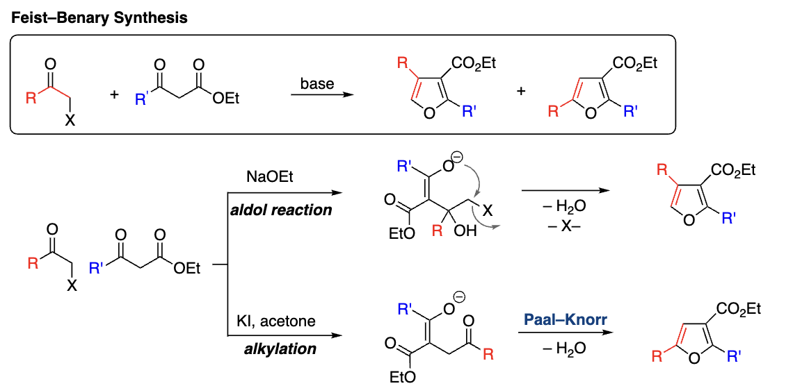
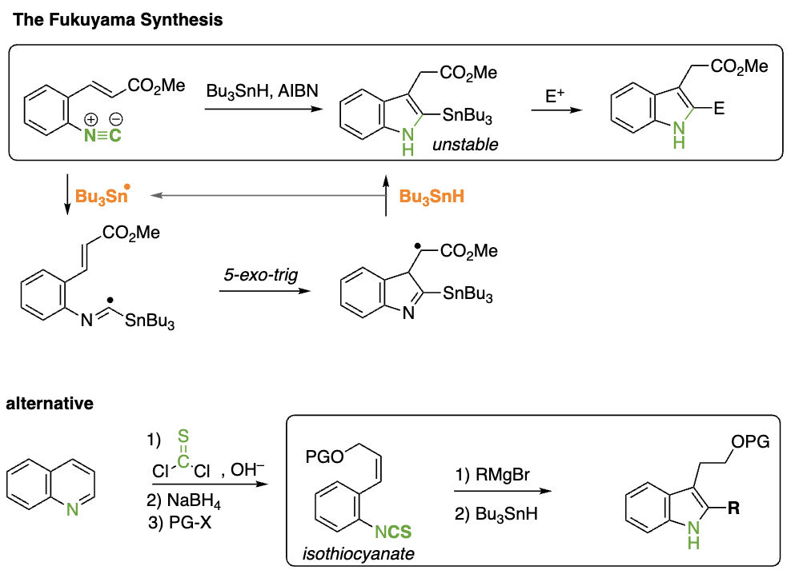
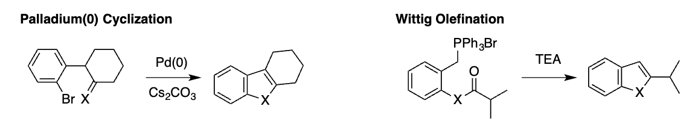
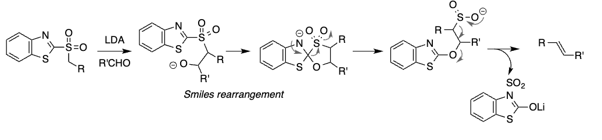

# Five-membered heterocycles

## Pyrrole

### Reaktivität gegenüber elektrophiler aromatischer Substitution

> Bevorzugt erfolgt die $S_EAr$ reaktion am C2 

### Synthesen zur Herstellung von Pyrrole

#### Paal-Knoor Synthesis

> Synthesis of Furans, Pyrrols and Thiophenes from 1,4 Diketones

##### Mechanismus Furan-Synthese

Protonierung von Carbonyl gefolgt von einen Enol Angriff

##### Mechanismus Pyrrole Synthese

Protoniertes Carbonyl wird vom Amin angegriffen zum Hemiaminal, dann erfolgt die Dehydrierung

##### Mechanismus Thiophene Synthese

#### Knorr Synthese

> $\alpha$ Aminocarbonyl condensation with 1,3-dicarbonyl

1. Enamine Formation
2. Nucleophilic attack of enamine at carbonyl
3. Dehydration

#### Hantzsch Pyrrole Synthesis

> Enamine together with $\alpha$ haloketone

Favored is first the substitution of the enamine then the condensation

#### Barton Zard Synthesis

> Isocyanoacetate together with $\alpha,\beta$ unsaturated nitro compound

#### Van Leussen Pyrrole Synthesis

> TosMIC reacts with Enone

#### Huisgen Pyrrole Synthesis

> Reaction of a Münchnone together with an Alkine [3+2] CA

#### Piloty-Robinson Synthesis

> Dimerization of Hydrazin and Ketone

#### Trofimov Synthesis

> Oxime reacts togehter with an Alkine with sigmatropic Rearangement

### Pyrrole Reactions

+ Electrophilic Substitution at C2 site
+ Protonation difficult because aromatic system gets destroyed
+ Halogenation with NXS
+ Azo Coupling
+ N Substitution with BuLi and pTsCl
+ Houben Hasch (Friedel Craft like Acylation)

## Furan

### Furan Synthesis

#### From Fufur (Vegetable Residues)

> Dehydration Reacrtion of Aldopentose with $H_2SO_4$

#### Feist-Benary Synthesis

> $\alpha$ haloketone reacts with dicarbonyl. Two reaction pathways can lead to different substitution patterns

#### Jacobi Synthesis

> [4+2] Cycloaddition of 1,3 oxazole with alkine

 

#### Wittig-type Synthesi

> Using a Bestman Ylide

#### Wipf Synthesis

> Pd(0) organocatalytic method

### Reactions of Furan

#### Achmatowicz Reaction

#### Piancatelli Rearrengment

## Thiophene

### Synthesis of Thiophene

#### Fiesselmann Synthesis

> Condensation of Alkineesters and Thiols in Base

#### Hinsberg Synthesis

> Condensation of 1,2 Diketone with Thiol

### Thiophene Reactions

## Indole and Congeners

### Indole Synthesis

#### The Fischer Indole Synthesis

> Phenylhydrazin gets combined with Ketone under Acidic Conditions

#### Gassman Synthesis

> Synthesis of Indole by Addition of Aniline and a Ketone with a Thioether Substituent

#### Bartoli Indole Synthesis

> Nitrobromophenols are combinded with 3 times vinylgrignard

#### Leimgruber-Batcho Synthesis

> Using DMDFA and Pyrrolidine

#### Fukuyama Synthesis

## Benzofuran and Benzothiophene

### Synthesis Stragegies

#### Perkin Rearrangement

> From Coumarin via electrophilic addition of $Br_2$, Opening with KOH and elemination

#### Dehydration Reactions

> Dehydration of Carbonyls with Acid

#### Palladium and Wittig Type

## Benzotriazole, Benzimidazole, Benzothiazole

These are the Coupling Reagents

### Benzotriazole Synthesis

> Through a Aza-Self Coupling

### Benzimidazole Synthesis

> Coupling with an Acid first substitution then formation of an imine

### Hydroxybenzotriazole Synthesis

> Nucleophilic Aromatic Substitution with Hydrazine, then Condensation

### Benzothiazole Synthesis

> Coupling with Acid then Imine Formation

### Coupling Reaction of Amino Acids

Problem of Amino Acid Coupling is often that a azlactone is formed which leads to racemization of the Residue

### Julia Olefination

> Synthesis of E Alkenes

## Triazole and Tetrazole

> The more nitrogen the more decrease in pKa value. The lower the $pKa$ the more easily the proton is removed.

### Synthesis

### Dediazotation Reacton

### Conversion of Carboxylic Acids to tetrazoles

## Oxazole, Thiazole and Imidazole

### TosMic Azole Synthesis

+ Imines = 1,3 imidazole
+ Aldehydes = 1,3 oxazole

### Hantzsch Thiazole Synthesis

$\alpha$ haloketone toghether with Thioamid

### Nitrile Oxide Cycloadditions

### Conforth Rearrangement

### Erlenmeyer-Plöchl Azlactone

### Barton McCombie Reaction

