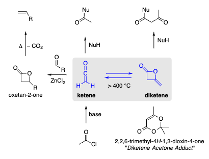

# Four-Membered Heterocycles

[[Five_Rings]] Five_Rings
[[53420675894591]] Six-Rings

Important ones to remember:

**Hantzsch-Wibmann**: 

+ N-heterocycles: ete (unsaturated), etidine (saturated)
+ N-free heterocycles: ete (unsaturated), etane (saturated)

## Oxetane and Oxete

> Oxetan ring is not planar, ring puckering to avoid interactions

### Synthesis of Oxetane

#### Reminder Corey Chaykovski Reaktion

> Synthesis of Epoxides, Aziridines and Cyclopropanes. A sulfure ylide is used on aldehyde, imine or enone

### Synthesis of Oxete (unstable)

+ Most common way to synthesize oxetene (oxete) is by a photochemical cyclization of acrolein

### Paterno-Büchi Reaction 

> Paterno-Büchi is a photochemical [2+2] cycloaddition 

2+2 is no a (4n+2) number but can be achieved photochemically, here the reaction can be carried out because one electron in the homo gets raised to the **SUMO** level

### Reactions of Oxetane

Important ones to remember here:

+ Corey Chaykovski to Synthesize THF
+ Reduction with $LiAlH_4$ to respective alcohol
+ LIDBB makes negative charged Oxetane → Substitution reaction on alcohole

#### Ring Expansion of Oxetane to form Furan and Pyrrole

## Dioxetane

Two synthetic approaches where discussed in the lecture

+ Electrophilic addition of $Br_2$ to alkene then subsitution with peroxide
+ Using Singlett Oxygen to to a photochemical cycloaddition

## Oxetane-2-one

+ Ketenens can be generated when Acid-Chlorides are treated with base

### Reminder Thermal [2+2] Cycloadditions

+ Isocyanates and Ketene can undergo cycloadditions because the $\pi$ bonds are orthogonal and can interact in the cycloaddition reaction

In typical [2+2] Cycloadditions $\beta$ lactams can be synthesized

## Phosphetane

Three important usages of Phosphetane were discussed during the lecture:

### Wittig Reaction

> In the Wittig Reaction Alkenes are synthesized by using ylides generated from a phosphonium salt

### Lawesson Reagent

> The Lawesson Reagent is prepared by using benzyllic methylether and $P_4S_{10}$

The Lawesson Reagent can be used in combination with RaNi to carry out deoxygenation processes

### Woolins Reagent

## Azete, 2,3-Dihydroazete, Azetidine

### Synthesis Strategies of Azetidine

### Staudinger Synthesiz of Azetidine-2-one

> This is a classical example of a thermal [2+2] cycloaddition

#### Burgees Dehydration Reagent

Methanol and a Isocyanate are combined under basic conditions to form the Burgees reagent

Basically the alcohol can then attack the sulfur and the negative charge on the nitrogen deprotonates giving a alkene

### Kinugasa Reaction

> Copper(I)phenylacetylides and nitrones are combined to yield $\beta$ lactames

## Penicillins and Cephalosporines

### Morin Reaction

> This is a rearrangement reaction when Penicilin is treated with NaIO4 and AC2O it can be turned into the cepham scaffold

 

