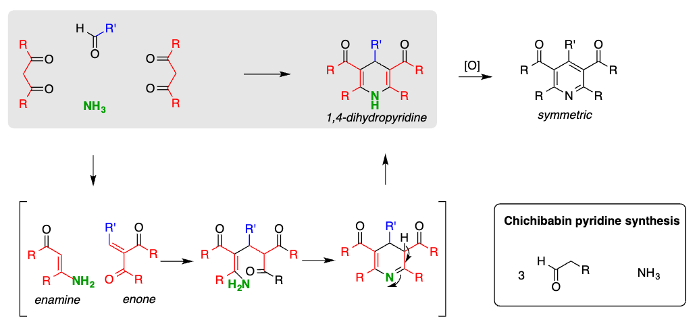

# Six Membered Heterocycles

## Pyridine

+ $S_EAr$ more reluctant than benzene
+ $S_NAr$ more readily than benzene

 

### Synthesis Strategies of Pyridine

#### Condensation Reactions

+ With 1,5 Dicarbonyls: Imine formation, Enamine Turomerism, Condensation
+ With 1,3 Dicarbonyls: Conjugated Addition, Enamine and then Condensation

#### Hantz (Dihydro-) Pyridin Synthesis

+ Enamine formation, Enone formation via aldol condensation then conjugated 1,4 attack of enamine

Hantsch Ester (1,4 Dihydropyridine) can be used as a mild reduction agent as it donors two hydrogen Atoms

#### ChichiBabin Pyridine Synthesis

> Condensation of Aldehyde or Ketone Components in the Presence of Ammonia and Base

#### Guareschi-Thorphe Pyridine Synthesis

>  Condensation of Cyanoenamine and 1,3 Dicarbonyl under Basic Conditions

##### Mechanism

1. Enamine Formation
2. Attack of the Enamine on the Carbonyl
3. Condensation of Amin with the Carbonyl
4. Dehydration

#### Krönkhe Pyridine Synthesis

1. Keto Enol Tautomerism
2. Conjugated attack to the Enone
3. 1,5 Condensation to Dihydropyridine  and Pyridine as a leaving grop

#### Bohlmann-Rahtz Pyridine Synthesis

1. Conjugated attack of the Enamine to the Alkine and then Condensation

#### Liebeskind Pyridine Synthesis

> Cross coupling reaction of Alkenyboronic acids, with $\alpha, \beta$ unsaturated ketoxime-o-pentafluorebenzoates and electrocyclisation

#### Roche Synthesis of Pyridoxine

#### Cycloaddition Reactions to Synthesis Pyridine

#### Ciamcian-Dennstedt Rearrangement

> This reaction happens under thermic conditions, no water allowed, (see Reimer Tiemann Formylation)

### Reactions of Pyridine

In general a electrophilic addition to the nitrogen can activate pyridine for an nucleophilic attack. After this attack a $6 \pi$ ring opening can occure

#### Zincke Reaction

In this reaction a pyridine is transformed into a pyridinium salt with a 2,4 dinitrochlorbenzol compound

> In the Case of an primary amine the nucleophilic attack leads to a $6\pi$ ring opening followed by formation of an aminal. This aminal can then be cleaved ending up with the imine / enamine compound

> with secondary amides the secondary imine is not stable and hydrolyses under waterous conditions

An example here is the synthesis of strychnine hier the Zincke salt is used to bould up up an Zincke aldehyd which can then undergo a sigmatropic rearrangement

#### Alkylation increases the rate of nucleophilic substitution on pyridine

Often pyridinium salts are used in nucleophilic catalysis as they form active ester compounds (DMAP)

#### Reduction of Pyridine

+ The heteroaromatic ring can much easier be reduced than respective benzene by usage of $H_2/Pt$
+ Using Birch Conditions Li/NH3 1,4 dihydropyridine is formed.

#### Reaction of Pyridine N-oxides

This compound is less basic than pyridine. Pyridine N-oxides can carry out electrophilic substitution. reactions for example nitrations

##### Boekelheide Reaction

The Boekelheide reaction enables the substitution of pyridine N-oxides together with acid anhydrides.

##### Nucleophilic Functionalization with Oximes

#### Chichibabin Reaction (SnAr on pyridine)

This is a addition elemination aromatic substitution in sodium amide in liquid ammonia

1. The addition leads to the Meisenheimer Complex and hydride is lost to regain aromaticity
2. A workup step is followed to ensure formation of 2-aminopyridine

## Quinoline

### Synthesis Strategies of Quinoline

#### Skraup Synthesis

> In situ generation of acrolein from glycerol using acid. After the conjugated attack, a Friedel Craft like Reaction occurs

#### Doebner Miller Synthesis

> Modification of the Skraup synthesis

#### The Combes Synthesis

> Condensation of Aniline and 1,3-dicarbonyl. Amide first attacks the carbonyl and forms enamine, then Friedel Craft like reaktion

#### Conrad Limpach-Knorr Reaction

#### Friedländer Synthesis

> Carbonyl + Anilineketone undergoes a condensation
> Aldol Reaction + Imine Formation

#### The Pfitzinger Synthesis

> Starting from Isatin the Amide is opened with base then a aldehyd is converted to the enamine and nucleophilic attack.

#### The Bischler Napieralski Synthesis of Dihydroisoquinoline

The amine is converted into a amid and then turned into the imide (similar to Vilsmeier Haack). A Friedel Kraft attack on the nitrilium ion can occure

#### Pictet-Spengler Reaction

The condensation of an aldehyd with the amine forms a imine then a Friedel Craft like Reaction occurs

