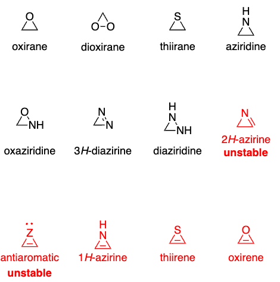

# Three membered heterocycles

 

## Oxirane and Dioxirane

### Synthesis

#### Scheffer-Weitz Epoxidation (Electron Defficient alkenes)

> In this method nucleophilic epoxidation reagents are used

#### Epoxidation with DMDO (electron rich double bonds)

> Dioxiranes are electrophilic oxidants mechanism is through a spiro transition state, DMDO is synthesized with acetone and KHSO5

#### Corey Chaykovski Reaction

Here a sulfur ylide is used to snythesize the respective three membered ring system

#### Darzens Glycidic Ester Synthesis

Using $\alpha$ Haloesters and Ketones / Aldehyds epoxided be synthesized

#### Shi Epoxidation

> Chemical reaction of alkenes with oxone and a fructose derived catalyst

> trans double bonds

Oxone = KHSO5 0.5 KHSO4 0.5 K2SO4

#### Jacobsen Katsuki Epoxidation (Mn(V)-salen based)

> cis double bonds!

#### Assymmetric Scheffer-Weitz Epoxidation

 

This method uses a quinine derivative and $H2O2$ 

#### Sharpless Assymetric Epoxidation

Memento: Si → S,S, Re → R,R

### Reactions of Oxiranes

#### Nucleophilic Ring opening

Both $Sn_1$ and $Sn_2$ reactions possible

#### Base-promoted Ring opening

Usage of assymetric LDA

#### Sharpless Deogyxenation

> Using Wolframchloride $WCl_6$

#### Payne Rearrangement

#### Eschenmoser Tanabe Fragmentation

#### Wharton Olefin Synthesis

> Using a Ketone with a epoxide in the $\alpha$ position together with hydrazine

## Oxaziridine

### Synthesis

#### Oxidation of Imines

#### Photoisomerization of Nitrones

#### Amination of Carbonyl Compounds

### Reactions

#### Davis Oxidation

The hemiaminal intermediate breaks up and gives the hydroxyl group

### 1,3 Dipoles

### Thiirane (Oxide, Dioxide)

### Aziridine

