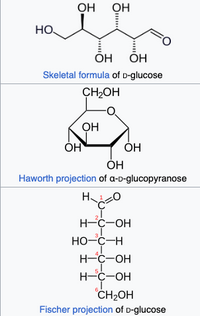
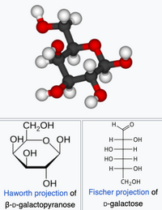
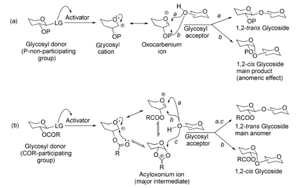
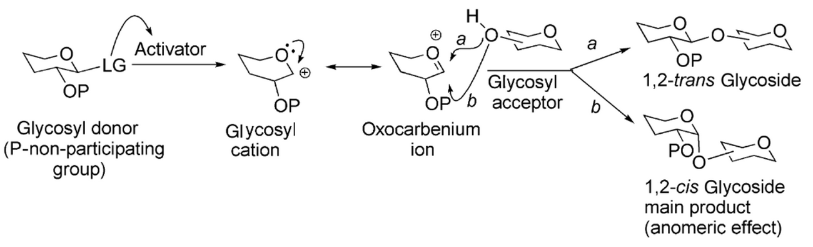

# Neighbouring Group Participation in O-Glycosilation

> Stereoselective Glycosilation reactions are one of the most challenging tasks for synthetic glycochemists. Protective Building Blocks on the glycosides contribute significantly in attaining the required stereochemistry of the resulting glycoside.

→ Strategic Installation of Protective Groups in C-2 position vincinal to anomeric carbon, renders neighbouring group participation

## Some Biological Aspects

Introduction Slide:

+ Lactose: Build up from Glucose and Galactose (Epimers)
+ ATP used for energy in cell
+ Cellulose is complex carbohdrate, that forms main structural component of plant cell walls, making up to 33% of all vegetable matter
+ Daunomycin: used for acute myeloid leukemia, administered via injection to a vine. Interacts with the DNA via intercalation and inhibits macromolecular biosynthesis
+ Erythromycin: Used in treatment of various bacterial infections. It is the 271st most commonly prescribed medication in the US, has bacteriostatic activity
+ Heparin: blood antivogualant, increases the activity of antithrombin. Used in treatment of heart attacks and unstable angina. Isolated from Dog Liver hepar is the greek word for liver

**Cell Surface Glycans**

Diverse Class of macromolecules that participate in many key biological processes including cell-cell comunication. The glycan covering that surrounds the cell surface termed glycocylyx can both promote and hinder binding of canonical protein ligandds to cell surface receptors

## Overview Carbohydrates

> Biomolecule composed of carbon (C), hydrogen and oxygen

Division:

+ Monosaccharides: Glucose, Galactose, Fructose Xylose
+ Disacharrides: Sucrose, Lactose, Maltose
+ Oligosaccharides 3-9; Maltodextrines, Raffinose
+ Polysaccharides >9: Starch, Amylose, Glycogen, Cellulsoe

## Some facts about glycosidation

Glycosidation is the most crucial step in the oligosaccharide synthesis. Main problen in the glycosilation is the structural complexity of the carbohydrate.

+ Mechanistic pathway depends on many factors: Concentration of participatinc moieties, reaction temperature, hydrogen bonding, solvent, nature of the leaving group and promoter
+ Mechanism of glycosilation lies at the interface of $S_N1-S_N2$ reaction, the continioum expands in both direction
+ **Destabilization and greater reactivity of the oxocarbenium, causes the nucleophilic part to attack in a concerted process $S_N2$**
+ **Stability of the Carbocation contributes the dissociative two step $S_N1$ reaction. (Studied by Codee et al by mapping a ensemble of conformations in a conformational energy landscape study)
+ Protective Groups enable to shift this $SN1/SN2$ spectrum to attain desired stereochemical outputs

## Formation fo 1,2 Trans glycosides

> An acyl protecting group in the vincinal C-2 position is widely accepted as the participating group facilitating the formation of the 1,2-trans glycoside.

+ Electron Deficient Acyloxonium ion forms, this blocks of the alpha face, inducing the attack of the nucleophile from the opposite side leading to the trans glycoside

+ Cis and Trans → Cis Hydroxyl group of anomerica carbon and the substittuent of the carbon its bondet are on the same side, Trans opposite

## Acetyl and Benzoyl Protecting Grou

In the scheme on **Slide 15** both were activated under air with catalytic amounts of methanesulphonic acid. 

→ Significant 1,2-trans selectivity means neigbhouring group parcitpitation

## Leuvinioyl protective groups

can be cleaved by using AcOH again yielding selective 1,2 trans glycosides and is a substitute to acetyl or benzoyl protection. Often one can also use this masked protecting group, Thioacetal!

## Pivalate Protecting groups

Another participating ester group, the neopentyl group introduced here reduces probability of for a nucleophilic attack at the oxocarbenium centre instead of the anomeric carbon.

+ Removal often requires harsher condition, the one with the tert-dimethylsilyl in the scheme can be cleaved of with the help ov fluoride anions.
+ The one with the olefinic bond needed hydroboration oxidation
+ Cyanopivaloyl ester protection group showed high versatility, → reduces formation of the orthoester intemidiate. Can be cleaved of by hydrogenation in the precense of Pd-C this allows for orthogonal deprotection

**On slide 20 this is a orghogonal deprotaction where all the protectibe groups can be deprototected in onestep to yield the desired product**

## Notes to the non-ester participating groups

Problem is that the ester groups are electron withdrawing and reduce the reactivity of the glycosyl doners. But this C-2 protection help the formation of the desired stereochemical output.

+ **Slide 23** Typcial MOM methoxymethyl or also BOM benzyloxymethyl  protective groups.
+ Activation of the glycoside donor, happens through a combination of NIS and IN(OTF) the nthe nucleophilic attack of the acceptor follows

Again Mechanism on Slide 24:

+ Formation goes through a oxocarbenium intermediate. This was shown by Kulkarni and Co-workeds which made an efficient neighbouring group participation and enabiling the $\pi-\pi$ interaction between the p orbitals of the oxonium ion intermediate and the aromatic ring

