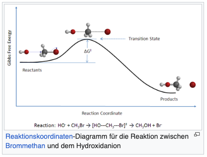

#  Theorie des Aktivierten Komplexes

> Transition State Theory ist eine molekulare Theorie zur Reaktionskinetik. Sie wurde hergeleitet unter Berücksichtigung molekularer Größen, der Zustandssummen und ermöglicht die Bestimmung der absoluten Geschwindgikeitskonstanten einer chemischen Elementarreaktion

## Grundprinzip

+ Edukte und Produkte sind durch Potentialwall getrennt
+ Diese Aktivierungsbarriere ist ein Sattelpunkt auf der Potentialhyperfläche
+ Die Reaktion der Edukte über den Übergangszustand zu den Produkten verläuft entlang einer Trajektorie der Reaktionskoordinate.

**Wichtigsten Annahmen**

+ Seperation von Kern- und Elektronenbewegungen → Born-Oppenheimer Näherung
+ Wahrscheinlichkeitsdichte der Energiezustände der Edukte lässt sich durch Boltzmann-Verteilung beschreiben
+ Im Übergangszustand kann die Bewegung entlang der Reaktionskoordinate von anderen Bewegungen separiert und klassich als Translation behandelt werden
+ Der Übergangszustand steht mit dem Edukten in einem Gleichgewicht

## Ableitung der Geschwindigkeitskonstante

Für bimolekulare Reaktion $A + B \to [AB]^* \to P$ kann man die Reaktionsgeschwindigkeit durch

$\frac{d[P]}{dt}=k[A][B] = k^*[AB]^*$ beschreiben. Zusammen mit der Gleichgewichtskonstante $K^* = \frac{[AB]^*}{[A][B]}$ erhält man

$\frac{d[P]}{dt}=k^*[AB]^* = k^*K^*[A][B]=v^*[AB]^*$

und man definiert $k_2 = v^*K^*$

### Statistisch-mechanische Beschreibung des aktivierten Komplexes

Gleichgewichtskonstante kann man durch Zustandssumme ausdrücken

$K^* = \frac{q^*_{AB}}{q_Aq_B}e^{-\frac{\Delta E_0^*}{kT}}$

Damit ist $k_2 = v^* \cdot K^*$ und man hat eine Allgemeine molekulare Zustandssumme $q = q_{trans}q_{rot}\prod q_{vib}{q_{el}}$

**Um zu Zerfallen geht eine Schwingung des aktivierten Komplexes in Translation der Produkte über → $q_{AB}^* = q_{AB}^{*'}q_{vib}^*$**

Allgemein gilt für die Schwingungszustandssumme $q_{vib} = (1-\exp{\frac{-hv^*}{kT}})^{-1}$

Durch Taylor Reihen Entwicklung landet man dann nach einführen des Transmissionskoeffizienten bei der **Eyring'schen Gleichung**

$k_ = \kappa \frac{kT}{h} \frac{q^*_{AB}}{q_Aq_B}\exp{-\frac{\Delta E_0^*}{kT}}$

### Bemerkung zu den Freiheitsgraden

**Edukt**

+ 3 Translations Freiheitsgrade
+ 2 Rotationsfreiheitsgrade wann linear
+ 3 Rotationsfreiheitsgrade wann nicht-linear
+ (3N-5) Vibrationsfreiheitsgrade wann Linear
+ (3N-6) Vibrationsfreiheitsgrade wann nicht linear

**Im Aktivierten Komplex**

+ 3 Translation
+ 2 Rotationsfreiheitsgrade wann linear
+ (3N-6) Vibrationsfreiheitsgrade wann linear
+ 3 Rotationsfreiheitsgrade wann nicht-linear
+ (3N-7) Vibrationsfreiheitsgrade wann nicht-linear

## Thermodynamische Beschreibung AK-Komplex

Auf Basis von $\Delta G^{0,*} = -RT \ln K^*$ und Gibbs-Helmholtz Gleichung $\Delta G = \Delta H - T\Delta S$

erhält man die Geschwindigkeitskonstante

$k_2 = \frac{kT}{h} e^{-\frac{\Delta G}{RT}} = \frac{kT}{h}e^{\frac{\Delta S}{R}} e^{-\frac{\Delta H }{RT}}$

+ Verbesserung der Theorie durch Auftreten der Aktivierungsentropie
+ Locker gebundener ÜZ hat höhere Entropie als stärker gebundener
+ Häufig Entropieabnahme bei BIldung des Aktivierten Komplex
+ Zb Bimolekulare Reaktion, Verlust von Translations und Rotationsfreiheitsgrade

Man kann Präexponentiellen Faktor der Arrhenius Gleichung bestimmen durch

$B(T) = \frac{kT}{h} e^{\frac{\Delta S^{0,*}}{R}}$

## Berechnung der Geschwindigkeitskonstanten für eine unimolekulare / bimolekulare Reaktion

$\Delta E_0$ entspricht der Inneren Energie zur Bildung des Aktivierten Komplexes $\Delta E_0 = \Delta H_0 - \Delta (pV)$ nach 1. Hauptsatz der Thermodynamik

+ In flüssig und festen Phasen kann die Volumensarbeit vernachlässigt werden für condensed Phase $\Delta E_0 = \Delta H_0$
+ $E_a = \Delta H_0 + RT$
+ Für ideale Gase $\Delta (pV) = \Delta nRT$
+ $\Delta H_0 = \Delta E_0 + \Delta n RT$

Damit Beispielsweise für eine bimolekulare Reaktion mit $\Delta n = -1$ 

$E_a = \Delta H_0 + 2RT$

