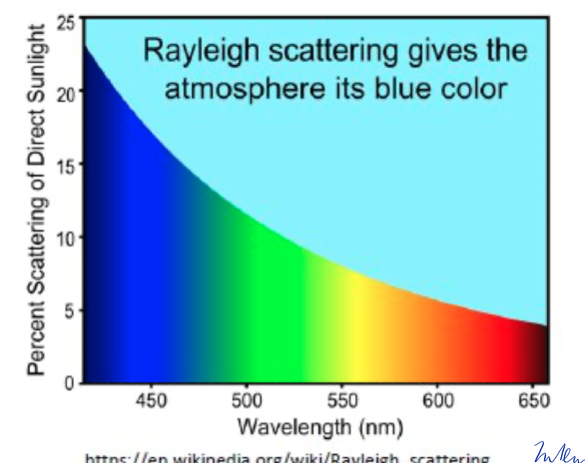

#### ODP

+ Ozone Depletion Potential
+ $Cl_3FC$ with 1
+ Brominated Substances Higher
+ Hydrochlorofluorcabrons smaler

#### High Radiative Forcings

+ $CO_2$
+ $CH_4$
+ $N_2O$
+ Halocarbons
+ Ozone
+ Aerols
+ Albedo

### Vertikale Durchmischung in Atmosphäre

+ Peplosphäre
    + Untersten 1,5-2km
    + Bodenreibung & Erwärmung Turbulenzen
    + Hohe Konvektion
    + Dunstschicht durch Anreicherung von Aerosolen → Frühnebel

+ WInde

    + Horizontaler Transport und Durchmischung
    + Luftströmung aufgrund von Druckunterschieden

+ Inter-Tropical Convergence Zone ITCZ

    + Doldrum 0°
    + Windstilles Äquatorgebiet

+ Konvektion

    + Bewegungsvorgänge in Atmosphäre durch Auftrieb
    + Aufsteigen warmer Luftpakete

+ Feinstaub in Troposphäre auswaschen durch Niederschlag

+ In Stratosphäre bis zu 100 Tage

### Diffussion

+ Molekulare Diffusion
    + Keine Turbulente Atomosphäre
    + Langsame Durchmischung
+ Eddy Diffusion Turbulente Atmosphäre
+ Schnelle Durchmischung

+ Vertikale Durchmuschung
    + In Troposphäre
        + Konvektion
        + Kaltluftsee Tropopause
    + In Stratosphäre
        + Eddy Diffusion
     
+ Horizontale Durchmischung
    + WInde

In Heterosphäre

	Gaskinetische Entmischung

+ Aufteilung nach VBolzmann Statisitik
+ Keine WInde
+ Große Mittlere Freie Weglänge

### Tcokenadiabatischer Temperaturgradient

$\Lambda_D = 7.86 K / km$

+ Beispiel → Adiabatische Ausdehhnung von Wetterbalon Teilchen leisten volumenarbeit, kinetische ENergie geht verloren weniger T

+  Feutadiabatischer Temperaturgradient

+  Abkühlung bewirkt Kondensation von Wasser

+  Spezifische Verdampfungswärme $q_v$ wird frei

+  Ziurka $5K/ km$

### Tröpfchenbildung

+ Wachstumsmechanismen in der Flüssikeit
+ Herandiffusion von Wasserdampf , Wachstum von 5 auf 150 ym dauert Tage
+ Koaleszenz 10 Minuten für 10 % wachstum
Wachstm üver Eiskeime
Herandiffusion cvon Wasserda,pf 5 auf 150 ym in 3 minuten
Akkretion Eingangen von Flüssigen Tropfen
Aggregation  Graupelund Hagelbildung

Eis Bildung, → Diffusion von Wasser, So groß das sie Hersaufalle nasu Wolke, Durch beschleunigung Shcmelze dann regne

Brauch nukleation vom Eis

 Mit zugabe von zb NaCL geht die Ausblildung von Tropfen bereits unter 80 % Sättigung

 + CUmulonimbus. Gewitterwolke mit Hohen Ambos
 + Cirrus, komplette Eiswolke
 + Nimbostratus klassische Regenwopllek
 + Cirrustratus und cirrocummulus

Reinigungsmechanismen Atmosphäre

+ Feuche Abscheidung
+ Trockene Abscheidung durch Absorption
+ Photolyse
+ Abau durch Radiakle

OH Radikal am Tag, NO3 Radiaal in der Nacht

+ Sommer Smog, Braun, NO2 + VOC + Lamda

Morgen Bildung von No

$NO_2 ü hv \to NO + O

Dann bildung von Ozon

$O_2 + O + M\ to O_3 + M$

$O_3 + NO \to NO_2 + O_2$

Warum Regentropfen Sauer

$H2O + Co_2 \to H2_CO_3$

Zwrfällt $H_2CO_3 \to H + + HCO_3^-$
natürlkuch er pH bei 5,5 - 7

Entstehung Wintersmog

+ Erhöhre Emisisoonsn Ruß. $SO_2$ Staub Inversionswetterlage

$H_2O + CO_2 \to H2_CO3$

Rayleight Streuung, Wellenlägne Wird an Teilchen gestreut, Dabei Elektronen Angeregt und induzieter Dipolmoment,
Teilchendurchmesser  viel kleeiner als die Wellenlänge

Steuung in Allen Rictugnen
Intensität der Strahlung $I \approx \frac{1}{\lambda^4}$

Blauz wird stärker Gestreut

Shcnee ist weiß weil Luftbläschen

Eisberge sind blau da weniger Luftbläschen enthalten

+ Mie Streuung
    + Elastische Streuung and SPhärischen objekten
    + Geringe Wellenöängenabjhängigkerit
    + partikelgröße entspricht der Wellenlänge des Lichts
    + Tritt bei Staubpartikel und Wassertropfen auf
+ Tyndall Effekt, Streuung an Licht an Schebeteilchen, damit werdenmanche Sachen trob erscheinen, da blaues licht mehr gestreut wird