# Prüfungsausarbeitung

## 22.1.2024

### Physikalische Eigenschaften der Atmosphäre

#### Wodurch unterscheiden sich Rayleigh-Streuung, Mie Streuung und klassiche Berechnung von Sonnenlicht in unserer Atmosphöre + Optisches Phänomen

**Rayleigh-Streuung**

Bezeichnet die elektromagnetische Streuung von Wellen an Teilchen, deren Durchmesser klein im Vergleich zur Wellenlänge $\lambda$ ist.

Hierbei ist der Streuquerschnitt $\sigma$ proportional zur vierten Potenz der Frequenz der Elektromagnetischen Welle.

Die frequenzabhängige unterschiedlich starke Streuung von Sonnelicht an den Teilchen der Erdatmosphäre bewirkt das Himmelsblau am Tag und die Morgen und Abendröte.

Elektronen eines Moleküls werden angeregt und ein Dipolmoment induziert.

> Wirkungsquerschnitt $\sigma(\omega) \approx \sigma_{Th}\frac{\omega^4}{\omega_0^4}$

Beispiel Verhältnis von Wirkungsquerschnitt von blau $\lambda = 450$ nm und rot $\lambda = 650 nm$ 

$\frac{\sigma_{blau}}{\sigma_{rot}} = (\frac{650 ~ nm}{450 ~ nm})^4  \approx 4.4$

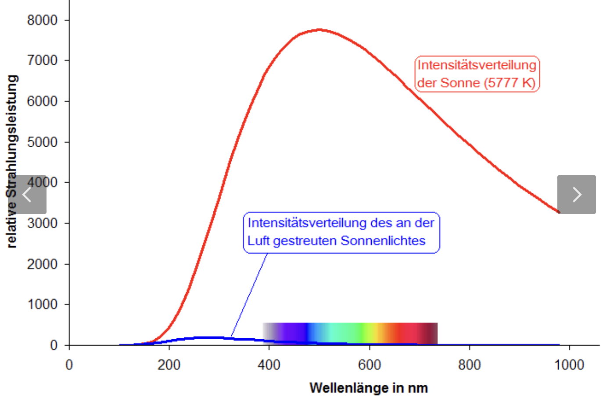

+ Am Tag: Licht kurze Strecke wenig blaues licht wird gestreut, Sonne ist gelb
+ Bei niedrigem Sonnenstand ist Strecke länger, hochfrequentes blaues Licht wird seitlich gestreut verbleibt rotes licht

**Mie-Strahlung** 

Tritt auf wenn die Größe der streuenden Teichen die Größenordnung der Wellenlänge des Lichts liegt, zb (Regentropfen, Nebeltropfen) ist dann Mie Streuung. Es ist die Streuung weniger wellenlängenabhänig deshalb zb Wolken weiß, weil alle Farben des Lichts reflektiert werden

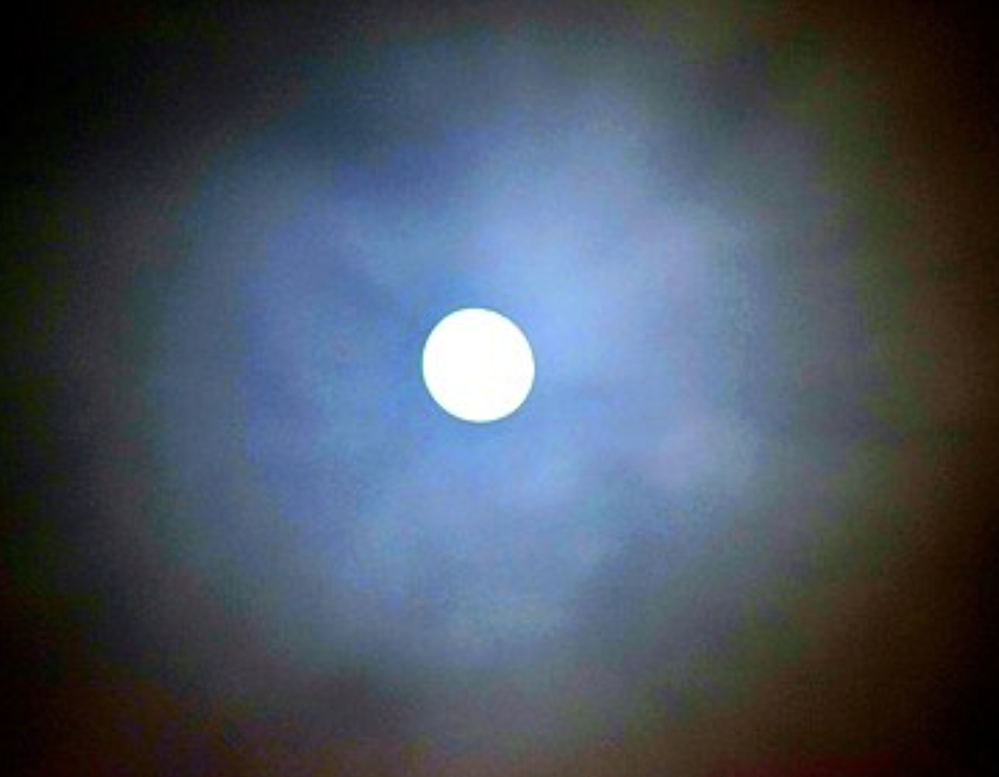

**Klassiche Brechnung**

Diese tritt auf wenn Licht beim Übergang zwischen Medien unterschiedlicher Dichte seine Richtung ändert. Dies hängt vom Brechungsindex ab.

Optisches Phänomen wäre hier der Sonnenaufgang und Sonnenuntergang da das Licht der Sonne an der Atmosphäre gebrochen wird

### Strahlungsbilanz

#### Erläutern Sie die Bedeutung der beiden Begriffe "Emmisionskante" und "Kühlhauseffekt". Nutzen Sie dafür eine Skizze des Infrarotfensters

> Das Infrarotfenster ist ein Fenster im Infrarotspektrum wo wenig Absorption von atmosphärischen Gasen Auftritt.

In der Erdatmosphäre liegt dieses Fenster bei 8-14 $\mu$m. Hierbei spielt $CO_2$ eine wichtige Rolle and der langen Wellenlängenbarriere des Spektrums

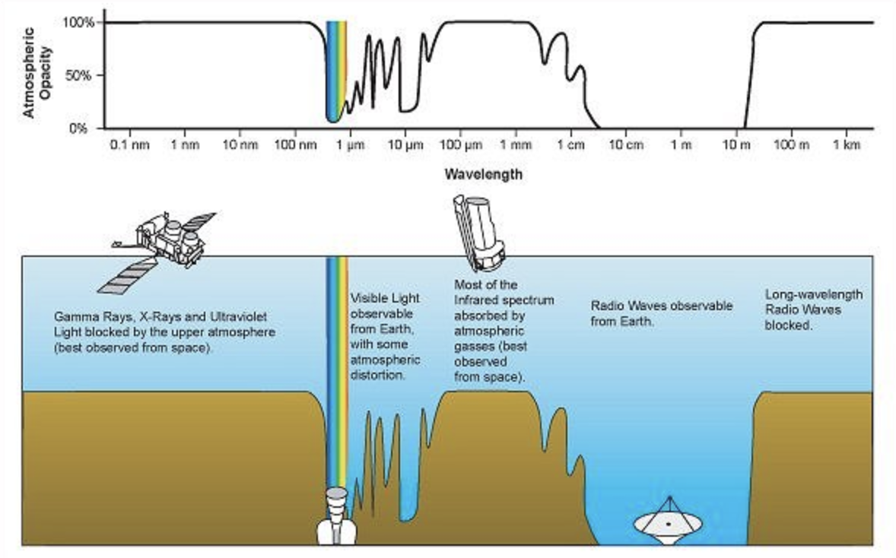

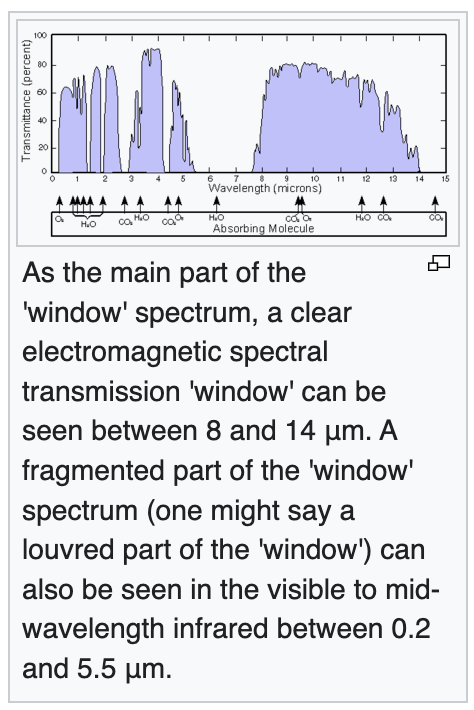

**Emissionskante:**

Beschreibt den Übergang von Bereichen in dem die Atmosphäre IR Strahlung stark absorbiert und wieder emittiert, zu Bereichen wo die Strahlung ungehindert entweichen kann.

Im Beispiel oben zb bei 15 mikrometer wo $CO_2$ relativ stark abobiert

**Kühlhauseffekt**

Manche Teile des Treibhauseffekt Strahlen ungehindert durch die Atmosphäre in den Weltraum ab und sorgen das die Erde Energie verliert und abkühlt. Das wären dann Bereiche wo die Strahlung ungehindert durchdringt

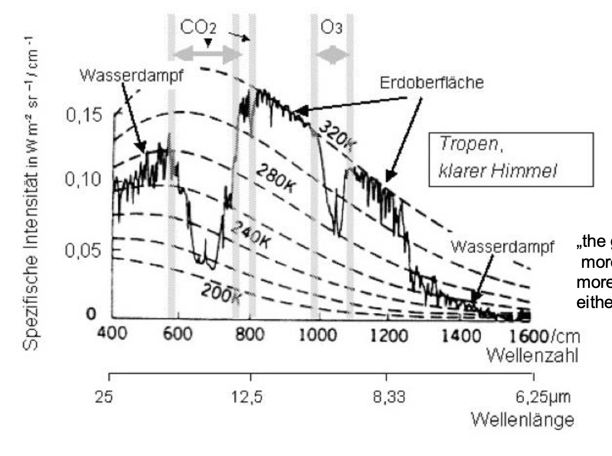

#### Aus welchen Grund ist ein Molekül Methan ein deutlich stärkeres Treibhausgas als ein Molekül Kohlendioxid? Welchen Beitrag zum antropogenen Treibhauseffekt haben Methan bzw Kohlendioxid insgesamt

**Treibhauspotential (GWP)** 

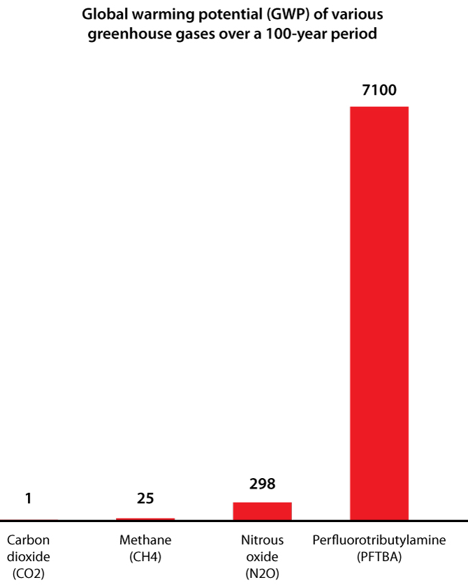

Methan hat ein viel höheres Global Warming Potential als $CO_2$ Das liegt am Fakt das Methan mehr Infrarotstrahlung als CO2 absobieren kann. Am IR Spektrum der sieht man klar das durch die höhere Anzahl an Schwingungsmoden von Methan auch ein breiterer IR Bereich absobiert wird.

 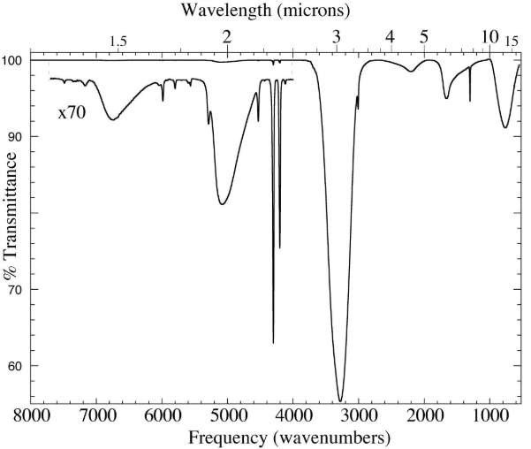

 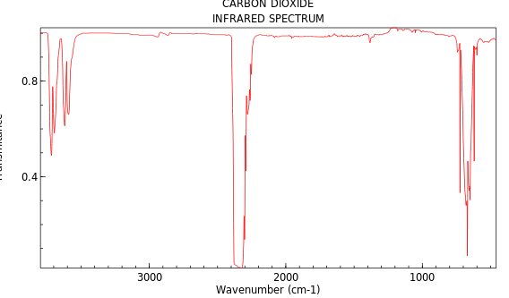

 **Beitrag zur Erderwärmung**

 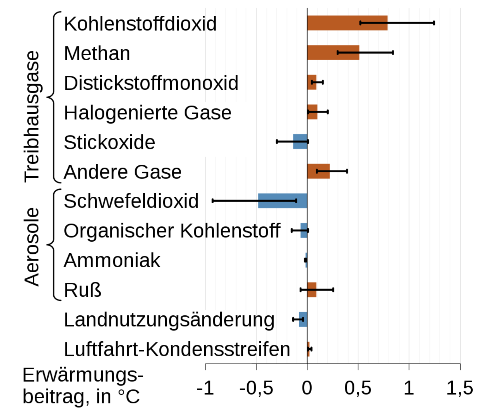

 Bezogen auf den Beitrag zur Gesamten Erwärmung sieht man:

 + $CO_2$ trägt zu einer Erwärmung von 0.8 °C bei
 + $CH_4$ trägt zu einer Erwärmung von 0.5 °C bei

#### Was ist "Klimasensitivität"? Wie hoch wird die Klimasensitivität für $CO_2$ eingeschätzt (Svante Arrhenius und Modern)

> Klimasensitivität beschreibt wie sich die gemittelte Oberflächentemperatur der Erde ändert würde wenn die Atmosphärische $CO_2$ Konzentration ansteigt

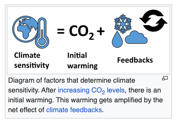

**Berechnung nach Svante Arrhenius**

> Arrhenius hat IR Beobachtungen des Mondes verwendet um zu Berechnen wie viel Wärme von $CO_2$ und von $H_2O$ in der Atmosphäre behalten werden

Zitat: "Any Doubling of the percentage of $CO_2$ in the Air would raise the temperature of the earth by 4 °C"

**Key Numbers**

+ $CO_2$ Gehalt ist von 280 ppm im 18. Jahrhundert auf 415 ppm (2020) gewachsen.
+ Nach Moderenen Bestimmungen und Modellen von 2021 ist die Klimasensitivität in einen Bereich von 2.3 bis 4.7 °C

#### Was ist unter dem $CO_2$ Buget im Zusammenhang mit dem Pariser Klimaabkommen zu verstehen

> Der Begriff $CO_2$ Buget beschreibt den Durchschnittlichen Betrag an $CO_2$ pro Einwohner welcher produziert werden darf um das Limit der 1.5 °C Erwärmung einzuhalten.

+ Man unterscheidet Relativ zwischen der Pre-Industirellen Periode mit dem Totalen Carbon Budget und den Remaining Carbon Budget

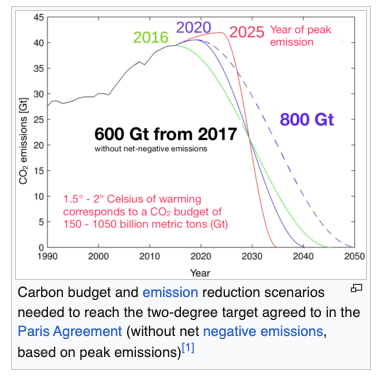

Zwei IPCC Definitionen

+ An assessment of carbon cycle sources and sinks on a global level, through the synthesis of evidence for fossil fuel and cement emissions, emissions and removals associated with land use and [land-use change](https://en.wikipedia.org/wiki/Land-use_change "Land-use change"), ocean and natural land sources and sinks of carbon dioxide (CO2), and the resulting change in atmospheric CO2 concentration. This is referred to as the _global carbon budget_
+  The maximum amount of cumulative net global anthropogenic CO2 emissions that would result in limiting global warming to a given level with a given probability, taking into account the effect of other anthropogenic climate forcers. This is referred to as the _total carbon budget_ when expressed starting from the pre-industrial period, and as the _remaining carbon budget_ when expressed from a recent specified date.

> Seit 1750 bis 2019 wurden 2390 Gigatonnen an $CO_2$ global freigesetzt

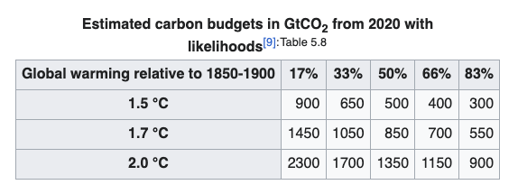

### Stratosphäre

#### Welches sind die drei wichtigsten katalytischen Ozonabbauzyklen in der Stratosphäre? Welche dieser Zyklen dominiert in welcher Höhe? Schreiben Sie den katalytischen Mechanismus an

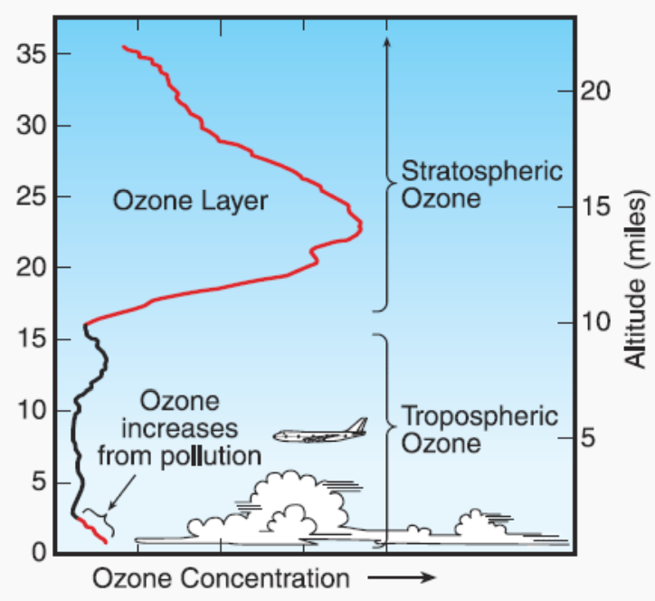

Der katalytische Ozonabbau ist ein wichtiger Prozess in der Chemie der Atmosphäre. Die Ozone Moleküle werden durch Katalysatoren abgebaut, das führt Beispielsweise zu einen Antrieb des Ozonabbaus in Polargebieten.

> Man hat NOx, ClOx, HOx und BrOx welche auf verschiedenen Höhen wirken

Der generelle Katalytische Prozess kann beschrieben werden als

1. $X + O_3  \to XO + O_2$
2. $XO + O \to X + O_2$
3. Net: $O_3 + O \to 2 O_2$

Betrachten wir also die einzelnen Zyklen

**NOx**
1. $NO + O_3 \to NO_2 + O_2$
2. $NO_2 + O \to NO + O_2$
3. Net: $O_3 + O \to 2 O_2$

**ClOx**
1. $Cl + O_3 \to ClO + O_2$
2. $ClO + O \to Cl + O_2$
3. Net: $O_3 + O \to 2O_2$

**BrOx**
1. $Br + O_3 \to BrO + O_2$
2. $BrO + O \to Br + O_2$
3. Net: $O_3 + O \to 2 O_2$

+ In der Niedrigen Stratosphere ist $ClOx$ und $BrOx$ dominant
+ In der Mittleren Atmospäre wird der $NOx$ Zyklus wichtig mit Einfluss von $ClOx$
+ In der Höheren Atmosphöre hat man dan $HOx$ mit $NOx$

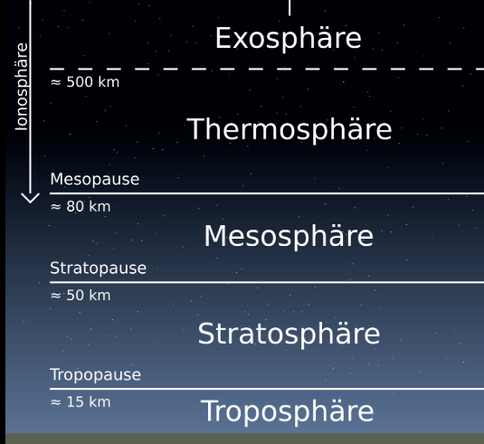

#### Beschreiben Sie die Rolle von polaren stratosphärischen Eiswolken für den Ozonabbau im polaren Frühling

Die Polaren Stratosphärenwolken (PSCs) treten in einer Höhe von 20 km auf und können nur bei Temperaturen unter -78 °C entstehen. Dies geschieht regelmäßig im WInter bei den Polarregienen. In der Stratosphäre ist der Wasserdampfgehalt sehr gering dass sich keine herkömmlichen Wolken bilden können. 

Diese Wolken bestehen aus Kristallen von Schwefelsäure und Salpetersäure

**Typ I**

Die Typ 1 PSCs haben Wasser, Salpeter und Schwefelsäure und sind ein Grund für den Ozonabbau. Es werden die chemischen Reaktionen um aktives Chlor für den katalytischen Abbau von Ozon beschleunigt. Auch wird gasförmige Salpetersäure entzogen was ebenfals den Stickstoff und Chlor Zyklus beschleunigt

+ Typ Ia sind große Partikel aus Salpetersäuretrihydrate (NAT)
+ Typ Ib sind Supercooled tenary solution (SAT) von Schwefelsäure, Salpetersäure und Wasser

#### Wie tief dringt sichbtbares bzw Ultraviolettes (UV-A, UV-B und UV-C) Licht von der Sonne in die Erdatmosphäre ein? Welche elementare Prozesse sind für das Filtern verantwortlich

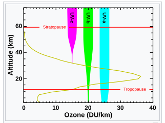

> Die Ozonschicht ist die Region in der Erdatmosphäre welche einen großteil der UV Strahlung von der Erde absobiert. In der Ozone schicht sind um die 10 ppm an $O_3$ und ist normal im unteren Teil der Stratosphäre 15-35 km

Reaktionsmechanismus:

$O_2 + hv \to 2 O$
$O + O_2 \to O_3$

**Zur UV Strahlung**

Extrem kurzwelliges UV (10-100nm) wird durch Stickstoff gefilterd. Ausgehend von der Wellenlänge hat man drei Kategorien:

+ UV-A (400-315 nm)
+ UV-B (315-280 nm)
+ UV-C (280-100 nm)

UV-C wird durch Sauerstoff (<200 nm) und durch Ozone (> 200 nm) ausgefiltert in 35 km Höhe.
UV-B wird durch teilweise gefiltert macht normalerweise den Sonnenbrand
UV-A ist transparent für die Ozonschicht

### Troposphäre

#### Welche 3 Faktoren müssen zusammentreffen, damit es zu Sommersmog kommt? Wodurch unterscheiden sich Sommersmog von Wintersmog?

> Sommersmog wird auch als photochemischer Smog bezeichnet

 1. Hohe Temperaturen
     1. Hohe Temperaturen über 25 °C fördern Reaktionen die zur Bildung von bodennahem Ozon führen.
2. Hohe Sonneinstrahlung
    1. UV Licht spaltet Stickstoffoxide ($NO_2$) in Stickstoffmonoxid und freiem Sauerstoff ($O$). Dieses Sauerstoff kann dann mit molekularen Sauerstoff ($O_2$) zur Bildung bon Ozon $O_3$ beitragen
3. Vorhandensein von Vorläufscherschadstoffen
    1. Stickoxide und flüchtige organische Verbindungen (VOCs) müssen in ausreichender Menge vorhandensein
  
Unterschied von Sommersmog und Wintersmog:

+ Sommersmog wird durch photochemische Reaktionen verursacht wo Stickoxide und VOCs in Kombination mit Sonnenlicht Ozon und andere Schadstoffe bilden. Hohe Temperaturen sind hierzu notwendig Sommersmog ist Ozonbasiert
+ Wintersmog entsteht durch die Ansammlung von $SO_2$, Feinstaub und Stickoxide bei niedrigen Temperaturen und hoher Luftfeuchtigkeit. Da warme Luftschichten von kälteren Umschlossenwerden kommt es zur Inversionswetterlage welche den Luftaustausch verhindert

**Chemie**

+ Entstehnung von Ozon: $O + O_2 + M \to O_3 + M$ und $O_3 + NO \to NO_2 + O_2$
+ Am frühen Morgen: $NO_2 + hv (\lambda < 420nm) \to NO + O$
+ Vormittag: Entstehung von Organischen Radikalen $RH + O \to R^*$
+ Nachmittag: Bildung von Hydroxyl-Radikalen $H_2O + O \to 2HO^*$

#### Welchen EInfluss hat NaCl-Aerosol auf die Nukleation von Wassertröpfchen in einem feuchten Gas? Erläutern Sie den Effekt anhand einer Skizze (Tröpfchenradius vs relative Feuchte) jeweils mit und ohne Einfluss von NaCl

> Salzpartikel haben die Fähigkeit als Kondensationskerne zu fungieren, was die Bildung bon Wassertröpfchen bei einer geringen relativen Feuchtigkeit ermöglicht.

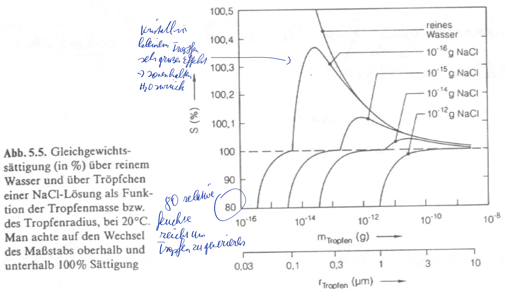

**Reines Wasser**

Für Reines Wasser muss die relative Feuchte über 100 % liegen damit Wassertröpfchen aus der Gasphase Kondensieren. Ohne NaCl braucht es also eine Übersättigung um Stabile Tröpfchen zu bilden

**Zugabe von NaCl**

Mit Steigender NACL Menge verschiebt sich die Kurve nach Links unten es bilden sich also schon viel früher Tröpfchen. Beispielsweise kann mit $10^{-16}$g NaCl bereits bei einer Luftfeuchtigkeit von 80 % ein Wassertropfen entstehen

#### Aus welchen Vorläufer-Molekülen entsteht das OH-Radikal in Bodennähe

> Das OH Radikal entsteht in der Troposphäre aus Ozon und Wassermolekülen durch UV strahlung und ist ein Waschmittel der Atmosphäre

Aus Ozon:

+ Spaltung: $O_3 + hv \to O_2 + O$
+ Dann Reaktion mit Wasserdampf $O + H_2O \to 2 OH$

Aus Stickstoffoxid:

+ Spaltung $NO_2 + hv \to NO + O$
+ Dann Reaktion mit Wasserdampf $NO_2 + hv \to NO + O$

Aus Wasserstoffperoxid:

+ $H_2O_2 + hv \to 2 OH$

#### Ab welchem pH Wert spricht man von "saurem" Regen? Welche Säuren sind in sauren Regentropfen typischerweise enthalten?

> Als sauren Regen bezeichnet man einen Niederschlag, dessen pH-Wert bei etwa 4,2-4,8 liegt und damit niedriger als 5,5 - 5,7 was das reine Regenwasser durch den CO gehalt in der Atmosphäre hat

Normalerwese Schwefelige Säure ($H_2SO_3)$ und Schwefelsäure ($H_2SO_4)$:

+ $SO_2 + H_2O \to H_2SO_3$
+ $SO_3 + H_2O \to H_2SO_4$

Weiteres aus salpetrige Säure ($HNO_2)$ und Salpetersäure ($HNO_3)$ aus den Stickoxiden

+ $2 NO_2 + H_2O \to HNO_2 + HNO_3$
+ $N_2O_4 + H_2O \to HNO_2 + HNO_3$

#### Nennen Sie die vier Abbaumechanismen von Molekülen in der Atmosphäre

1. Photolyse

Moleküle werden durch die Absorption von Sonnenlicht in kleinere Bestandteile zerlegt, dabei werden chemische Bindungen gebrochen zb Ozon

$O_3 + hv \to O_2 + O$

2. Reaktion mit Radikalen (OH und $NO_3$)

3. Feuchte Abscheidung

4. Trockene Abscheidung

??

#### Nennen SIe drei verschiedene Typen von Wolken in der Troposphäre

+ Cumulonimbus: Stark vertikal mit einen Amboss an der Spitze die Gewitterwolke
+ Nimbostratus: Sehr hoch bei 7000m und klassich ausgedehnt
+ Cirrus: Seht hoch gelegen >7000 m ausschließlich Eis

#### Unter welchen Bedingungen werden Wolken oberhalb der Tropopause beobachtet? Bennen Sie auch diese Wolken

> DIe Lage der Tropopause bei 15 km Höhe ist erkennbar da es fast keine Wolken mehr gibt und es gibt in der Flugfahrt eine fantastische Fernsicht.

Besonders heftige AUfwinde lassen manche Gewitter über die Tropopause hinausschießen und Tragen den Eisschirm den Amboss mit geringen Mengen an gefrorenen Wasser bis unter die Stratosphäre.

Zudem:

+ Perlmutwolken (PSCs) werden wie oben in den Polarregionen durch Kondensation von Schwefel und Salpertersäure gebildet
+ Schimmerndes Aussehen da sie das Sonnenlicht in verschiedenen Farben brechen
+ Leuchtende Nachtwolken (Polare Mesosphärenwolken NLC) bilden sich in der Mesosphäre bei 80 - 85 km Höhe. Sind kurz nach oder Vor Sonnenaufgang sichtbar und bestehen aus kleinen Staubpartikeln

### Ionosphäre

#### Welcher Fundamentaler Prozess verursacht allgemein die Farben, die wir als "Polarlichter" beobachten können? Zeichnen SIe das Termschema um konkret die intensive Grüne Linie bei 558 nm zu erklären

> Fundamentaler Prozess ist die Anregung von Atomen und Molekülen durch den Beschuss mit Elektronen aus einen Sonnenwind. Diese Elektronen übertragen Energie auf die Atome der Atmosphäre zb $O_2$ und Stickstoff und emittieren dan Photonen

Das Licht bei 558 nm entsteht durch den Übergang eines Sauerstoffatoms

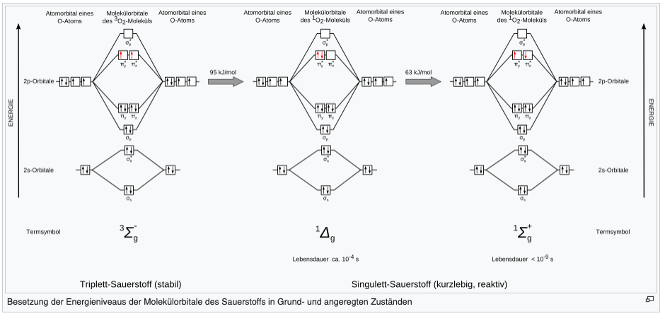

Die beiden Singlett Zustände des Sauerstoffs unterscheiden sich dadurch ob die Elektronen in einem $\pi^*$ $^1\Delta_g$ oder in beiden $\pi^*$ $^1\Sigma_g$ befinden

Grunde genommen geht man von einen Angeregten zustand $^1S$ (Singlett) zurück in einen Grundzustand ($^1D)$ und macht dabei einen Übergang von 558 nm

#### Aus welchen Grund ist die Zahl der freien Elektronen in etwa 200-250 km Höhe maximal? Warum ist die Zahl der Elektronen in 500 km sowie in 100 km Höhe geringer?

1. Maximale Ionisation in 200-250 km Höhe:
	
    + Intensive UV und Röngtenstrahlung der Sonne trifft auf Stickstoff $N_2$ und Sauerstoff $U-2$
    + Atmosphärendichte hier hoch genug damit eine effiziente Ionisierung stattfindet
    + Rekombinationsrate relativ gering da die Dichte in Vergleich zu niedrigen Höhen bereits abgenommen hat

2. Weniger Elektronen in 100 km Höhe:

	+ In einer Höhe von 100 km ist die Dichte sehr viel höher, damit kommt es zu einer höheren Rekombinationsrate sprich die freien Elektronen werden wieder eingefangen
  
 3. Weniger Elektronen in 500 km Höhe:

	+ Hier gibt es einfach wenig Teilchen welche Ionisiert werden können das bewirkt diesen Effekt
   
#### Erläutern Sie die wichtigsten Merkmale der D,E und F-Schichten der Ionosphäre

> Innerhalb der Ionosphäre exestieren drei lokale Ionisationsmaxima, weswegen siein drei Bereiche unterteilt wird: Die $D, E$ und $F$ Schichten.

D-Schicht:

 
