# Prüfungsausarbeitung

## 22.1.2024

### Physikalische Eigenschaften der Atmosphäre

#### Wodurch unterscheiden sich Rayleigh-Streuung, Mie Streuung und klassiche Berechnung von Sonnenlicht in unserer Atmosphöre + Optisches Phänomen

**Rayleigh-Streuung**

Bezeichnet die elektromagnetische Streuung von Wellen an Teilchen, deren Durchmesser klein im Vergleich zur Wellenlänge $\lambda$ ist.

Hierbei ist der Streuquerschnitt $\sigma$ proportional zur vierten Potenz der Frequenz der Elektromagnetischen Welle.

Die frequenzabhängige unterschiedlich starke Streuung von Sonnelicht an den Teilchen der Erdatmosphäre bewirkt das Himmelsblau am Tag und die Morgen und Abendröte.

Elektronen eines Moleküls werden angeregt und ein Dipolmoment induziert.

> Wirkungsquerschnitt $\sigma(\omega) \approx \sigma_{Th}\frac{\omega^4}{\omega_0^4}$

Beispiel Verhältnis von Wirkungsquerschnitt von blau $\lambda = 450$ nm und rot $\lambda = 650 nm$ 

$\frac{\sigma_{blau}}{\sigma_{rot}} = (\frac{650 ~ nm}{450 ~ nm})^4  \approx 4.4$

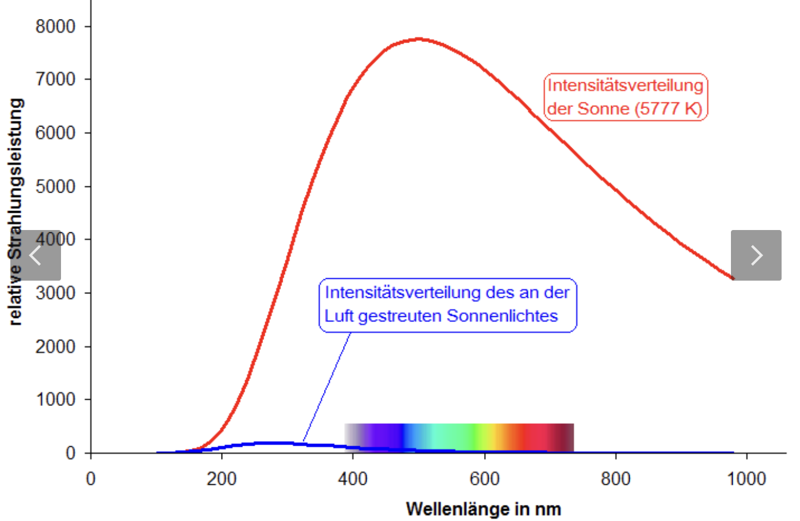

+ Am Tag: Licht kurze Strecke wenig blaues licht wird gestreut, Sonne ist gelb
+ Bei niedrigem Sonnenstand ist Strecke länger, hochfrequentes blaues Licht wird seitlich gestreut verbleibt rotes licht

**Mie-Strahlung** 

Tritt auf wenn die Größe der streuenden Teichen die Größenordnung der Wellenlänge des Lichts liegt, zb (Regentropfen, Nebeltropfen) ist dann Mie Streuung. Es ist die Streuung weniger wellenlängenabhänig deshalb zb Wolken weiß, weil alle Farben des Lichts reflektiert werden

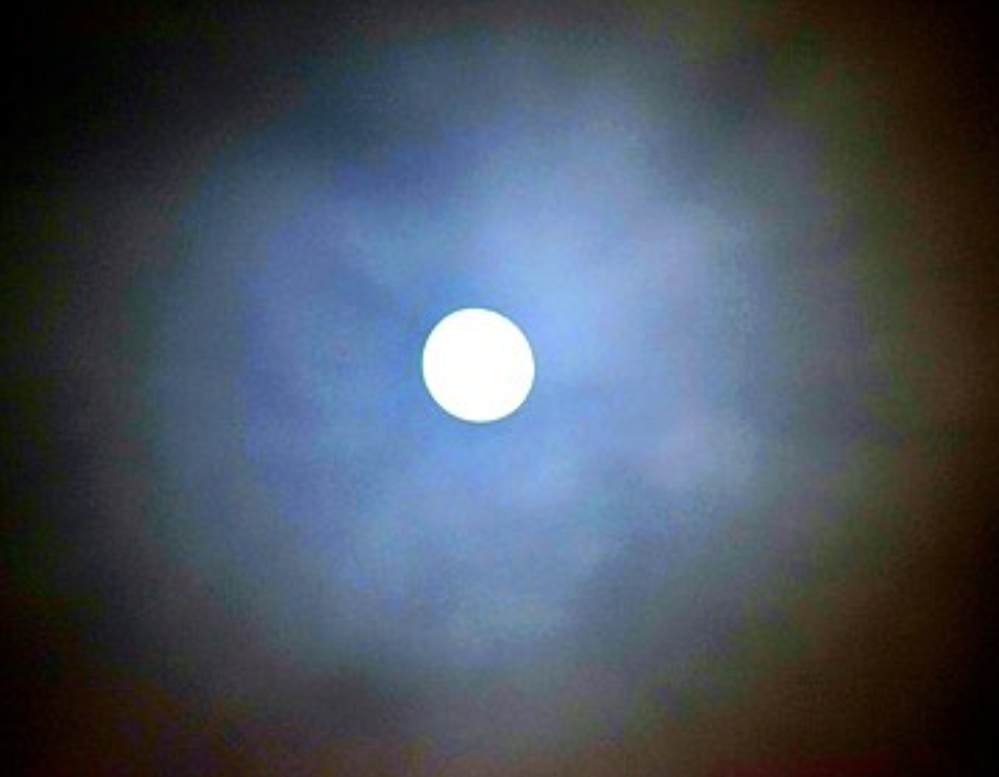

**Klassiche Brechnung**

Diese tritt auf wenn Licht beim Übergang zwischen Medien unterschiedlicher Dichte seine Richtung ändert. Dies hängt vom Brechungsindex ab.

Optisches Phänomen wäre hier der Sonnenaufgang und Sonnenuntergang da das Licht der Sonne an der Atmosphäre gebrochen wird

### Strahlungsbilanz

#### Erläutern Sie die Bedeutung der beiden Begriffe "Emmisionskante" und "Kühlhauseffekt". Nutzen Sie dafür eine Skizze des Infrarotfensters

> Das Infrarotfenster ist ein Fenster im Infrarotspektrum wo wenig Absorption von atmosphärischen Gasen Auftritt.

In der Erdatmosphäre liegt dieses Fenster bei 8-14 $\mu$m. Hierbei spielt $CO_2$ eine wichtige Rolle and der langen Wellenlängenbarriere des Spektrums

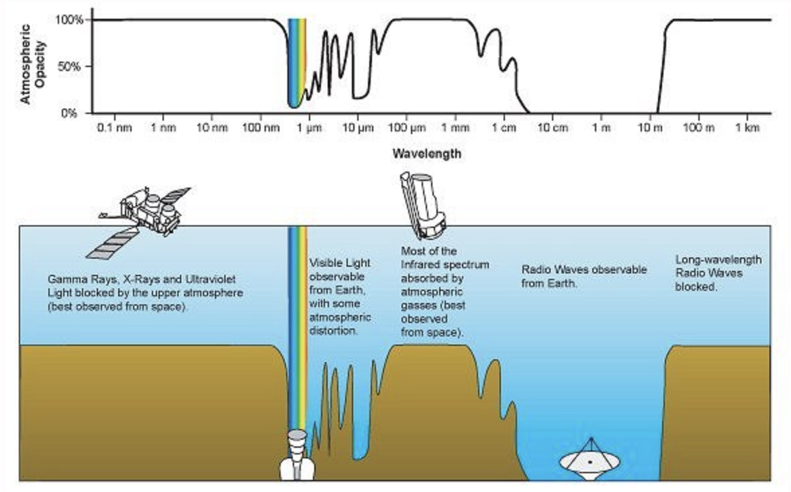

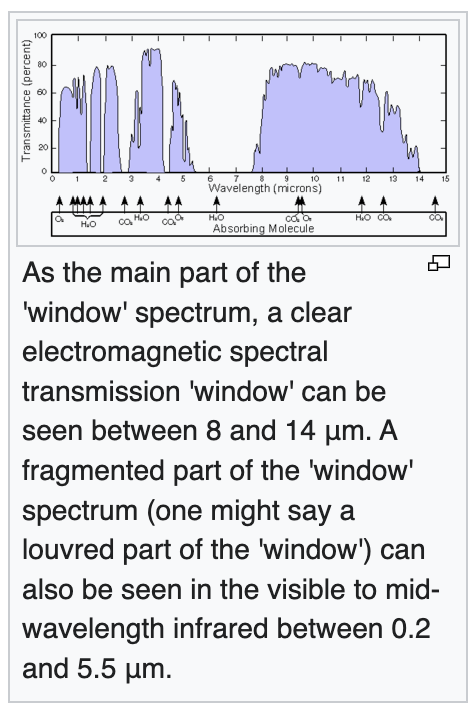

**Emissionskante:**

Beschreibt den Übergang von Bereichen in dem die Atmosphäre IR Strahlung stark absorbiert und wieder emittiert, zu Bereichen wo die Strahlung ungehindert entweichen kann.

Im Beispiel oben zb bei 15 mikrometer wo $CO_2$ relativ stark abobiert

**Kühlhauseffekt**

Manche Teile des Treibhauseffekt Strahlen ungehindert durch die Atmosphäre in den Weltraum ab und sorgen das die Erde Energie verliert und abkühlt. Das wären dann Bereiche wo die Strahlung ungehindert durchdringt

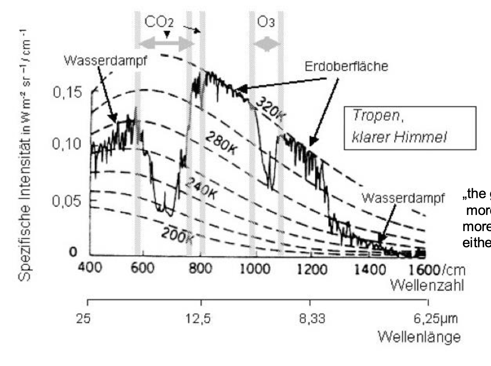

#### Aus welchen Grund ist ein Molekül Methan ein deutlich stärkeres Treibhausgas als ein Molekül Kohlendioxid? Welchen Beitrag zum antropogenen Treibhauseffekt haben Methan bzw Kohlendioxid insgesamt

**Treibhauspotential (GWP)** 

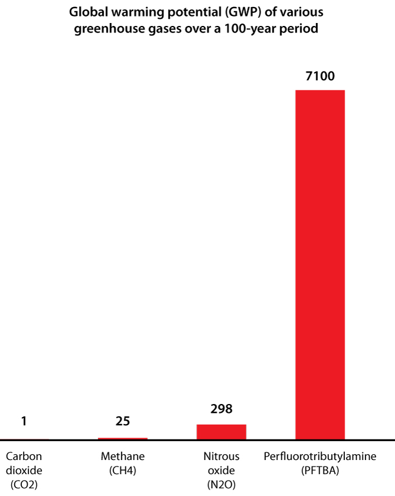

Methan hat ein viel höheres Global Warming Potential als $CO_2$ Das liegt am Fakt das Methan mehr Infrarotstrahlung als CO2 absobieren kann. Am IR Spektrum der sieht man klar das durch die höhere Anzahl an Schwingungsmoden von Methan auch ein breiterer IR Bereich absobiert wird.

 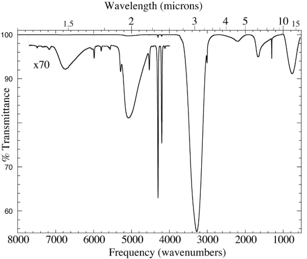

 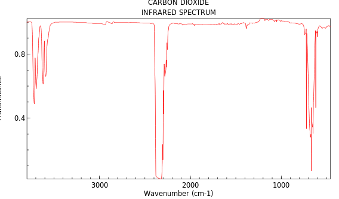

 **Beitrag zur Erderwärmung**

 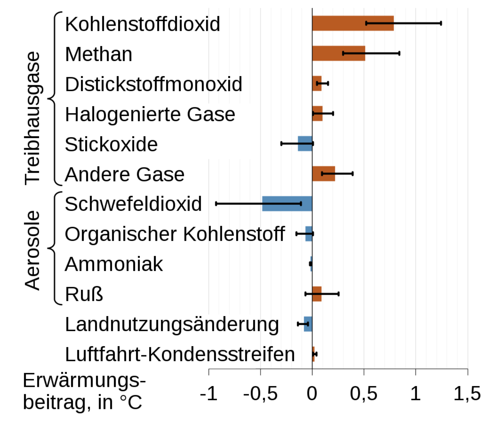

 Bezogen auf den Beitrag zur Gesamten Erwärmung sieht man:

 + $CO_2$ trägt zu einer Erwärmung von 0.8 °C bei
 + $CH_4$ trägt zu einer Erwärmung von 0.5 °C bei

#### Was ist "Klimasensitivität"? Wie hoch wird die Klimasensitivität für $CO_2$ eingeschätzt (Svante Arrhenius und Modern)

> Klimasensitivität beschreibt wie sich die gemittelte Oberflächentemperatur der Erde ändert würde wenn die Atmosphärische $CO_2$ Konzentration ansteigt

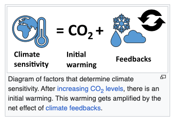

**Berechnung nach Svante Arrhenius**

> Arrhenius hat IR Beobachtungen des Mondes verwendet um zu Berechnen wie viel Wärme von $CO_2$ und von $H_2O$ in der Atmosphäre behalten werden

Zitat: "Any Doubling of the percentage of $CO_2$ in the Air would raise the temperature of the earth by 4 °C"

**Key Numbers**

+ $CO_2$ Gehalt ist von 280 ppm im 18. Jahrhundert auf 415 ppm (2020) gewachsen.
+ Nach Moderenen Bestimmungen und Modellen von 2021 ist die Klimasensitivität in einen Bereich von 2.3 bis 4.7 °C

#### Was ist unter dem $CO_2$ Buget im Zusammenhang mit dem Pariser Klimaabkommen zu verstehen

> Der Begriff $CO_2$ Buget beschreibt den Durchschnittlichen Betrag an $CO_2$ pro Einwohner welcher produziert werden darf um das Limit der 1.5 °C Erwärmung einzuhalten.

+ Man unterscheidet Relativ zwischen der Pre-Industirellen Periode mit dem Totalen Carbon Budget und den Remaining Carbon Budget

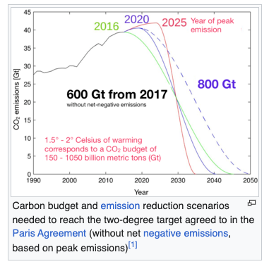

Zwei IPCC Definitionen

+ An assessment of carbon cycle sources and sinks on a global level, through the synthesis of evidence for fossil fuel and cement emissions, emissions and removals associated with land use and [land-use change](https://en.wikipedia.org/wiki/Land-use_change "Land-use change"), ocean and natural land sources and sinks of carbon dioxide (CO2), and the resulting change in atmospheric CO2 concentration. This is referred to as the _global carbon budget_
+  The maximum amount of cumulative net global anthropogenic CO2 emissions that would result in limiting global warming to a given level with a given probability, taking into account the effect of other anthropogenic climate forcers. This is referred to as the _total carbon budget_ when expressed starting from the pre-industrial period, and as the _remaining carbon budget_ when expressed from a recent specified date.

> Seit 1750 bis 2019 wurden 2390 Gigatonnen an $CO_2$ global freigesetzt

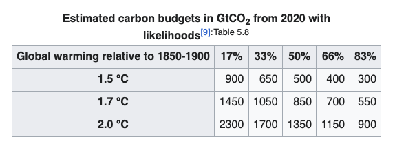

### Stratosphäre

#### Welches sind die drei wichtigsten katalytischen Ozonabbauzyklen in der Stratosphäre? Welche dieser Zyklen dominiert in welcher Höhe? Schreiben Sie den katalytischen Mechanismus an

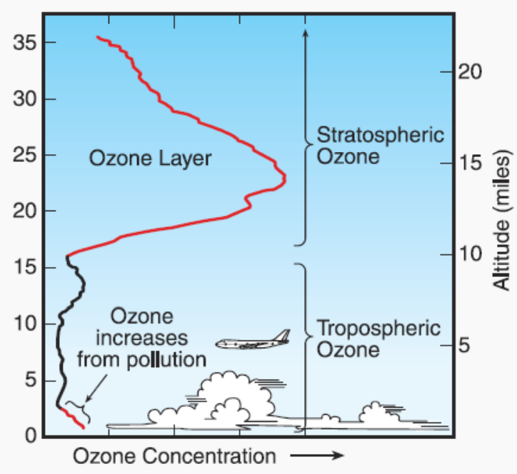

Der katalytische Ozonabbau ist ein wichtiger Prozess in der Chemie der Atmosphäre. Die Ozone Moleküle werden durch Katalysatoren abgebaut, das führt Beispielsweise zu einen Antrieb des Ozonabbaus in Polargebieten.

> Man hat NOx, ClOx, HOx und BrOx welche auf verschiedenen Höhen wirken

Der generelle Katalytische Prozess kann beschrieben werden als

1. $X + O_3  \to XO + O_2$
2. $XO + O \to X + O_2$
3. Net: $O_3 + O \to 2 O_2$

Betrachten wir also die einzelnen Zyklen

**NOx**
1. $NO + O_3 \to NO_2 + O_2$
2. $NO_2 + O \to NO + O_2$
3. Net: $O_3 + O \to 2 O_2$

**ClOx**
1. $Cl + O_3 \to ClO + O_2$
2. $ClO + O \to Cl + O_2$
3. Net: $O_3 + O \to 2O_2$

**BrOx**
1. $Br + O_3 \to BrO + O_2$
2. $BrO + O \to Br + O_2$
3. Net: $O_3 + O \to 2 O_2$

+ In der Niedrigen Stratosphere ist $ClOx$ und $BrOx$ dominant
+ In der Mittleren Atmospäre wird der $NOx$ Zyklus wichtig mit Einfluss von $ClOx$
+ In der Höheren Atmosphöre hat man dan $HOx$ mit $NOx$

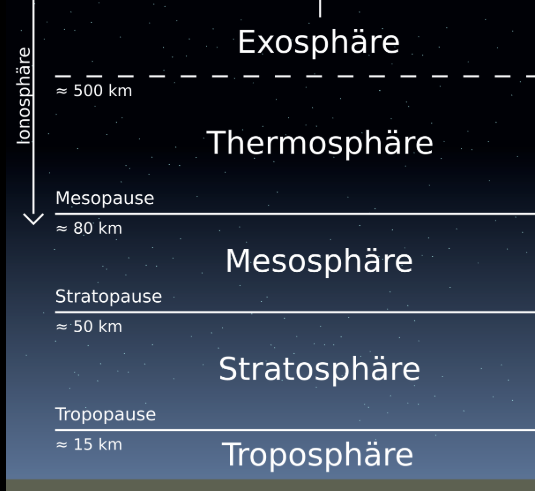

#### Beschreiben Sie die Rolle von polaren stratosphärischen Eiswolken für den Ozonabbau im polaren Frühling

Die Polaren Stratosphärenwolken (PSCs) treten in einer Höhe von 20 km auf und können nur bei Temperaturen unter -78 °C entstehen. Dies geschieht regelmäßig im WInter bei den Polarregienen. In der Stratosphäre ist der Wasserdampfgehalt sehr gering dass sich keine herkömmlichen Wolken bilden können. 

Diese Wolken bestehen aus Kristallen von Schwefelsäure und Salpetersäure

**Typ I**

Die Typ 1 PSCs haben Wasser, Salpeter und Schwefelsäure und sind ein Grund für den Ozonabbau. Es werden die chemischen Reaktionen um aktives Chlor für den katalytischen Abbau von Ozon beschleunigt. Auch wird gasförmige Salpetersäure entzogen was ebenfals den Stickstoff und Chlor Zyklus beschleunigt

+ Typ Ia sind große Partikel aus Salpetersäuretrihydrate (NAT)
+ Typ Ib sind Supercooled tenary solution (SAT) von Schwefelsäure, Salpetersäure und Wasser

#### Wie tief dringt sichbtbares bzw Ultraviolettes (UV-A, UV-B und UV-C) Licht von der Sonne in die Erdatmosphäre ein? Welche elementare Prozesse sind für das Filtern verantwortlich

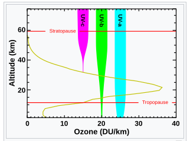

> Die Ozonschicht ist die Region in der Erdatmosphäre welche einen großteil der UV Strahlung von der Erde absobiert. In der Ozone schicht sind um die 10 ppm an $O_3$ und ist normal im unteren Teil der Stratosphäre 15-35 km

Reaktionsmechanismus:

$O_2 + hv \to 2 O$
$O + O_2 \to O_3$

**Zur UV Strahlung**

 
