# Zusammenfassung Atmosphärenchemie

**Definition der Atmosphäre**

> Die gasförmige Hülle eines Himmelskörpers. Planeten haben eine Gashülle wenn sie genügend Masse und eine hinreichend niedrige Temperatur haben Gase aufgrund der Massenanziehungskraft und entgegen der Gasbewegung zu binden

## Kapitel 1 Physikalische Eigenschaften

+ Berechnung von Druck $p = \frac{F}{A}$ mit Druck an der Erdoberfläche $p_0 = \frac{M_Ag_0}{4 \pi R_E^2}$
    + Mit $R_E = 6371$ km, $g_0 = 9.81$ $m/s^2$  
+ Standarddruck auf der Erdoberfläche 1013,25 mbar → 101325 Pa
+ **Masse der Erdatmosphäre**  $M_A = 5.3 * 10^{18}$ kg

### Druckprofil der Erde

> Die Barometrische Höhenformel beschreibt die vertikale Verteilung der Teilchen in der Atmosphäre der Erde, sprich die Abhängigkeit des Luftdruckes von der Höhe

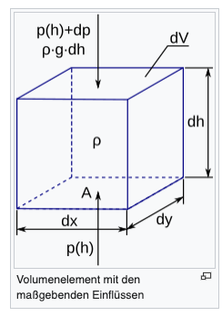

+ Man betrachtet zur Herleitung ein quaderförmiges Volumenelement mit Grundfläche $A$ und Höhe $dh$ welches Luft der Dichte $\rho$ enthält.
+ Von Unten auf die Grundfläche wirkt Kraft $\rho*A$.
+ Von Oben wirkt die Gewichtskraft $dm * g = \rho dV * g = \rho g dh *A$
+ Insgesamt ist der Druck oin dieser Höhe um $dp$ verschieden damit ist die Kraft $(p + dp)* A$
+ Im hydrostatischen Gleichgewicht gilt dann $p*A - \rho g dh * A - (p + dp)A = 0$
+ Umformen + Ideale Gasgleichung $\frac{dp}{dh} = - \frac{p M g}{RT}$

> Nach anschließender Integration gilt $p = p_0 \exp(- \frac{mg \delta H}{kT})$

**Definition Skalenhöhe:** Ist die Höhendifferenz bei der der Druck um den Faktor der Euler'schen Zahl $e$ abnimmt $H_S = \frac{kT}{mg}$ 

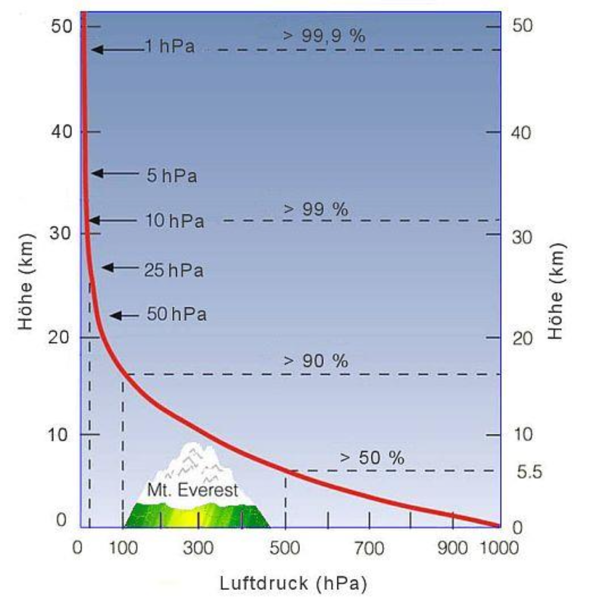

### Strahlungstemperatur der Erde

> Der Strahlungshaushalt der Erde ist der wichtigste Bestandteil des Energiehaushalts der Erde.

Grundsätzlich kann die Strahlungsbilanz wie folgt formuliert werden:

$Q_k = G - R = D + H _ R = (1-\alpha)G$

mit
+ $G$ = Globalstrahlung
+ $D$ = direkte Strahlung
+ $H$ = diffuse Strahlung
+ $R$ = reflektierte Strahlung
+ $\alpha$ = Albedo

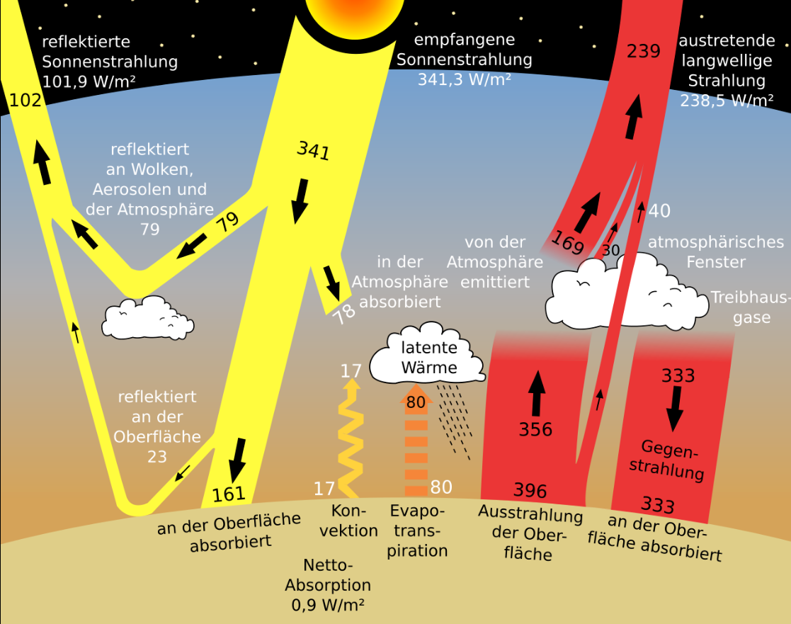

Grundsätzlich gilt hier das Stefan-Boltzmann-Gesetz (T-hoch vier Gesetz)

+ Emittierte Energie der Erde $E_{Erde} = 4 \pi R^2_p * sT_e^4$
+ Ankommende Energie der Sonne $E_{Sonne}= \pi R^2_p(1-A)F_s$
    + $R_p$ Radius der Erde, $F_s$ solarer Strahlenfluss

Man kann zudem die Effektive Temperatur der Sonne durch die Gleichsetzen berechnen

$T_e = \{ \frac{(1-A)F_s}{4s}\}^{1/4}$ 

> Die effektive Temperatur der Erde beträgt $T_e = 256 K$ entspricht -17 °C mit Treibhauseffekt auf + 15°C

#### Albedo

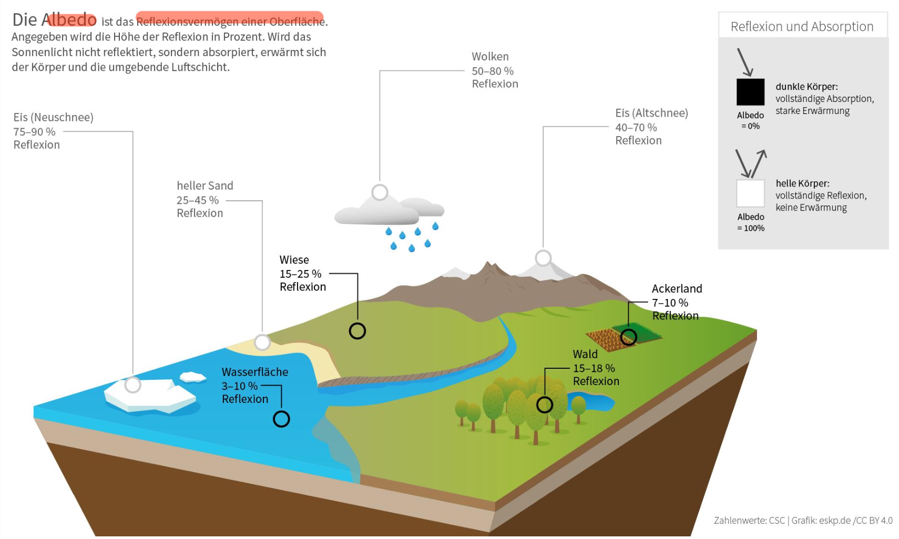

**Ice-Albedo Feedback Loop**

> Dies beschreibt die Wechselwirkung zwischen der Kryosphäre (schnee und eisbedeckter Erdoberfläche) und dem globalen Klima. Abkühlung führt zu einer Ausdehung von Schnee und Eisflöchen was zu einer erhöhten Rückstrahlung und mehr Abkühlung führt.

## Kapitel 2 Temperaturprofil der Erdatmosphäre

**Reminder Wiensches Verschiebungsgesetz**

Die Wellenlänge die bei einem Schwarzkörper die intensivste Srahlung abgibt ist umgekehrt Proportional zur Temperatur

Es gilt also $\lambda_{max}(T) = 2897,8 ~ \mu m * \frac{1}{T/K}$ 

+ Sonne 5778 K → $\lambda_{max} = 0.5 \mu m$
+ Erde 288 K → $\lambda_{max} = 10 \mu m$

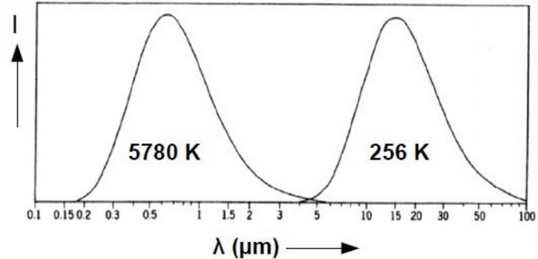

### Strahlungsabsorption in der Atmosphäre

Man kann die UV Strahlung der Sonne in drei Kategorien einteilen:

+ UV-C 100-290 nm
+ UV-B 290-320 nm
+ UV-A 320-400 nm

Diese Strahlung wird in der Ozonschicht absobiert bei 15-30 km Höhe. Grundsätzlich wird UV-C fast komplett gefiltert nur UV-B und UV-A sind durchlässig

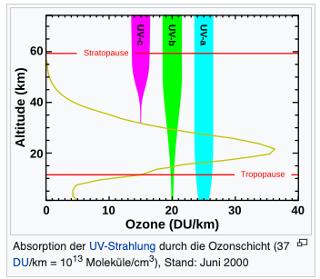

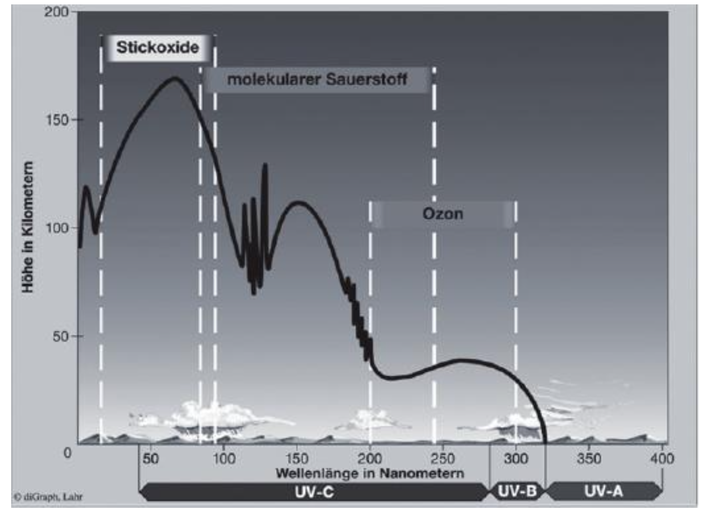

### Temperaturprofil der Atmosphäre und Schichten

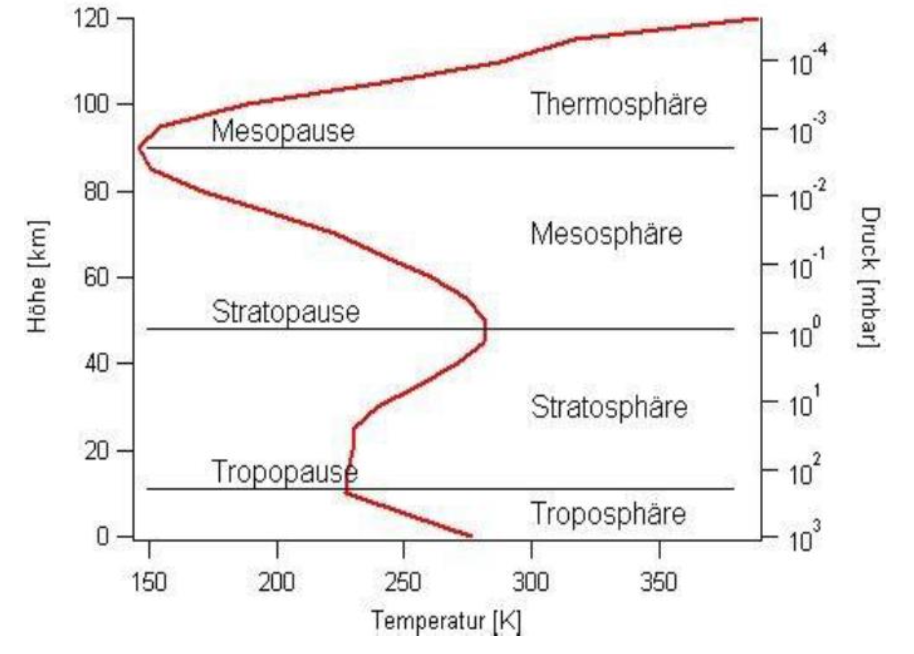

+ Troposphäre von der Erdoberfläche bis Tropopause in 7-17 km Höhe
+ Stratosphäre bis zur Stratopause in 50 km Höhe
+ Mesosphäre bis zur Mesopause in 80-85 km Höhe

**Bezug auf den Durchmischungsgrad**

+ Homosphäre ist turbulent durchmischt und reicht bis 100 km Höhe
+ Darüber ist die Heterosphäre wo sich Teilchen nach Molmasse trennen

**Bezug auf den Radio-Physikalischen Zustand**

+ Neutrosphäre
+ Ionosphäre bei > 80 km**
+ Plasmasphäre > 1000 km vollständige Ionisatzion**
+ Magnetosphäre

#### Wann beginnt das Weltall?

+ Karman Linie: Liegt bei 100 Kilometer, oberhalb ist die Atmosphäre so dünn dass ein Flugzeug nicht mehr genügend auftrieb erhält
+  Nasa Definition: Liegt bei 80 Kilometer, dannach ist man Astronaut
+  Exosphäre diese Beginnt bei 500 - 1000 km so wenig Partikel das man fast Vakuum bedingung hat

## Kapitel 3 Oberflächentemperatur und Treibhauseffekt

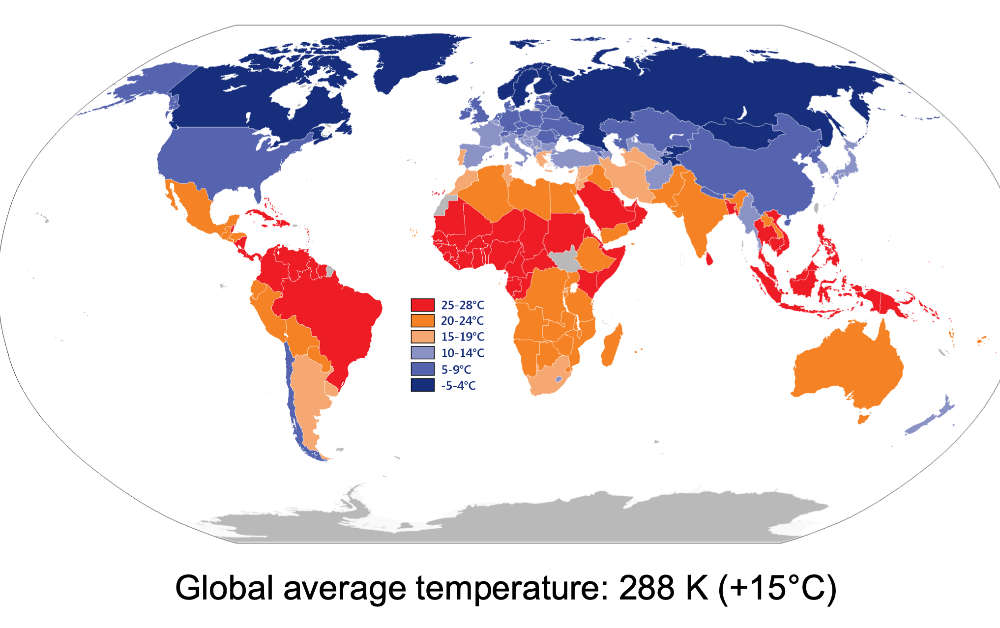

Betrachten wir zuerst die Atmosphärische Zusammensetzung einiger unserer Nachbarplaneten

1. Venus: 44 g/mol (96.5 % $CO_2$, 3.5 % $N_2$) mit $H_s = 19.9$ km
2. Mars: 44 g/mol (95.8 % $CO_2$ 2% $Ar$ , 2% $N_2$) mit $H_s = 11.1$ km
3. Jupiter: 2.2 g/mol $H_s  = 27$ km

### Infrarotfenster der Atmosphäre

> Als Infrarotfenster bezeichnet man Bereiche im Spektrum bei dem wenig Absorption von Atmosphärischen Gasen auftritt. In der Erdatmosphäre liegt dieses Fenster zirka bei 8 - 14 $\mu m$

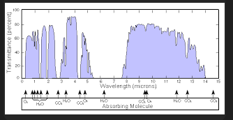

**Warum brauchen wir das?**

Im Bereich 8-14 $\mu m$ kann die Erde relativ effizient Energie in form von Infrarotstrahlung aufnehmen da dort Treibhausgase wie $CO_2$, Methan usw absorbieren.

Bei $15 \mu m$ tritt beispielsweise eine starke **Emissionskante** auf diese ist durch $CO_2$ verursacht

### IR Spektren bekannter Klimagase

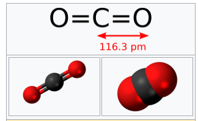

$CO_2$ hat als lineares Molkül $3N - 5  = 9-5 = 4$ Vibrationsmoden.

+ Antisymmetric Stretching Vibration
+ Symmetric Stretching Vibration
+ 2x Degenerate Bending Modes

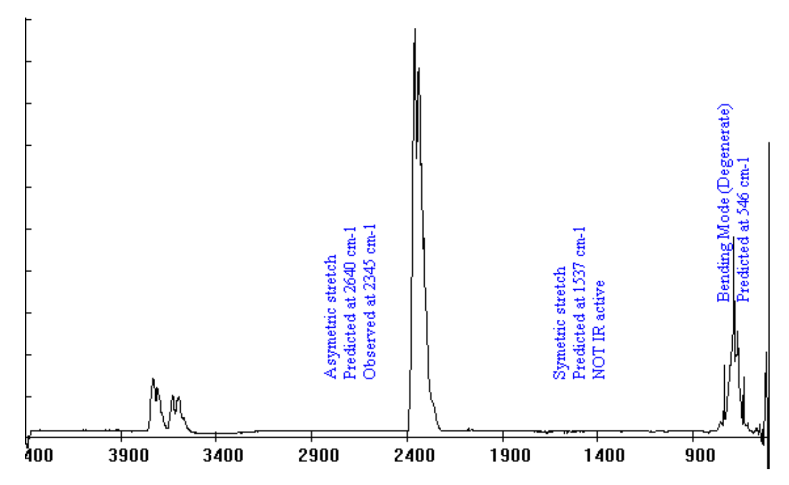

$H_2O$ hat dann $3N-6 = 9-6 = 3$ Schwingungsmoden

+ Antisymmetric Stretch
+ Symmetric Stretch
+ In Plane Bend

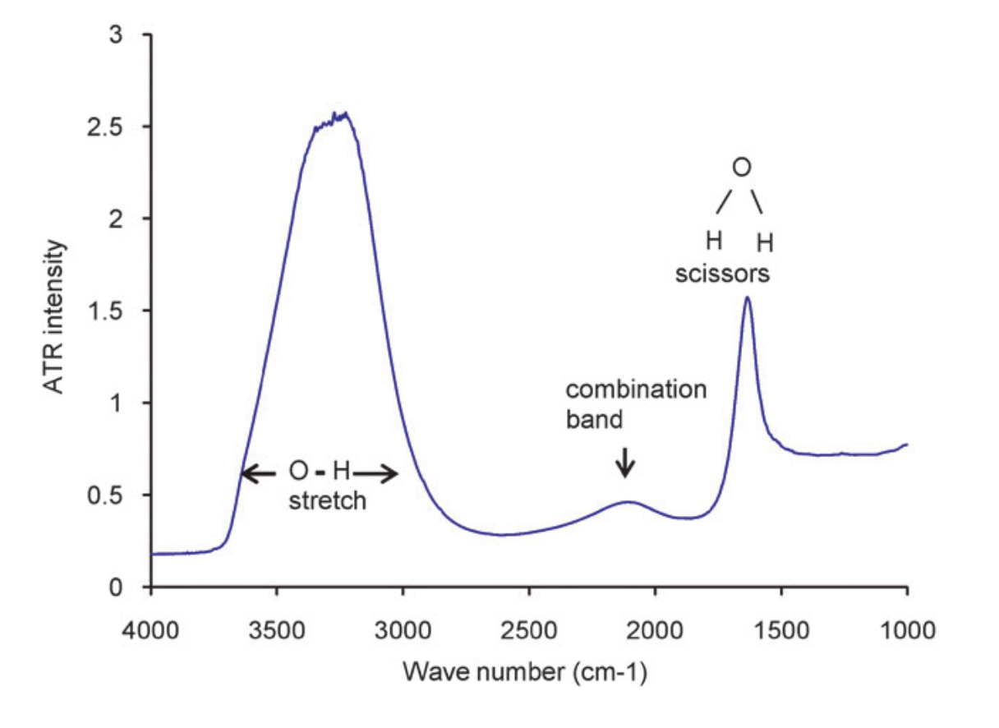

### Climate Sensitivity

> Klimasensitivität misst wie viel sich die Erdoberfläche erwärmt wenn die Menge an Atmosphärischen $CO_2$ verdoppelt wird.

Grundsätzlich kann man diese Klimasensitivität in zwei Terme aufteilen:

+ Initial warming was durch die $CO_2$ Konzentration verursacht wird
+ Feedback zum Beispiel das Eisschmelzen welches als Konsequenz der Erwärmung auftritt und boosted

Man spricht zudem von:

+ Transient Climate Response: Das ist das Wachstum an globaler Temperatur wann sich der $CO_2$ gehalt verdoppelt
+ Equilibrium Climate Sensitivity: Das ist der Langzeit Temperaturanstieg im Limit des Gleichgewichts

Nach Svante Arrhenius: 

> any doubling of the Percentage of $CO_2$ in the Air would raise the temperature of earths surface by 4°C

Nach IPCC

> The Literature assesment estimates that the TCR likely lies between 1 °C and 2.5 °C

Folgende Grafik zeigt die Erwärmungsbeiträge von verschiedenen Klimagasen

### Klimabuget $CO_2$

> Das Kohlenstoffbuget bezeichnet - im Kontext von Klimapolitik und globalen Klimaschutzmaßnahmen die Gesamtmenge and $CO_2$ an antrophogenen Quellen, die beginnend mit der Industrialisierung als Referenzzeitpunkt emmitiert werden darf um eine Grenze im Temperaturbereich einzuhalten

Im Falle des Pariser Klimaabkommens:

+ globale Erwärmung sollte auf 2 °C beschränkt werden
+ Globale Treibhausemmisionen sollten bis Mitte des 21 Jhr auf null gesenkt werden
+ Alle 5 Jahre müssen nationale Beträge zur Emmisinsreduktion vorgetragen werden
+ 

## Kapitel 4 Zusammensetzung der Erdatmosphäre

Die bodennahen Schichten bis in etwa 90 km Höhe (Karman-Linie) haben eine recht gleichförmige Zusammensetzung weshalb man auch von Homosphäre spricht.

> Der Massenanteil von Wasserampf an der Masse d er Atmosphäre beträgt nur 0.25 %, diese sind allerdings sehr unregelmäßig verteilt. Der konkrete Wert hängt stark von der Temperatur der Atmosphäre ab

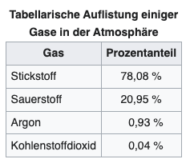

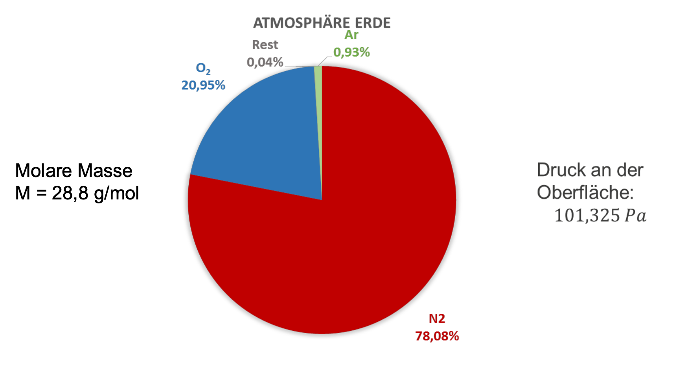

### Durchmischung der Atmosphäre

#### Wiederholung mittlere freie Weglänge $\lambda_m$

> Die mittlere Freie Weglänge $\lambda$ ist die Länge die ein Teilchen in einer gegebenen Materie zurücklegt bevor es zum Stoß beliebiger Art mit einen anderen Teilchen kommt

$\lambda_m = \frac{1}{\sqrt{2 \pi d^2}}\frac{kT}{p}$ 

Wichtig ist das die Strömungseigenschaften von der mittleren freien Weglänge abhängig sind:

+ $\lambda_m$ groß entspricht einen niedrigen Druck und damit einer laminaren Strömung
+ $\lambda_m$ klein enstpricht einen hohen Druck und damit einer turbulenten Strömung

#### Homosphere und Heterosphäre

**Definition Homosphere**

Luftgemisch, einheitliches Gas, mittlere freie Weglänge $\lambda_m$ sehr klein: Diffussion

**Definition Heterospäre**

mittlere freie Weglänge sehr groß, Mixing lenght $l_m$ spielt eine wichtige Rolle, Bulk Motions

> Homopause bei $l_m = \lambda_m = 0.1-1$ m, normalerweise spricht man über 80 km von der Heterosphäre. Man sieht klar nach der Homopause eine Abnahme der molaren Masse der Atmosphäre da hier eine Trennung der Moleküle stattfindet

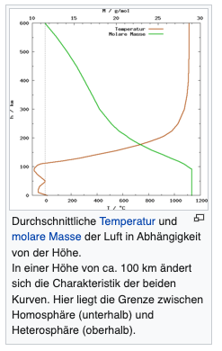

#### Die Beiden Ausnahmen

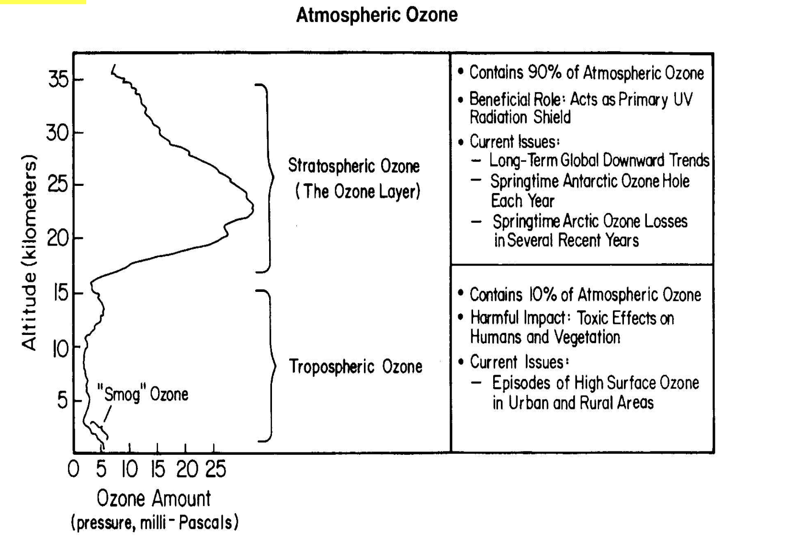

Erste Ausnahme hier ist die Ozonschicht, diese liegt in einer Höhe von 15-30 km und weist einen dort die höchste Konzentration auf, dies ist ein wiederspruch zur Definition der Homosphäre wo eine uniforme Durchmischung beobachtet wird

Die zweite Ausnahme ist die Verteilung des CFKW $CFCl_3$ man sieht auch hier das die Konzentration gerade auf der nördlichen Halbkugel in einer Höhe von 15-20km stark ansteigt

#### Fluchtgeschwindigkeit & Entweichen aus der Atmosphäre

> Beim Erreichen der Flucht oder Entweichgeschwindigkeit ist die kinetische Energie eines Probekörpers gerade ausreichend um den Gravitationspotential eins Himmelskörpers ohne weiteren Antrieb ballistisch zu entkommen.

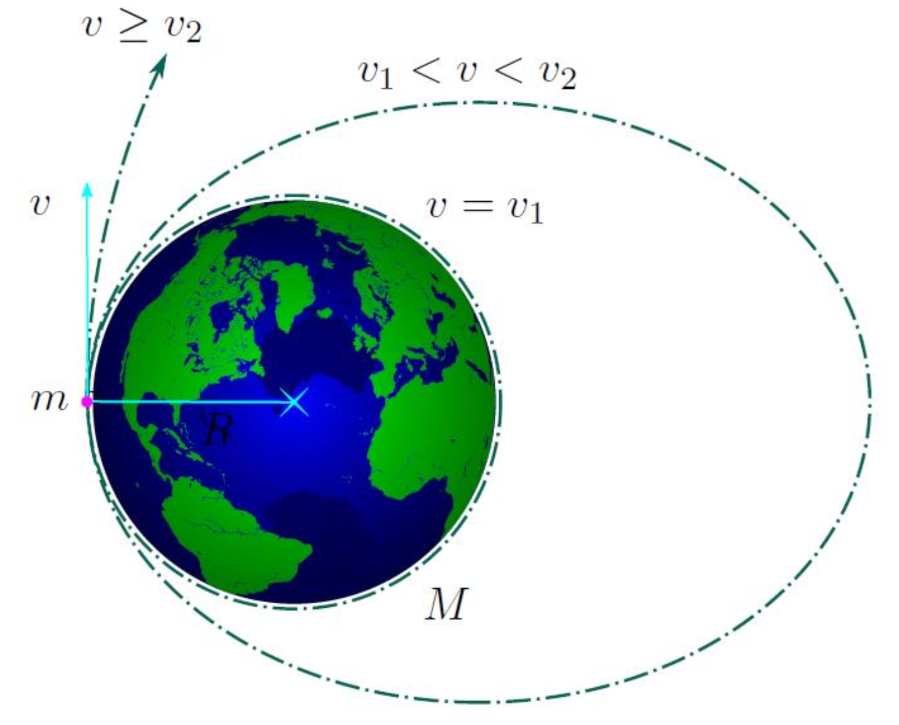

**Kreisbahngeschwindigkeit $v_1$**

Wenn sich ein Körper mit der Geschwindigkeit $v$ auf einer Kreisbahn mit Radius $r$ um das Zentrum der Erde bewegt, beträgt seine Zentripetalbeschleunigugn $\frac{v^2}{r}$. Im freien Fall wird diese ausschließlich von der Gravitation des Planeten verursacht

$v_1 = \sqrt{\frac{GM}{r}}$

mit G… Gravitationskonstante und M… Masse des Planeten und $GM = 3.986 * 10^{14}$ $m^3/s^2$, Radius r… 6371 km

> Es ergibt sich die erste kosmische Geschwindigkeit als $v_1 = 7.91$ km/s. Solche Geschwindigkeiten sind in der Erdatmosphäre nicht aufrecht zu erhalten aufgrund des Luftwiderstands

**Fluchtgeschwindigkeit $v_2$**

Diese ist um den Faktor $\sqrt{2}$ größer als die Erste kosmische Geschwindigkeit und entspricht einer Geschwindigkeit das man nicht mehr auf eine Kreisbahn zurückkehrt

$v_2 = \sqrt{\frac{2GM}{r}}$ 

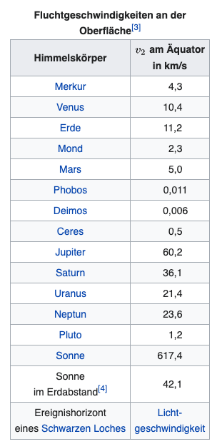

### Definition der Exosphäre

> Ein Teilchen hat einen Durchmesser $d$ und einen Wirkungsquerschnitt $\sigma$. Die durschnittliche Strecke zwischen zwei Stößen $\lambda$ hängt von Druck und Temperatur ab.

$\lambda = \frac{k_BT}{\sqrt{2}\sigma p}$ und $\sigma = \pi d^2$ 

+ Flucht ist erst möglich wenn ein schnelles Teilchen eine freie Weglänge hat bei der es nicht mehr zum Stoß in der Atmosphäre kommt
+ **Die Exosphäre beginnt bei 400-500 km und die Dichte an Teilchen ist so gering das man im Grunde von Kollisionsfreier Bewegung spricht**
+ Dies entspricht auch einer möglichen Definition des Weltalls

## Kapitel 6 Ionosphäre

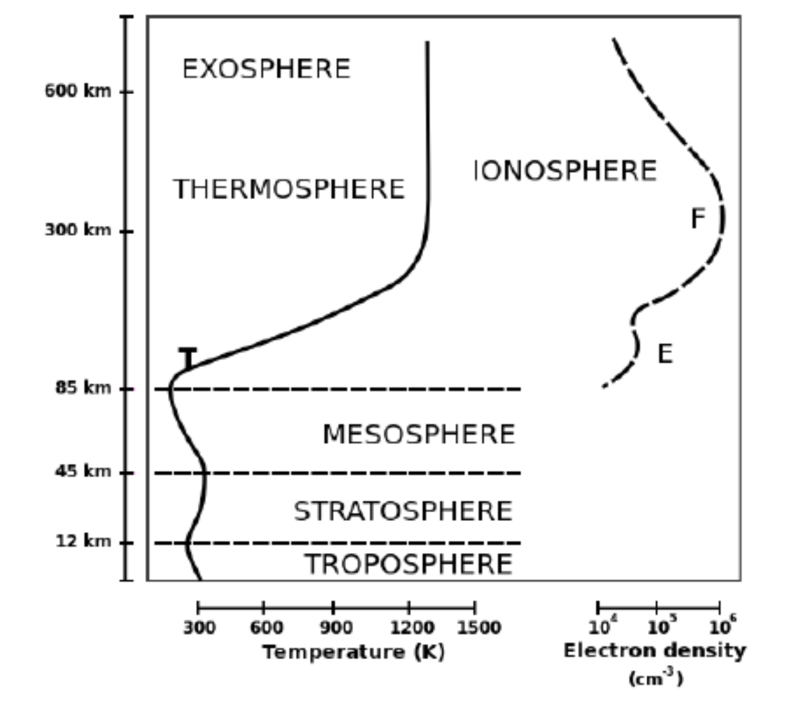

> Die Ionosphäre ist jener Teil der Atmosphäre eines Himmelskörpers, der große Mengen von Ionen und freien Elektronen enthält. Für die Planeten des Sonnensystems macht die Ionosphäre einen Großteil der Hochatmosphäre aus. Die Ionisation der Teilchen selbst erfolgt durch energiereiche Anteile an Sonnenstrahlung

+ Ionosphäre der Erde beinfluss Funkverkehr da sie Kurzwellen reflektiert damit weltweite Verbindung ermöglicht.
+ Die Ionosphäre beginnt oberhalb der Mesophäre bei 80 km. Die größte Elektronendichte ist bei 300km

### Die Schichten der Ionosphäre

> Innerhalb der Ionosphäre exestieren drei lokale Ionisationsmaxima, weswegen sie in drei Bereiche unterteilt wird: Die D-, E- und F-Schiht

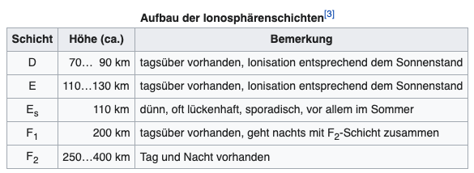

**Die D-Schicht**

+ Exestiert nur am Tage in einen Höhenbereich von 70 - 90 km
+ Ionisation durch Lyman-$\alpha$-serie bei 121.6 nm wird von Stickstoffmonoxid absobiert
+ Kationen und Anionen
+ Effiziente Rekombination
+ $e^- + O_2 + M \to O_2^- + M$

**Die E Schicht**

+ Bildet sich zwischen 90-130 km aus. Ionisation findet aufgrund von Röngtgenstrahlung statt.
+ Hauptsächlich Molekülionen $N_2^+ / O_2^+$
+ Oftmals sproadisch starke Ionisationsmaxima
+ Schneller Abau von $N_2^+$ durch $N_2^+ + O \to N^* + NO^+$
+ Wichtige Rolle von $NO$ durch $O_2^+ + N_2 \to NO + NO^+$

**Die F Schicht**

+ Diese liegt bei 200-400 km Höhe und ist die stärkste ionisierte Schicht. Extreme Ionisation durch UV strahlung welche auf Sauerstoff und Stickstoff trifft
+ $O^+ + N_2 \to N + NO^+$
+ $NO_+ + e^- \to N^* + O^-$
+ Die F Schicht besteht auch Nachts da wegen der großen mittleren freien Weglänge die Elektronen nur langsam rekombinieren

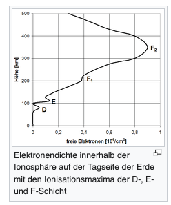

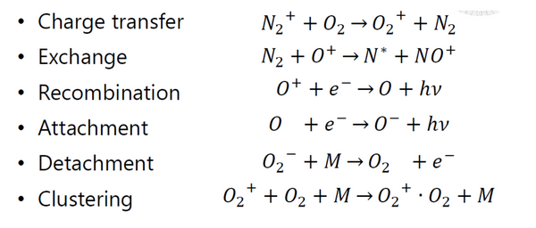

### Air-Glow

> Das Nachthimmellicht bezeichnet ein schwaches Leuchten von höheren Atmosphärenschichten. Ein Teil dieses Leuchten wird durch Rekombination von Ionen und Elektronen in der Ionosphäre verursacht

**Spezifisch hier ist ein grünes Band bei 90-100 km Höhe was der Anregung von atomaren Sauerstoff entspricht**

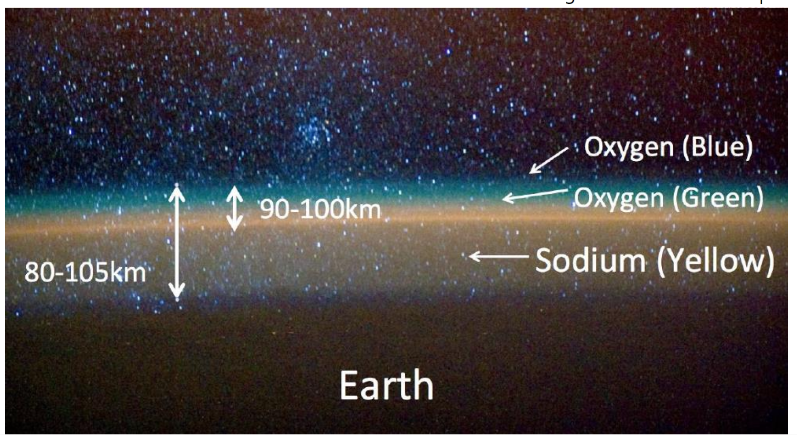

### Aurora borealis

> Das Polarlicht ist eine Leuchterscheinung durch angeregte Stickstoff und Sauerstoffatome der Hochatmosphäre also ein Elektrometero.

**Entstehung**

Das Plasma des Sonnenwindes wird durch das Erdmagnetfeld in weitem Bogen um die Erde gelenkt, da elektrisch gerladene Teilchen sich nicht quer zum Magnetfeld begwegen können. Es kommt zur Deformation der Magnetosphäre. Bei einer Sonneeruption wird die Magnetosphäre gestört. Es kommt zur Beschleunigung von Elektronen auf im "polaren Elektrojet" um die Erde. Durch Kollision werden Stickstoff und Sauerstoff angeregt es kommt dann zur Licht aussendung

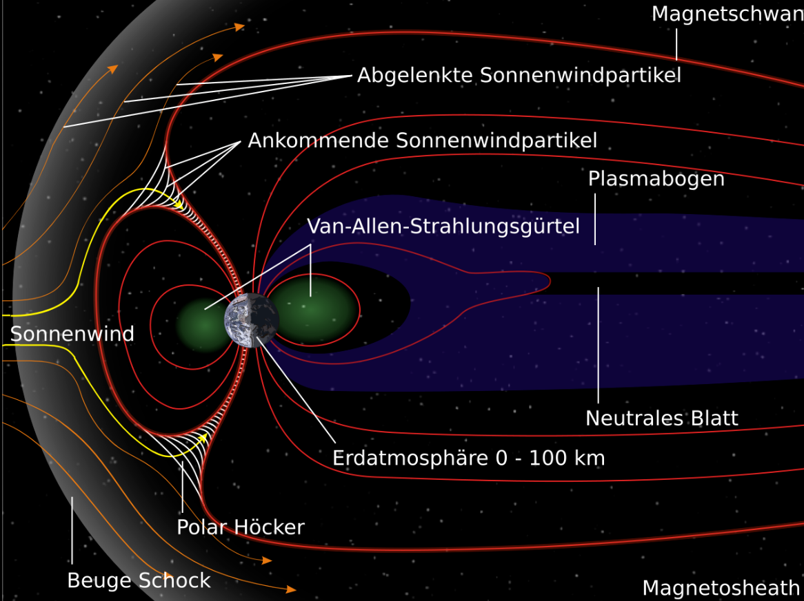

#### Übergänge von Atomaren Sauerstoff

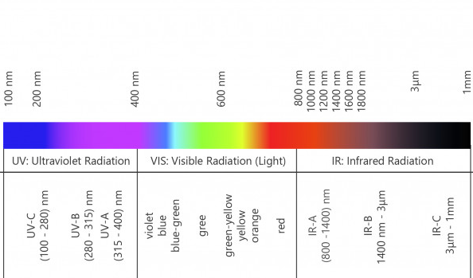

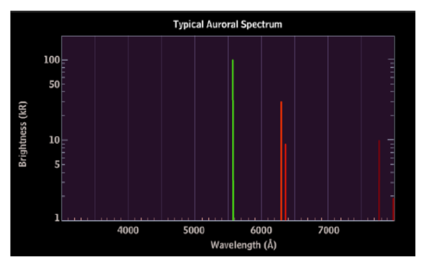

**Zwei sehr spezifische Banden im grünen Lichtbereich werden von atomaren Sauerstoff verursacht**

1. 557,7 nm mit $O(^1 S)\to O(^1 D)$
2. 630.0 nm mit $O(^1 D) \to O(^3 P)$

Ausgehend vom Atomorbitalschema kann man die Anregung wie folgt darstellen

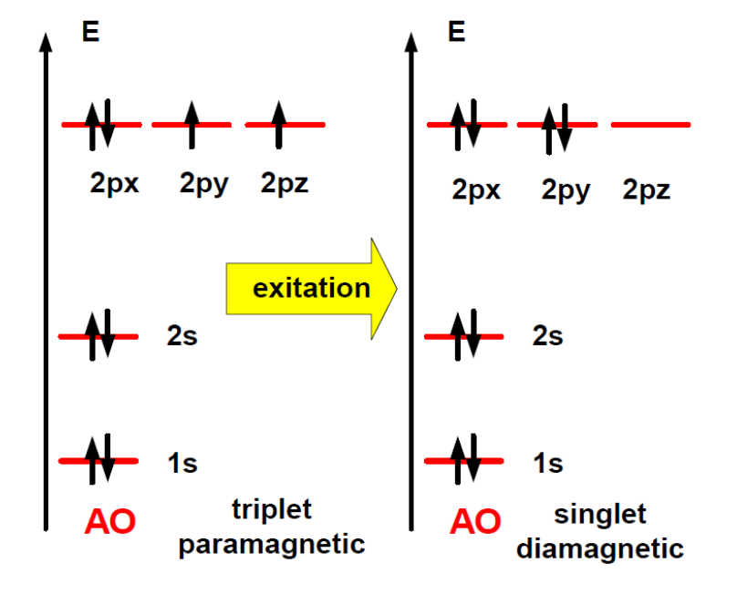

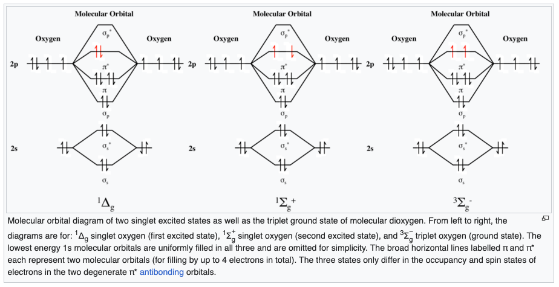

> Molekularer Sauerstoff besitzt zwei angeregte Zustände die eine deutlich größere Energie als der Grundzustand besitzen. In diesen Zuständen sind die Spins entgegen der Hundschen Regeln antiparallel ausgerichtet damit diamagnetisch

+ $^1 \Delta_g$ singlet oxygen (first excited state) beide Elektronen in einen Orbital
+ $^1\Sigma_g^+$ singlett oxygen (second excited state) beide Elektronen in zwei Orbitalen
+ $^3\Sigma_g^-$ triplett oxygen (ground state)

> Der Übergang von Singlett Sauerstoff zurück in den Grundzustand macht die Charakteristische grüne Bande → Ist jedoch auf den atomaren Sauerstoff bezogen glaub ich

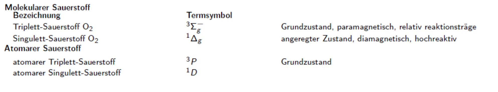

## Kapitel 7 Stratosphäre

### Exkursus Leuchtende Nachtwolken NLC)

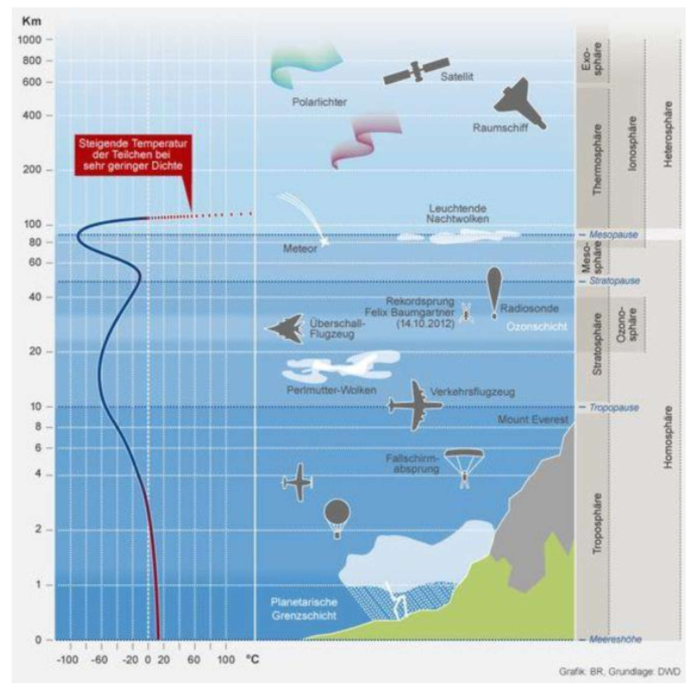

> Leuchtende Nachtwolken sind Ansammlungen von Eiskristallen oberhalb der Mesopause. Dort liegt das absolute Temperaturminimum der Erdatmosphäre

Entstehungsgrund ist nicht endgültig klar, man geht dabon aus dass es sich um Material handelt welches durch das Verglühen von Meteoren freigesetzt wird.

Woas eigentlich koaner wie de Folie da gelandet is

### Ozonschicht

**Definition Dobson Einheit** 1 DU =  10 $\mu m$ dicke Schicht eines Gases bei 1 atm und 273.15 K. Die Ozonschicht ist im mittel 300 DU dick

> Die Ozonschicht ist ein Bereich erhöhter Konzentration des Spurengases Ozon in der Erdatmosphäre. Zirka 90 % des atmosphörischen Ozons befinden sich in 15-30 km Höhe.

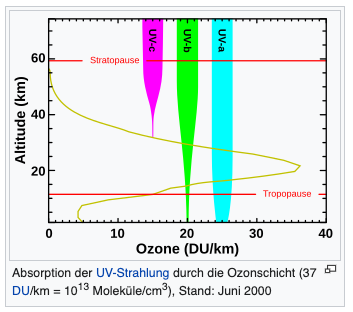

#### Ozon-Sauerstoff-Zyklus (Chapmann Zyklus)

> Der Ozon-Sauerstoff Zyklus auch Chapman-Zyklus ist ein Vorgang, durch welchen Ozon fortwährend in der Ozonschicht erneuert wird, wobei UV-Strahlung in Wärmeenergie umgewandelt wird

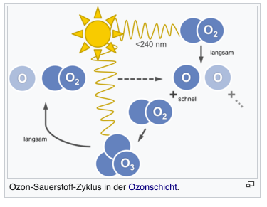

+ Entstehung: Atomarer Sauerstoff durch Spaltung: $O_2  + hv (\lambda < 242nm) \to 2O$
+ Dann mit Stoßpartner M: $O + O_2 + M \to O_3 + M$
+ Zerfall in der oberen Atmosphäre mit UV Licht $O_3 + hv (\lambda < 310nm)\to O_2 + O$
+ Atomarer Sauerstoff und Ozon $O + O_3 \to 2 O_2$
+ Zwei mal atomarer Sauerstoff $O + O + M \to O_2 + M$

#### Katalytischer Ozonabbau

> Der katalytische Ozonabbau sind chemische Prozesse wo durch Katalysatoren das Ozon abbgebaut wird

Der generelle Zyklus hat die Form:

1. $X + O_3 \to XO + O_2$
2. $XO + O \to X + O_2$
3. Net: $O_3 + O \to 2 O_2$

**NOx Zyklus**

1. $NO +  O_3 \to NO_2 + O_2$
2. $NO_2 + O \to NO + O_2$
3. Net: $O_3 + O \to 2 O_2$

**HOx Zyklus**

1. $OH + O_3 \to HO_2 + O_2$
2. $HO_2 + O \to OH + O_2$
3. Net: $O_3 + O \to 2 O_2$

**ClOx Zyklus**

1. $Cl + O_3 \to ClO + O_2$
2. $ClO + O \to Cl + O_2$
3. Net: $O_3 + O \to 2 O_2$

**BrOx Zyklus**

1. $Br + O_3 \to BrO + O_2$
2. $BrO + O \to Br + O_2$
3. Net: $O_3 + O \to 2 O_2$

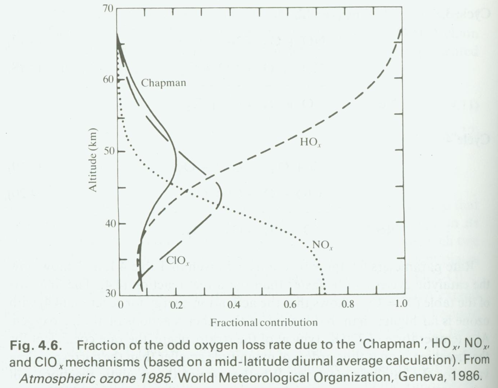

#### Das Ozonloch

> Als Ozonloch bezeichnet man eine starke Ausdünnung der Ozonschicht. Ursachen des Ozonabbaus sind hauptsächlich radikalische Chloratome aus chlorierten organischen Verbindungen zb Fluorchlorkohlenwasserstoff (FCKW oder CFCs)

Mechanismus durch Harold D. Johnston, Paul Crutzen ..

1. $CFCl_3 + hv \to CFCL_2* + Cl*$
2. $O_3$
3. $Cl* + O_3 \to ClO* + O_2$
4. $ClO* + O \to O_2 + Cl*$

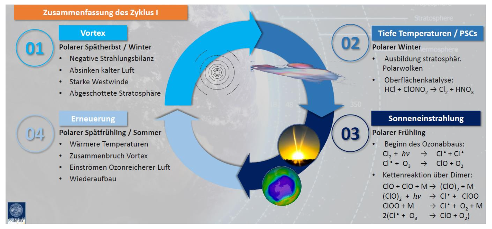

#### Polare Stratosphärenwolken

> Polare Stratosphärenwolken, oder auch Perlmutwolken genannt treten in der Stratosphäre in einer Höhe über 20 km auf. PSCs können nur nur bei niedrigen Temperaturen unter -78 °C entstehen

+ Typ 1: Polare Stratosphärenwolken vom Typ 1 bstehen aus Salpetersäure und Wasser werden in zwei Untertypen unterteilt
    + Typ 1b: Lösung aus Schwefelsäure, Salpetersäure und Wasser: Auf den Tröpfchen der Schwefelsäure lagert sich Wasser und $HNO_3$ an. Es kommt zu einer unterkühlten Tenären Lösung (STS) aus Schwefelsäure, Salpetersäure und Wasser
    + Typ 1a: Es können Kristalle aus Schwefelsäuretetrahydrat (SAT) zurückbleiben mit einer Schale aus Salpetersäuretrihydrat (NAT)
+ Typ 2: Vereistes Wasser auf SAT/Nat Partikeln

## Kapitel 8 Chemie der Troposphäre

### Vertikale Durchmischung der Atmosphäre

**Definition Boundary-Layer (Peplosphäre)**

+ Untersten 1,5 - 2 km
+ Bodenreibung und Erwärmung führen zu Turbulenzen
+ Hohe Konvektionsrate
+ Dunstschciht und Anreicherung von Aerosolen führen zum Frühnebel

**Definition Winde**

> Hauptursache für die Entstehung von Winde sind räumliche Unterschiede der Luftdruckverteilung. Es begwegen sich Luftteiclhen aus dem Gebiet mit einem Höheren Luftdruck zum Niederdruckgebiet

**Inter-Tropical Convergence Zone ITCZ**

> Bei Segler als Doldrum bekannt ein windstilles Äquatorgebiet wo Winde der nördlichen und südlichen Hemisphäre sich ausgleichen

**Konvektion**

> Bewegungsvorgänge in der Atmosphäre durch Auftrieb. Aufsteigen von warmen Luftpaketen absteigen von kälteren Luftpaketen.

#### Feinstaubkonzentration in der Atmosphäre

+ Feinstaub sind Schwebstoffe die in der Atmosphäre verweilen.
+ In der Troposphäre erfolgt ein Auswaschen durch Niederschlag
+ In der Stratosphäre kann eine Verweildauer bis zu 100 Tagen beobachtet werden

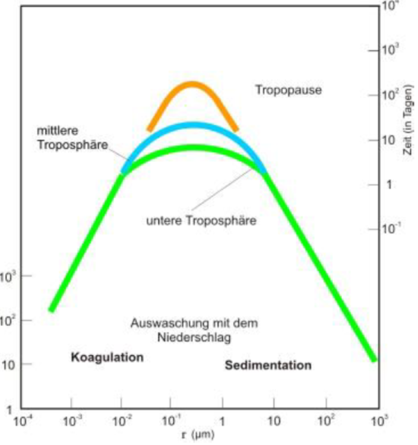

#### Trockenadiabatischer Temperaturgradient

> Der Trockenadiabatische Temperaturgradient gilt für adiabatisch reversible und damit isentrope Bedingungen ohne dass es zur Änderung des Aggregatzustands kommt. Er beträgt etwa 10 °C pro Kilometer höhe

Herleitung:

Druckänderung mit der Höhe

+ $dF = - g \rho A dz$
+ dp = -g \rho dz$

Temperaturänderung (Adiabatisch)

$dG = \delta Q + V dp = Vdp$

Es gilt $c_P = \frac{dH}{dT}$ und damit $c_PdT = Vdp = -V g \rho dz$ und nach umstellen $-\frac{dT}{dz} = 9.76 = \Gamma_d$ 

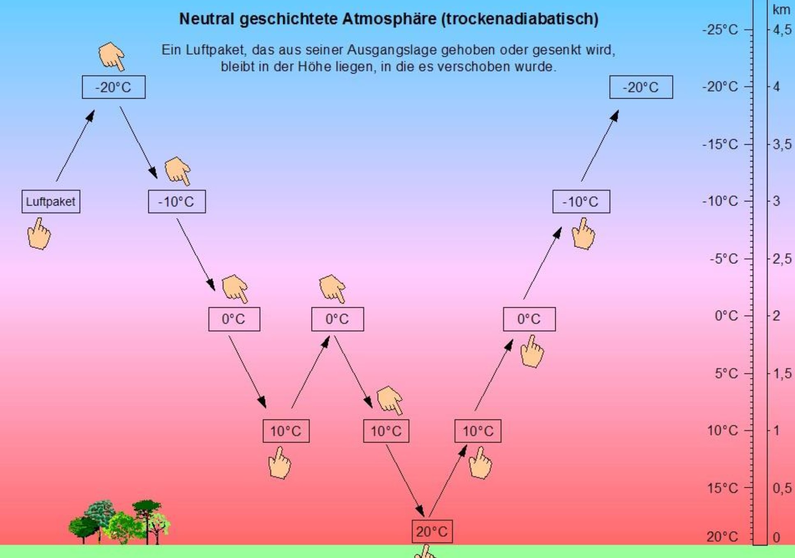

### Kategorisierung der Wolken

> Wolken werden Grundsätzlich nach Höhe und nach Erscheinungsbild eingeteilt

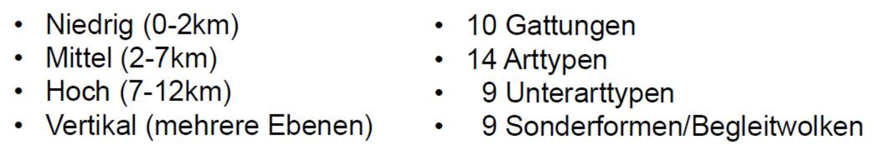

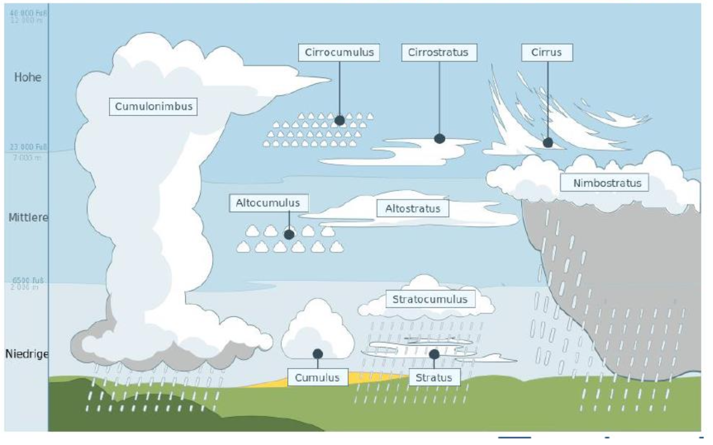

Einige Wichtige Wolkentypen

**Cirrus** In einer Höhe von 8-12 km mit dünne Fasern und Fäden, selten auch Büschel

**Cirrocumulus** Kleine Haufenwolken, fast ausschließlich Eiskristalle 8-12 km

**Cirrostratus** Schichtwolken oder fasriger Schleier in 8-12 km Höhe

**Altocumulus** Haufenwolke tritt als großes Feld aus einzelnen Wolken auf 2-8 km

**Altostratus** graue mittelhohe Schichtwolke ohne Konturen 2-8 km

**Stratocummulus** Haufenschichtwolken ohne Fasern, Häufigste Wolke havben oft graue Färbung da Wassertropfen Licht absobieren 0,5-2km

**Stratus** Klassicher Hochnebel, völlig Strukturlos 0-2km

**Cumulus** Dicht scharf voneinander abgegrenzte Haufenwolken verändern sich strändig 0,6-2 km

**Nimbostratus** Dunkelgraue Schicht klassische Dauerregenwolke 0.6 -12 km

**Cumulonimbus** Sehr große Haufenwolke mit Massiver Vertikaler Ausdehnung und Ambos

### Reinigungsmechanismen

+ Feuchte Abscheidung
    +  Auflösung und Reinigung durch Wasser (Regenwolken, Regentropfen Aerosole)
+ Trockene Abscheidung
    + Irreversible Absorption von Grund, Wasser, Pflanzenoberflächen
+ Photolyse
    + Spaltung durch Sonnenlicht, höhenabhängig
+ Abbau durch Radikale (OH & $NO_3)$
    + OH Radikal wird unterm Tag photokemisch hergestellt, Nitrat Radikal kann auch unter der Nacht bestehen
 
#### Bildung des Hydroxylradikals

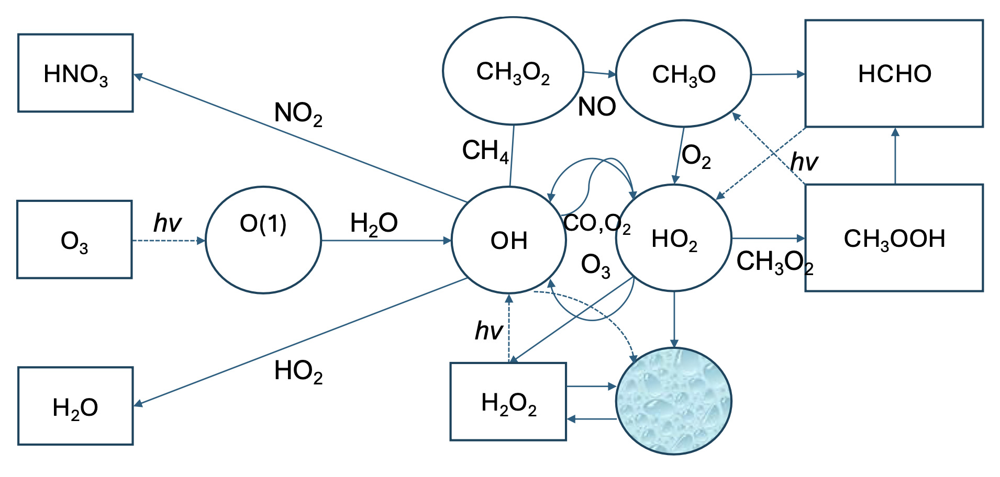

> Das Hyroxyl-Radikal besitzt ein einziges ungepaartes Elektron und ist sehr reaktiv. Es entsteht in der Troposphäre aus Ozon und Wassermolekülen

 1. Spaltung durch Ozon: $O_3 \to O_2 + O$ dann mit Wasserdampf $O + H2O \to 2OH$

## Kapitel 9 Smog und Stuff

### Sommersmog

> Sommersmog bezeichnet man die Luftbelastung durch hohe Konzentrationen von Ozon und anderen Photooxidantien. Sommersmog entsteht durch die photochemische Oxidation von Kohlenmonoxig Methan und flüchtigen Kohlenwasserstoffen in Gegenwart von Stickoxiden und Wasserdampf als Katalysator bei nicht zu kühlen Wetter in nicht zu großer Höhe

Man braucht

+ UV Strahlung in Verbindung mit
+ Stickoxiden
+ Flüchtigen organischen Verbindungen

Ablauf:

Am Morgen mit Stickoxiden

$NO_2 + hv (\lambda < 420 nm ) \to NO + O$

Dann Bildung von Ozon

+ $O_2 + O + M \to O_3 + M$
+ $O_3 + NO \to NO_2 + O_2$

Vormittag: Bildung von organischen Radikalen

+ $RH + O \to R^*$

Nachmittag Bildung von Hydroxylradikalen

$H_2O + O \to 2HO*$

Dann Reaktion mit organischen VOC

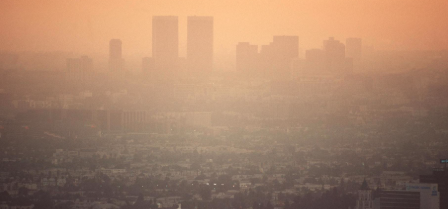

### Wintersmog

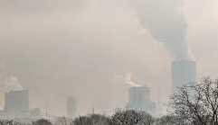

> Mischung aus Ruß, Schwefeldioxid $SO_2$ Staub und Nebel kann sich in Inversionswetterlagen lange Über Städten halten der Rauch stammt of aus Wärmekraftwerken Holzfeuerung und Farzeugen mit Verbrennungsmotoren

Sprich Warme Luftpakete werden von Kaltluft umschlossen damit Ausschluss von Zirkulation!
