# Introduction to Chemoinformatics

> Chemoinformatics focuses on storing, indexing, searching, retrieving and applying information about chemical compounds

+ How to we store information on a computer
+ How do we retrieve the data
+ What do we do with this data

## Data sources in chemistry

+ SciFinder by ACS - largest coverage of primary literature for chemistry
+ Reaxys by Elsevier - recommended for obtaining physico chemical data
    + For physico chemical data
    + Preperation methods for pure compounds
+ Pubchem - database of chemical molecules and activities against biological assays
+ ChEMBL - focus on bioactivity, drug like compounds and assays
+ DrugBank - focus on approved drugs
+ ZINC → Ligand vbased for virtual screening ready to dock
+ SureChEMBL → Patent Data
+ ENAMINE → Molecules on Demand by 167 parallel synthesis protocols
+ PDB protein structure database
+ CSD → 3D structure data of small molecules
+ IUPHAr information of licenced drugs and small molecules

## IC50 Value

> Half maximal inhibitory concentration is a measure of the potency of a substance in inhibiting a specific biological or chemical function. It measures how much of a substance is needed to inhibit a biological process by 50 %

Sometimes given in log scale: $pIC_{50} = -\log_{10}(IC_{50})$

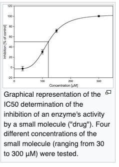

## The drug discovery process

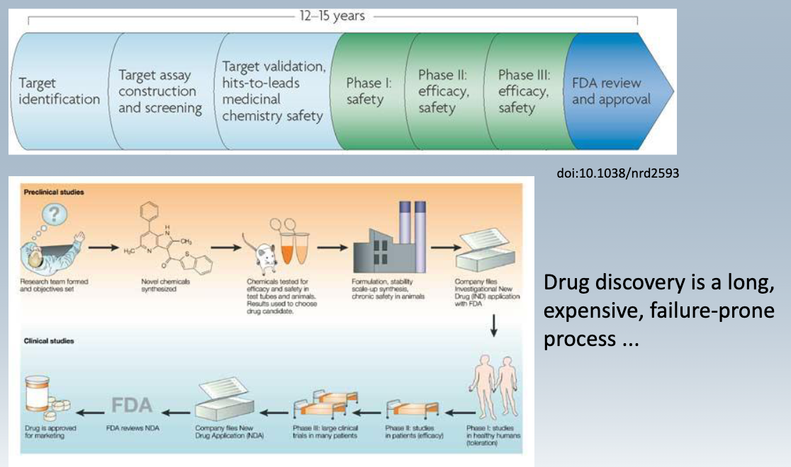

+ Phase 1: Studies in Healthy persons
+ Phase 2: Studies in Patiens
+ Phase 3: Large clinical trials

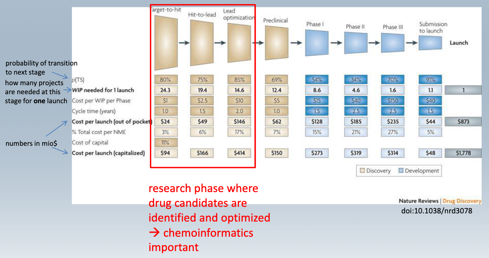

Phase II → Phase III very low probability of transition to the next stage but huge investment at this point

## Moore's Law

> Moore's law is the observation that the number of transistors in an integrated circuit (IC) doubles about every two years.

> Errom's Law is the opposite, the money it takes to get a drug to the market also increases exponentially

# Representation of Molecules

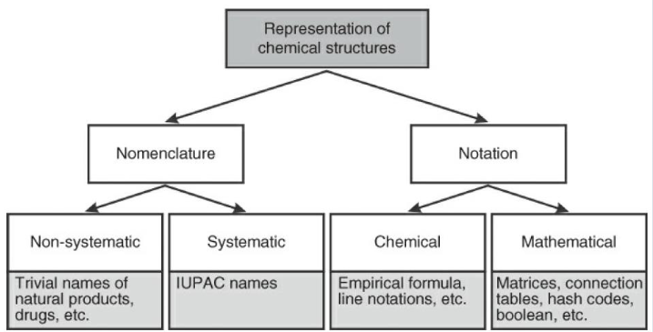

+ Nomeclature are names, like IUPAC and trivial names
+ Notation are formulas, line notation, matrices, hash codes ...

Representation can be in 2D / 3D:

2D and linear representations:

+ molecular graphs
+ connection tables
+ linear notations (SMILES, InChi)
+ Markush Notation

→ 2D Searches are in general (SUB) structure searches

3D representations:

+ conformation generation
+ pharmacophore generation
+ bioactive conformation

→ 3D searches are in general pharmacophore searches

## 2D Representations:

### Molecular Graphs

> A graph is a set of vertices V and edges E, where each element in E is comprised by a 2-element subset of V

In molecules:

+ Nodes are the atoms
+ Edges are the bonds
+ Small File size and powerful algorithms

### Smiles Notation

> SMILES = Simplified Molecular Input Line Entry Specification

+ Smiles is a string obtained by printing the symbol nodes encountered in a depth first tree traversal of a chemical graph

**Rules**

+ Atom is represented by respective atomic symbol. Upper Case (non-aromatic), lower case (aromatic) hydrogens are either skipped or all included
+ Bonds:
    + (-) single bond
    + (=) double bond
    + (#) triple bond
    + (:) atomatic bond
    + (.) disconnected structures
  + Branches: A branch is specified by placing the SMIles symbols in the parenthesis
  + CC(O)C → 2-Propanol
  + Rings use numbers to specify the opening and closing atom
  + Stereochemistry and configuration:
      + E/Z notation with / or \ → F/C=C/F → trans
      + Stereocenters: with @ or @@
  + Charges can be explicitly stated

#### Canonical Smiles

> Smiles annotation is not unique (depending on the enumaration of the sequence, disadvantage for comparison)

+ Ordering is called canonicalization, Morgan algorithm or CANGEN

##### Morgan Algorithm

1. Assign connectivity value
2. Replace Connectivity Value by sum of neighbors
3. Continue until different values are maximized

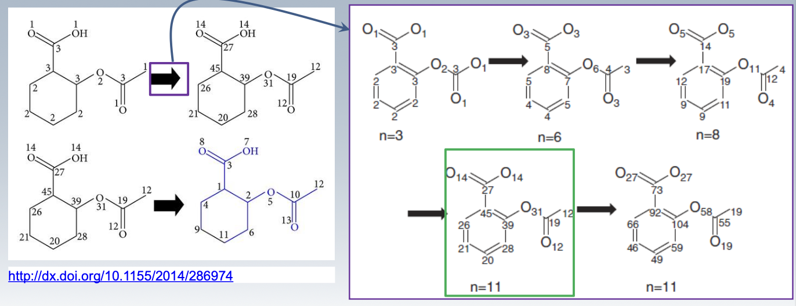

Then carry out the canonicalization technique:

1. Atom with highest EC number gets 1
2. All other neighbors get 2,3,4 according to EC value
3. Carry on with the next subsequent atom

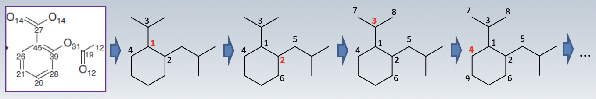

### InChI and InChI Keys

> Developed by IUPAC textual identifier for chemical substances, designed to provide a standard way to encode molecular information

+ Information collected in several layers
+ Ethanol "InChI=1S/C2H6O/c1-2-3/h3H,2H2,1H3"

3 Step Procedure:

1. Normalization of structures
2. Canoncialization
3. Serialization

> InChi-Keys are 27 character hash keys generated from InChi with SHA-2 hashing algorithm

+ Useful for structure search as inchy is to lenghty
+ Molecules can have same InChI key, but this occurs rarely

### Markush Notation

> Uses variables to encode more than one actual structure by one representation, often used in patents to ensure broad covrage of structures

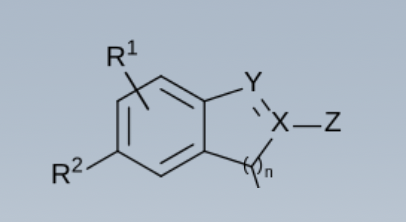

+ Substituent variations (R2 - phenyl / naphtyl)
+ Position variation, attachment points
+ chain length variations
+ Homology variation
+ stereochemistry variation

# Substructure Searches

Overview over methods:

+ Searching by graph theory
    + Subgraph isomorphism (NP complete) and time consuming
 
Two step approach:

1. prescreening: removal of large fraction of molecules
2. Apply subgraph isomorphism algorithm

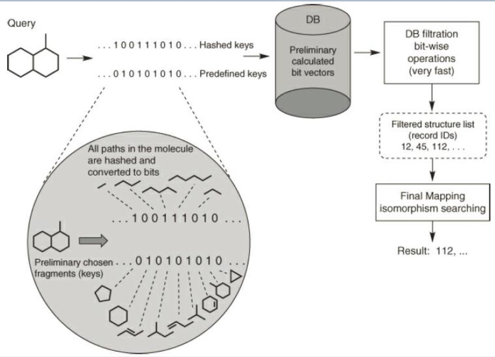

+ Query gets hashed
+ DB contains precalculated bit-vectors
+ Bit-wise filter operation
+ apply subgraph isomorphism to final result

## Structure Keys approach (MACCS)

+ Bit string of length n
+ If a predefined subtstructure / feature is present, set bit to 1
+ Remove mismatches
+ this approach is static

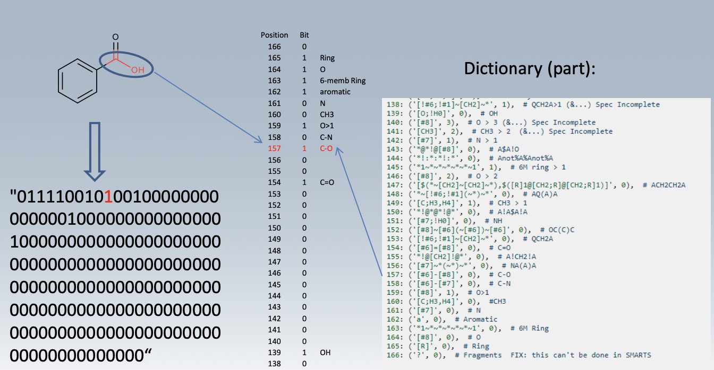

Example of a dictionary based search

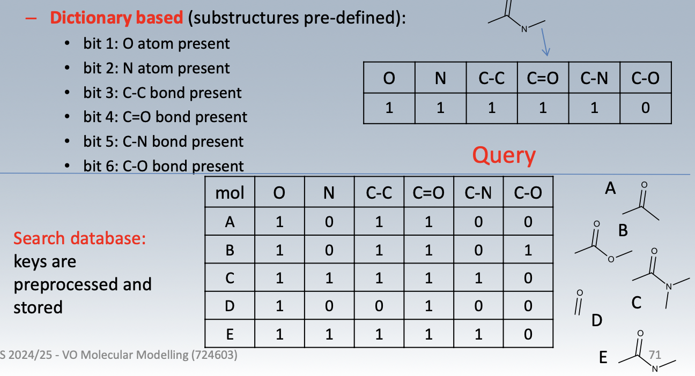

+ search for identical bit strings
+ filter hits and apply subgraph isomorphism tohits

## Hashed Fingerprints

+ Up to a given bond number all paths are detected
+ branching points and cycles are detected
+ hashing function uses this info to set bits
+ Importanrt is the fact that bit collisions are allowed

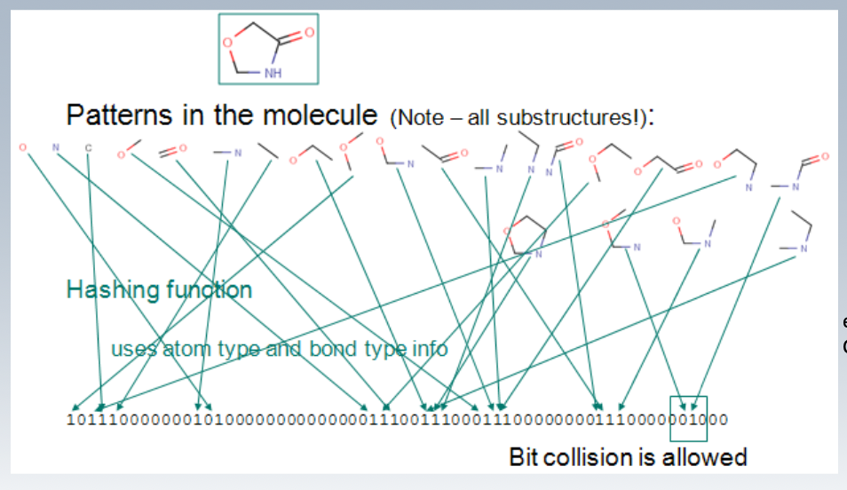

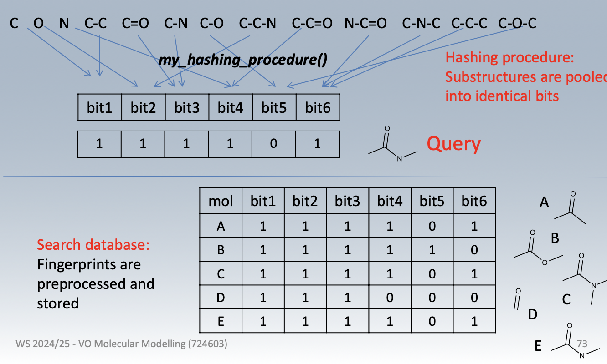

> very difficult to deduce original structure form the hashed fingerprints

## Important differences

+ Structure hash codes are for exact matching, not for similarity substructure searches, InCHi-Keys for example
+ Structure keys are 100-1000 bits and used in similarity searches
    + 0/1 denotes if a structural feature is present
    + MACCS keys or MDL keys
    + Keys are pre-defined
+ Fingerprints usually with > 1000 bits, used in similarity searches
    + Patterns are constructed from molecule and hashed
    + Useful for similarity search, no predefined library required
  

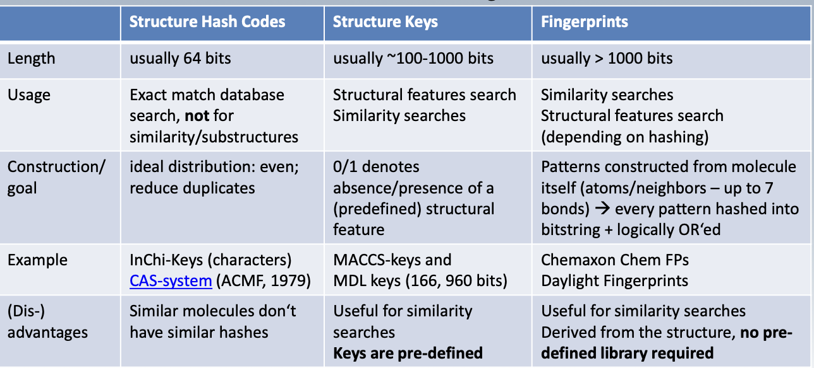

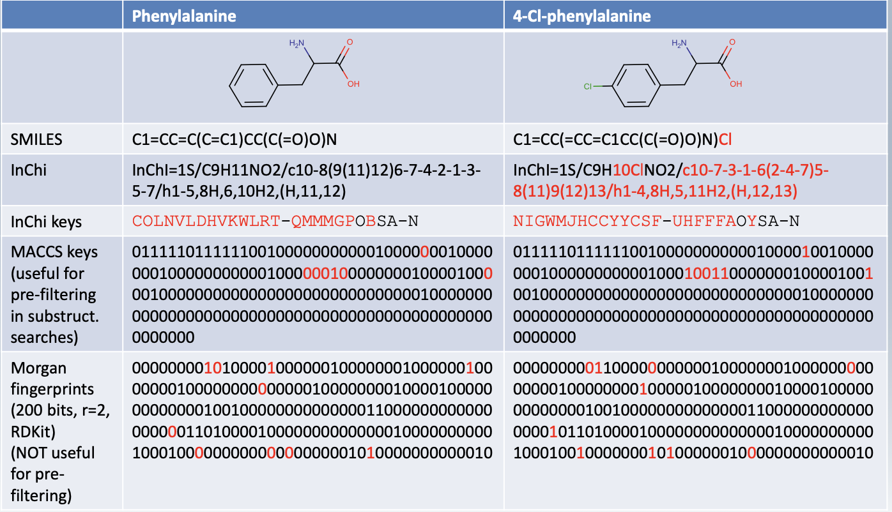

## Subgraph Isomorphism

+ Applied to all structures that match the query after pre-screening
+ Based on the adjacency matrix of a molecule
+ Goal is to identify a isomoprhic mapping A, which maps the adjacency matrix of the target into the query molecule (Q)

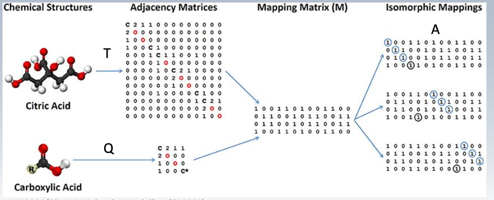

> Subgraph isomorphism algorithms are based on backtracking algorithms. Task is to find one mapping of Query Graph into Target graph

# 3D Representation of molecules

+ 2D structures only give information which atoms are bonded together
+ Many steric and electronic properties depend on spatial arrangemenent

Population of conformations is depending on the free energy of Boltzmann.

$\frac{N_i}{N} = \frac{\exp(-\Delta G/RT)}{\sum_j \exp(-\Delta G_j /RT)}$

**Calculation up to 3-4 kcal/mol above the global minimum are relevant**

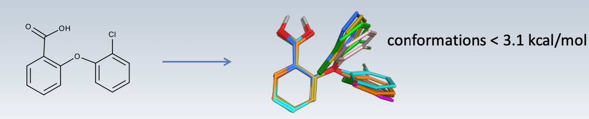

## Methods to generate 3D structures

Why do we need 3D confomers:

+ Virtual screening in 3D confomer databases
+ Generating bioactive conformations as query
+ Generate a set of energetically accessible and structurally diverse conformations

Common approaches

+ Generate one Conformation on empirical/statistical data (CORINA) program
+ Based on forcefields generate conformations
+ Based on quantum chemistry, energy assessment of conformations

### Experimental Databases

For example CSD database whichh as also statistics on the angular distribution

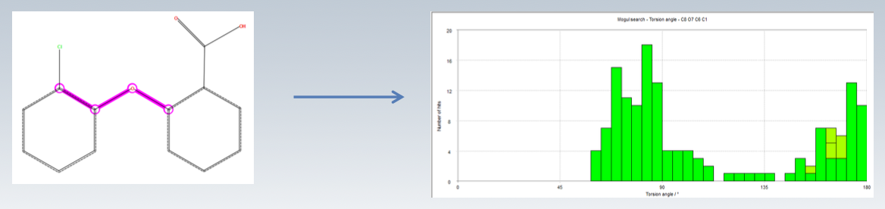

Or isostar to visualize and explore possible interactions

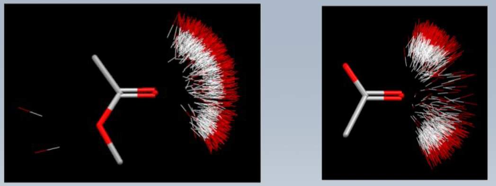

### CORINA

> Corina is a single, high-quality low energy conformation generator

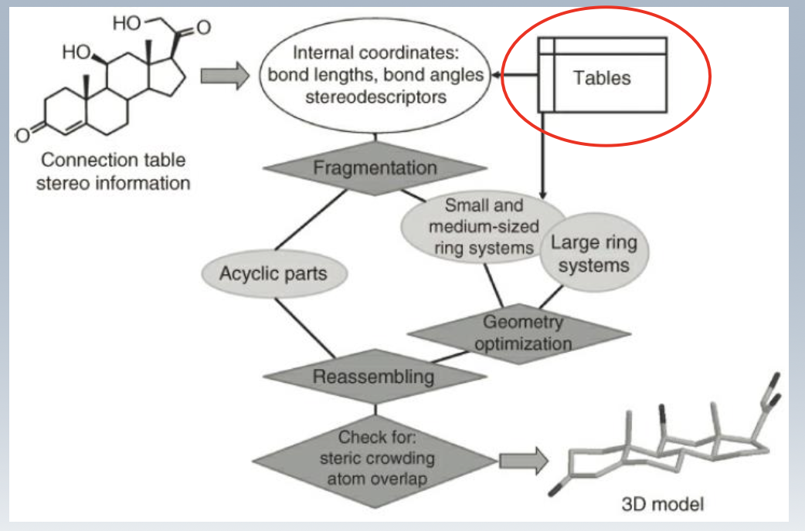

+ Is a fast 3D structure generator based on empirical data from experimental databases, adjusts bond lengths, angles ...

### Force Field Approach

+ Systematic search:
    + Torsion angles are set to allowed values (many rotable bonds mean huhe number of combinatorics)
    + Force field optimization to nearest minimum
    + Check if value is acceptibal and add to ensemble

Futher notes:

+ Represent torsional combinations as tree
+ Algorithm to enumarate conformations based on dfs algorithm
+ 
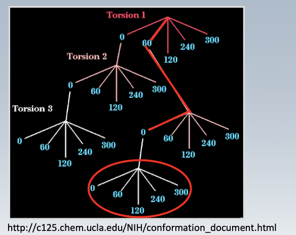

### Stochastic Search / MD

+ Include a random steb based on a previous structure (Metropolis Monte Carlo Algorithm)
+ If new structure is lower in energy: accept
+ If new structurre is higher in energy (acceptence accordance to boltzmann weighted tearms)
+ Not deterministic!
+ MD simulations can also be tacken

Smart approach: do the MD in torsional space

# Pharmacophores

+ Major use of 3D databases are pharmacophore searches

> A pharmacophore is a set of molecular features together with their spatial arrangement

> A ensemble of steric and electronic features that is necessary to ensure the optimal supramolecular interactions with a target

Typical features:

+ H Bond acceptors/donors
+ Charges
+ Aromatic rings

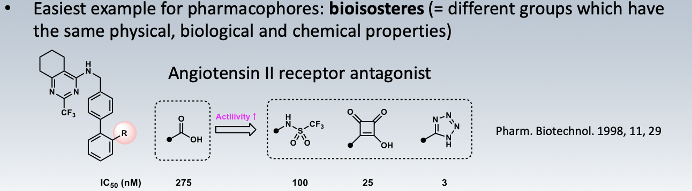

## Deriving Hypothesis

A pharmacophore hypothesis can be derived from:

+ Receptor / Ligand interactions (X-Ray)
+ Known bioactive conformation of ligands (X-Ray NMR)

### Pharmacophore mapping:

Pharmacophore mapping is a process in drug discovery where the key chemical features responsible for a drug’s biological activity are identified and spatially arranged. A pharmacophore represents the minimal set of molecular features needed to ensure optimal interactions with a specific biological target, often a receptor or enzyme. This process helps in understanding the drug-target interaction and aids in the design of new drugs with desired activity

+ Problem of conformational flexibility
+ A priori no knowledge of the most relevant features

Procedure:

1. Select training set of active ligands
2. Conformational analysis - find low energy conformations
3. Molecular superimposition
    1. Identify features in ligands
4. Abstraction - pool similar features and discard rare features in the ligand overlay
5. Validation - test with active molecules

### Searching in 3D Databases

+ Preperation of the databse and the query
+ Pharmacophore query preparation:
    + Encode information in bit string
    + Generate bit string for every conformation in database

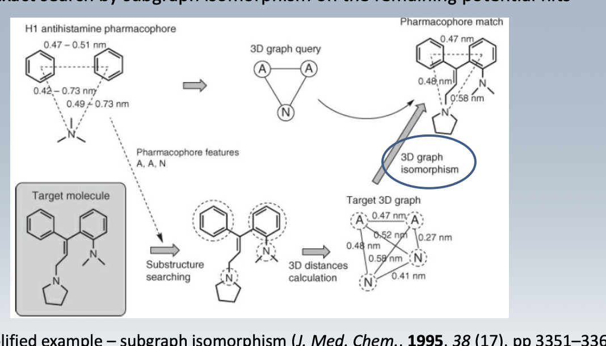

### ROCS (Rapid Overlay of chemical structures)

> Molecules are overlaid in 3D by shape overlay

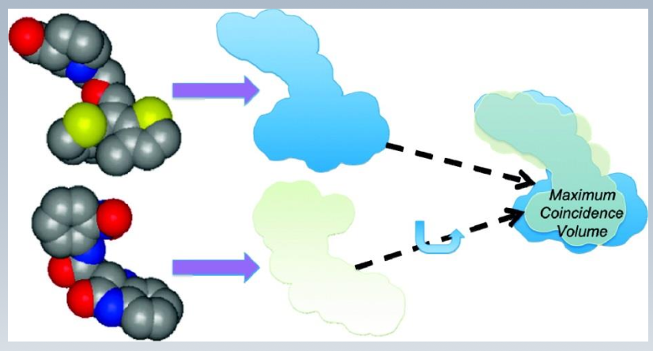

 
