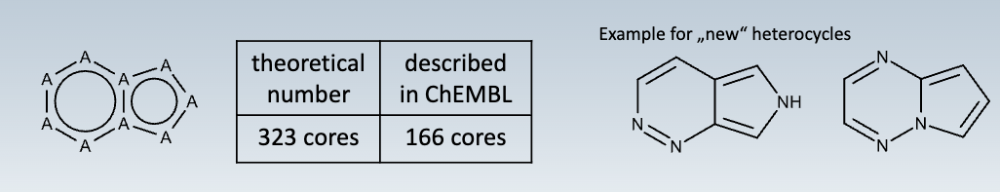

### DNNs Applications Alphafold and CASP

> CASP =Critical Assessment of Structure prediction, is a worldwide experiment for protein structure prediction taking place every two years

> AlphaFold is a articifial intelligence program developed by Deep Mind, which performs predictions of protein structure

**Special Facts about AlphaFold2**

+ Taylor made system with 32 individual modules
+ Unsual network type, modules are trained individually
+ Multi-sequence aligment as a basis, co-evolving residues assumed to be close in 3D
+ Physics based components at the end (Amber refinement)
+ Confidence Metric is provided

## Generative AI

> Generative AI is capable of generating text, images, media and also molecules using models. They learn patterns from their input training data then generate new data that has similar characteristic

**General Idea**

+ Input → Latent Space (Lower Dimensional Representation of Data)
+ Modified Vector in latent space → Output

### Application in Drug Design 

+ Starting from a discrete molecular representatin the encoder network converts the molecule into a vector in latent sace, which is a continious molecular representation
+ The decoder produces the corresponding smiles string
+ molecular properties are trainded
+ Minimize error in reproducing original string

## Bayesian Models

Given two events A and B the conditional property of A given that B is true is expressed as follows

$P(A | B) = \frac{P(B | A) P(A)}{P(B)}$ 

+ A is a proposition
+ B is the evidance or new data taken into acound
+ $P(A)$ is the prior probability which expresses one's beliefs about A
+ $P(B|A)$ is the likelihood function which can be interpreted evidence B given A is true

> We can calculate the probability of activity based on a combination of descriptors using the single pobability of descriptors if the molecule is active

## Support vector machines

> Support vector machine is a supervised machine learning algorithm used for classification and regression tasks. SVM algorithm identifies optimal hyperplane in N-dimensional space that can seperate data into different classes in feature space

+ Uses the kernel trick to project data into a higher dimensional space where the data can be seperated
+ High computational effort to train SVMs

## Decision Trees

> A decision tree is a non-parametric supervised learning algorithm, which is utilized for both classification and regression tasks. It has a hierachical, tree structure which consists of node, branches, internal nodes and leaf nodes

+ Tree learning is done by recursive partitioning of the dataset - split on statistically most significant descriptors
+ Go from observations about an item to conclusions of the target value

## Random Forests

> Random forest is a machine learning algorithm that combines the output of multiple decision trees to a single result

+ Ensemble learning method based on multiple decision trees
+ Input parameters for the individual trees are selected randomly
+ Quick training (linear dependence on the number of trees)

## Excursus ADME

> ADME is the four-letter abbreviaton for absorption, distribution, metabolism and excretion and is used in fields such as pharmacokinetics and pharmacology. These latters represent how a drug interacts within the body over time

+ Absorption / Administration: Drug must be taken into the bloodstream, via mucous surfaces like the digestive tract. Factors such as poor compound solubility gastric emptying time, chemical instability are important.
+ Distribution: The compound needs to be carried to its effector side often via the bloodstream. Regional blood flow rates, molecular size, polarity… have an effect
+ Metabolism: Compounds begin to break down in the body, a lot of small-molecule drug metabolism is carried out in the liver by redox enzymes.
+ Excretion: Compounds need to be removed from the body via excretion, for example the kidneys
+ Toxicity: Sometimes the potential toxicit of the compound is taken into account.

> Computational chemisty try to predicit ADME Tox qualities of compounds throug QSPR or QSAR

Typical Toxicity Problems

+ hERG (Potassium channel on the heart) interaction
+ AMES (mutagenicity) liability
+ other off targets (opioid receptors usw...)

Prediction of ADME Endpoints using machine learning methods

## Quantitative structure-activity relationship (QSAR)

> These are regression or classification models. QSAR relates to a set of predictor variables (X) and response variables (Y). The predictors in QSAR could be physio chemical properties of molecular descriptors, the response variable (Y) could be biological activity.

Steps in QSAR analysis:

+ Selection of data set and extraction of descriptors
+ Variable selecton
+ Model construction
+ Validation evaluation

> Basic assompution of all molecule based hypotheses is that similar molecules have similar activities. (Structure Activity Relationship)

# Chemical Spaces

Relevant spaces for drug discovery

+ Drug like molecules
+ Fragments
+ Natural products
+ Biologics
+ Macrocycles

Accessible Chemical Spaces

+ Theoretical compounds (combinatorial chemistry)
+ Existing compounds (published and vendor)

## Pharmacokinetics

> Is dedicated to describing how the body affects a substance after administration

+ This is Highly dependend on compound properties like permeability, solubility …

## Drug Likeness

> Drug Likeness is a qualitative concept which judges if a chemical structure could potentially qualifty as a oral drug

Lpinski's Rule of 5 states in general an orally active drug has no more than one violation of the following criteria:

+ No more than 5 hydrogen bond donors
+ no more than 10 hydrogen bond acceptors
+ molecular mass less than 500 dalton
+ $\log P$ ≤ 5

## CNS drugs

CNS targets have to cross the blood brain barrier (BBB)

+ Varias methods are possible, most of the time the lipophilic pathway is chosen.

## Fragment based drug discovery

> Based on identifying small chemical fragments which bind wekaly to the target

So a fragment is plased inside a target and then linked via linker

The fragments cover a much smaller chemical space than drug like molecules

Fragments usually:

+ MW < 300 Da
+ clogP < 3
+ H-bond acceptors < 3
+ H-bond donors < 3
+ rotable bonds < 3

## Natural products

+ Natural products may offer a good starting point for drug design
+ Synthetic approaches may vastly differ from current med. chem. strategies

## Biologics as therapeutics

Therapeutic antibodies / nanobodies.

+ Usually very potent and specific
+ Conjugation to cytotoxic small molecules feasible
+ Long half life (days-months)
+ Not orally available
+ Expensive to produce
+ Potentially immunogenic

Peptide therapeutics

+ about 100 peptide therapeutics are currently beeing evaluated
+ Half life extension crucual

## Accessible Chemical Spaces

+ Molecules following the lipinski rules ~ $10^{60}$
+ Up to 17 atoms of C,N,O,S and halogends $1.66*10^{11}$
+ Up to 13 atoms of C,N,O,S and Cl $9.9*10^8$

## Combinatorical Chemistry

> Parallel synthesis of reactants from the same classes via the same reaction pathway

+ Generation of many molecules at the same time
+ Library design crucial to avoid products with unwanted protperties
+ Similarity searches in combinatorial libraries

### Mix and Split procedure

> This method can be used to prepare combinatorial compound libraries. It is stepwise highly efficient and repited in cycles.
+ Solid phase synthesis beads with starting fragment attached are divided in N1 portions to react with reagents for R1. Then everything is collected and N2 portions are formed and distributed
+ Difficult to deconvolute

### DNA Encoded Libraries

+ Conjugation of chemical compounds to short DNA fragments that serve as identification bar codes. Split and mix yields unique DNA tags. Testing of compounds by affinity chromatography

# Virtual Screening

> Virtual screening is acomputational technique to search libraries of small molecules in order to identify those structures which are most likely to bind to a drug target

Two Approaches

+ Ligand based: Active Ligands are known
+ Structure based: 3D Structure of target is known

## Ligand Based Approaches

+ 2 D similarity searches to known actives
    + Fast, easy to perform, only 1 active ligand a query required
    + Disadvantage: Virtual Hits from the chemical classes
+ Pharmacophore mapping & fingerprints
    + New chemical classes can be retrieved
    + A common pharmacophore has to be established
    + Usually many active ligands are required for that
+ Machine learning:
    + For this a active and inactive set of molecules is required
 + Shape Screening → ROCS

## Targed based approaches -docking

> Docking is a method which predicts the preferred orientation of one molecule to a target when bound to each other to form a stable complex

+ Prediction and scroing of ligand / target 3D complex
    + Pose: Predicted ligand coordinates on the target
    + Several poses are predicted per docking run
    + Algorithms need to be able to explore ligand conformations and optimize placement on targed

### Algorithms for pose generation

+ Rigid body approaches (Glide, Dock)
    + Conformations are pre-computed
    + Algorithm performs rotations / translations

+ Monte Carlo Simulations: Simulated Annealing on Random Changes in Conformation and Orientation
+ Genetic Algorithms
+ Combination of Algorithms (Local Search Global Optimized

### Scoring Functions

> Scoring Functions are fast approximate methods used to predict the binding affinity

+ Force fields: Summing strength of intermolecular van der Waals and electrostatic interactions between atoms
+ Knowledge Based: Statistically derived potentials from PDF
+ Empirical: Based on counting favorable interactions
+ Machine learning

## Performance

Shortcomings of docking:

+ Neglecting solvent effects
+ Neglecting dynamics
+ Dependent on the molecule size

Different criteria for quality

+ Binding pose prediction
+ Affinity prediction → not satisfying
+ Virtual screenng