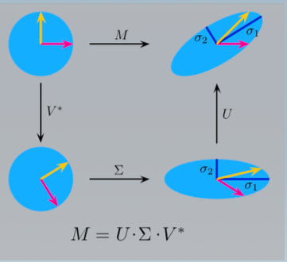

# Molecular Descriptors

> The molecular descriptor is the final result of a logic and mathematical procedure which transforms chemical information encoded within a symbol representation of a molecule into a useful number or the result of some experiment

+ Structure of molecule is transformed into a number
+ Experimental measurement (logP, molecular weight, ...)
+ theoretical descriptor .. fingerprints, surface area ...

## Different dimensionalities

+ 0D: plain counts, number of carbons, molecular weight, atom types, bond types
+ 1D descriptors: substructure counts, heteroatoms, fingerprints, rings, sp3 carbons
+ 2D descriptors: graph invariants or graph properties
+ 3D descriptos: QM descriptors, electrostatic potential, hydrophobicity, HB potential
+ 4D descriptors based on the ensamble, conformation parameter

###  0D/1D descriptors:

+ Counts:
    + hydrogen bond donors and aceptors
    + rotatable bonds
    + ring systems
    + formal charge
+ Basic properties:
    + molecular weight
    + fraction $sp^3$ atoms

#### logP

> logP is a measure for hydrophilicity of a chemical substance. Negative values are polar substances, positive values have higher values

$\log P = \log(\frac{[solute]_{octanol}}{[solute]_{water}})$

Importance in drug discovery:

+ solubility of molecules
+ permeability
+ metabolic stability
+ plasma protein binding

#### Calculation of clogP

+ Additive Schemes - fragments or atom based:
    + Starting with a measured logP value and correct for new substitutents
 
+ Fragmentation schemes:

    + logP of different fragments measured and estimated then combined
 
  

#### Calculation of the Wiener Index

> Known as distance of a graph, often correlated with boiling point properties of alkanes

$W = \frac{1}{2}\sum_{i=1}^{N}\sum_{j=1}^{N} D_{ij}$

#### Calculation of Branching Index

+ Based on the degree $\delta_i$ of an atom i = number of adjacent non-H atoms

$\sum_{Bonds}\frac{1}{\sqrt{\delta_i\delta_j}}$

### 2D Fingerprints

Originaly these methods are used for database pre-screening:

+ dictionary based approaches (MACCS keys)
+ fingerprints: generate all substructures up to a certain path length and apply hashing

#### Atom pairs fingerprints:

Those fingerprints encode the distance between all pairs of atoms in a molecule

#### Topological fingerprints

> Identifiy and hashes topological paths in the molecule and uses them to set bits in a fingerprint

#### Difference Structural Keys, Fingerprints

> Structure keys suffer from a lack of generality, because they are dependend on the predefined fragment dictionary

> Fingerprints eliminate this lack of generality by taking al substructures, path into account and relying on hashing. In a fingerprint there is no meaning behind the assigments

### 3D Fingerprints

> These are based on generation of 3D conformations which is often time consuming

+ 3D fragment screencs can be used to search for, distances/angles/dihedral ranges between atom types.
+ Pharmacophore keys uses 3-4 points pharmacophores hashses for example different combinations of 3 pharmacore features

#### Further 3D descriptors

+ QM Descirptors, like HOMO, LUMO, dipole moment, partial charges, molecular surface areas.
+ Field Descriptors

#### Molecular Interaction Fields

+ Molecules are placed in a rectangular grid
+ probes are put on each grid point, interaction energy is calculated

#### Van-der Waals Surface

> Van der-Waals surface is determined by the atomic van der Waals contact distances. Spheres with these distances are centered on each atom

The connolly surface is then build by rolling a spherical probe over the van der waals surface. Radius of 1.4 A is chosed, this surface is much smoother

Solvent Accessible Surface, the center of the solvent sphere here defines the sphere and is rolled over the colony surface

## Clustering of Descriptors

+ Descriptors form a overcomplete dataset as there are more desciptors than molecules
+ Descriptors with zero-variance are useless
+ Highly correlated descriptors don't give extra information
+ Remove descriptors that don't explain any variance.

### PCA Analysis

+ Multivariate method for reduction of dataset
+ Rotation and scaling of axes so that the maximal variance is found, followed by the second highest variance

Singular value decomposition $M = U \Sigma V$ 

New axes are linear combinations of the old variables $PC_I = \sum_{j=1}^n c_{ij}x_j$

**General Interpretation**

+ Descriptors which are close in the loading lot are correlated
    + Loading plot gives a qualitative picture of the compound properties in the scoring plot
+ Similar compounds are close together in the scooring plot 

# Molecular Similarty and Diversity 

## Why similarity

+ Pharmacophore searches and substructure searches rely on exact matches
+ Biological activity can be achoieved by exchanges of small groups

> Similar property principle, neighborhood behaviour: Structurally similar molecules tend to have similar properties

**Chemogenomics:** Binding sites which are phylogenetically related should accommondate similar ligands, and known ligands for a certain target are valid starting points for identifying ligands that bind to closely related targets

### Methods to search for similar molecules

+ Substructure searching:
    + Match/Mismatch → Size of hitlist can't be influenced

+ Pharmacophore Searching
	+ Match/Mismatch → SIze of Hitlist cant be influenced
 
+ Similarity Searching in Chemical Databases:
	+ Raning by Similarity → Size of Hitlist user determined
 

+ Descriptors represent the molecule
+ Distance D in the descriptor space is calculated
+ Similarit S = 1-D

### Fingerprint Similarity Search

+ Based on the fingerprint vectors of same length
+ Similarity of 2 fingerprint vectors is assessed on the presence/absence of identical bits
+ Tanimoto similarity $S_{AB} = \frac{c}{a+b-c}$

+ Frequently used are Tanimoto and Dice

> Assymetric metrices can be used for example Tversky if one compares molecules of different sizes

### 3D Similarity

+ A problem of 2D is that shape and spatial feature location are neglegted in the 2D approach

Different approaches for 3D similarity

+ Alignment independent
    + compare similarity between ensembles (3D fingerprints, pharmacophore keys)
+ Alignment dependet:
    + Define one molecule as rigid and compare ensemble of conformations of query
 
#### Alignment methods

+ Carbo proposed a alignment by the electron density
+ grid overlays very time consuming
+ overlay of extreme values

**ROCS (Rapid Overlay of Chemical Structures)** is a fast shape comparison application, based on the idea that molecules with similar shape that their volumes overlay well.

## Why diversity

Why would diversity analysis be important:

+ often one is missing the starting point for similairty searches
+ coverage of chemical space with few compounds
    + selection for biological testing
+ A diverse subset is assumed to have diverse properties
+ Important for synthesis planning

### Chemical Saces:

One has to identify:

+ General possible molecules
+ Molecules described by virtual procedures
+ Molecules with synthesis procedure
+ Molecules with patent claims
+ Molecules synthesised

# Cluster Analysis

A cluster is a object which contains elements that have a certain degree of similarities. Clusters are used to split datasets into groups of similar / disimilar

Approaches
+ Connectivity-based clustering (hierachical)
+ centroid based clustering
+ density based clustering

## Hierachical clustering

The compound relations are clasically visualized by a dendrogram

Example Algorithm:

1. Start from the bottom
2. Identify pair of closest clusters and merge into new cluster
3. iterate until all cpds belong to one cluster

These can the be selected either visually, or with variance criterions

