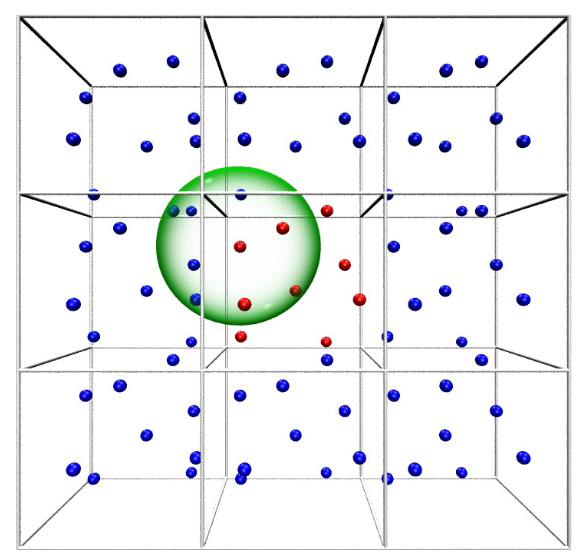

# Chapter 2 Periodic Simulation Cell

> Goal is to simulate a bulk medium, for this a periodic simulation cell is required to eliminate the influence of surface effects

## Periodic Boundary Conditions (PBC)

> Unter periodic boundary conditions the system is treated as if it is surrounded by identical copies

Therefore, the simulation system is considered as a unit cell of a pseudo crystal.

+ The size has to be chosen in such a way that artifacts resulting from the periodic treatment are avoided
+ Whenever a atom leaves the original cell the corresponding periodic image re-enters through the opposite face
+ To achieve a consistent ensemble (NVE,NVT,NPT) self interaction and double counting has to be avoided at all cost

> Principle of Minimum image convention: Interactions have to be computed employing the coordinates of the nearest image irrespective if it is the original particle or one of its periodic images

