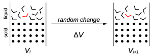
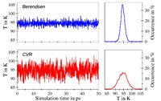

# Theoretical Chemistry Refresher

Computational Approaches are capable of accessing virtually every subdiscipline in chemical sciences including

+ Thermodynamics
+ Kinetics
+ Characterization of Molecules/Liquids/Solids:
    + Structural Properties
    + Dynamical Properties
    + Bulk properties of solids
    + Bulk properties of liquids
+ Investigation of Liquids

## Distinction of Method & Method

For a computational study in chemistry two different aspects in the methodology have to be considered:

1. How to calculate the interactions, potentials $V$ and forces $F$
2. What to do with $V$ and $F$

**HOW?**

+ Quantum Mechanics (QM)
+ Molecular Mechanics (MM)
+ Neural Network Potentials (NNPs)
+ Hybrid QM/MM

**WHAT**

+ Property Calculations (Single Points)
+ Structure Optimization (Energy Minimization)
+ Monte Carlo
+ Molecular Dynamics

## Techniques to evaluate Energies and Forces

### Molecular Mechanics:

Based on a parametrized potential function:

+ Simplified interaction models
+ Fast evaluation
+ Low Computational demand

**A problem of MM is the tedious parametrisaton process along with the limited accuracy and transferability**

### Quantum Mechanics 

The goal is to find numerical solutions to the Schrödinger Equation

$H|\psi \rangle = E | \pi \rangle$

+ High accuracy
    + Polarization
    + Charge Transfer
    + Many-body contributions
+ General no parametrisation needed

**Problem of QM is that the treatment is time consuming and has a high computational complexity**

### Machine Learning Approach

Neural Network Potential (NNPs) provide a promising alternative to MM and QM based methods.

Neural networks are build like nerv cells in living systems, we have a set of nodes and weights, these are grouped into different layers.

The neural network can be trained on data (which basically assigns the weights) and the be used in a Regression like approach to predict the potential

**NNPs as universal function approximators**

The universal approximation theorems provide a proof of existence of a sequence of neural networks $\phi_1,\phi_2,\phi_3 \to f$ which basically converge to any given function.


## The Potential Energy Surface

Because the Potential Energy is a function of all atomic coordinates in the system it is a surface in the configuration space $\mathbb{Q}$ where each $\vec{Q}$ is a configuration vector


## Configuration Space and Phase Space

The configuration of a general chemical system can be represented by generalized coordinates $\vec{Q}$.  The set of all points in this configuratio nspace define a manifold

Take for example 3D euclidian space defined by the vector $q=(x,y,z)$ then the configuration space is $Q = \mathbb{R}^3$ 


In the case that also velocities are involved both the atomic positions $\vec{Q}$ and the momenta $\vec{P}$ of a chemical sytem have to be considered in this sense we have vectors in the phase space

$\Theta = (\vec{Q},\vec{P})$

## Energy Minimization

**Statement of the minimization problem**

Given a function $f$ which depend on variables $x_1,...x_i$ we want to find the values of those variable where the function has a minimum value

For this we can use the derivatives

$\frac{\partial f}{\partial x_i}= 0, ~ \frac{\partial^2}{\partial x_i^2} > 0$

Based on statistical thermodynamics the description of a system employing just a minimum geometry corresponds to a treatment at $0K$

$S = k_b \ln(\Omega)$ which $\Omega$ being the degeneracy

$S \to 0 \Rightarrow T \to 0$ according to the third law of thermodynamics

### Derivative Minimization Methods

Write the potential energy as a Taylor series expansion about $x_k$:

$V(x) = V(x_k) + (x-x_k)V'(x_k) + (x-x_k)^2 V''(x_k)/2 + …$

Here $V'(x_k)$ is the gradient of the potential $V'(x_k) = \nabla V(x_k)$ and the second derivative is the hessian matrix $V''(x_k)= H(x_k)$ 


#### Steepest Descent (SD)

We basically follow the negative gradient (forces) into the minimum

$F = -\frac{\partial V(\vec{Q})}{\partial x_i}$

Using a stepsize $\alpha$ we can adjust our coordinates to find the next minimum

$Q' = Q + \alpha F$


## Non-Zero Thermal Conditions

In order to represent a chemical system at elevated temperatures many configurations (an ensemble) has to be considered.


Depending on the total energy $H$ available different configurations can be reached

$H = T  + V$

### Two Main Families of Chemical Simulations

**Monte Carlo**

Monte Carlo is based on random changes of the system

+ Only calculation of V required
+ No forces, faster evaluation
+ Efficient probing of configurations
+ By default in NVT ensemble
+ Highly generalizable
+ No time evolution

**Molecular Dynamics**

Numerical solutions to the Hamiltonian Equations of Motions

+ Access to structure and dynamics
+ All atoms move simultaneously
+ More intuitive than MC
+ Path intergal (QM MD)
+ Better suided for biomolecules
+ Requires calculation of force
+ By default in NVE ensemble

## Ergodenhypothese

**Stochastic and dynamical processes typically show the tendency to visit all accessible configurations in the long time limit**

In the case of simulations log MD, and MC simulations have the same results, relevant configurations …

In an ensemble based approach observables are expressed via time averages

$\langle o \rangle = \lim_{\tau \to \infty}\frac{1}{\tau}\int_0^\tau o(t)dt = \lim_{N \to \infty} \frac{1}{N}\sum_{n=1}^N o_n$ 

## Monte Carlo Simulations



In a Monte Carlo simulation a random molecular unit (molecule, atom) is randomly selected and moved in a random way. 


**Important Note** Because in MC only one unit is moved per step, in oder to avoid combinatoric explosions, vibrations are not considered (changes in the intramolecular structure)

### Metropolis Algorithm and Boltzmann Factor

In order to also randomly accept configuration with a positive $\Delta V$ the Metropolis Algorithm was introduced into the MC framework. We take the Boltzmann Factor $f_b$

$f_B = e^{- \frac{\Delta V}{RT}}$

And compare it to a random_integer $f_B \geq random[0,1]$


### The Monte Carlo Algorithm

```python
new_configuration = peform_random_move()

calculate_potentials()

configurations = []

if delta_V <= 0:
	configurations.append(new_configuration)
elif np.exp(-delta_V/RT) >= np.random.rand():
	configurations.append(new_configuration)
else:
	new_configuration = old_configuration
repeat()
```

### Isothermal Isobaric Ensemble (NPT)

In order to transform the general MC ensemble (NVT) into the NPT ensemble after a certain number of MC steps, one considered random changes in the cell volume and the atomic positions using a scaling factor

$L' = \lambda \cdot L$ and $r'_{com} = \lambda r_{com}$


**Important Note:** We have to use some kind of representative point (like com) for this scaling. If we would scale atom-based this would lead to a potential changer in the intramolecular potential $\Delta V_{intra}\neq 0$


The only other thing that changes is the Boltzman-Factor

$f_B = e^{-\frac{\Delta U + P \Delta V}{RT}}\geq random[0,1]$

+ The $P \Delta V$ term represents the work associated with the volume change


### Monte Carlo in the Grand-Canonical Ensemble ($\mu VT$)

**In order to use MC in the grand canonical ensemble one must consider deletion and insertion steps of particles to the system**


+ After each insertion/deletion MC criteria are used to estimate if the new configuration is accepted
+ Usage: Determination of number of solvent molecules in active sites
+ Host-Guest Complexes like gas@MOF systems

# The Periodic Simulation Cell

In order to simulate bulk systems like liquid water or ice a periodic simulation cell is required, to eliminate the influence of surface effects resulting from the vacuum interface.

Calculation how big is a cube containing 1000 water molecules at ambient conditions?

$\rho = \frac{m}{V}, n = \frac{m}{M}$

With $V = \frac{nM}{\rho N_A} = 3.00 * 10^{-26}m^3 = 30000 \AA \Rightarrow L = 31.1 \AA$

The surface to volume ratio is very bad for small boxes. The boundary of the cube (wall) would have a very strong impact on the simulation. Therefore we use perioidc boundary conditions (PBC)

## Periodic Boundary Conditions

Under PBC the simulation system is treated as if it was surrounded by identical copies (unit cell of a psuedo crystal).

The size of the cell has to be chosen i na way that artifacts from the periodic treatment are avoided. Whenever an atom leaves the original cell, the perioidc image re enters through the opposite face.

**In order to achieve an consistent ensemlbe, self interaction and double-counting of interactions has to be avoided at all cost**


**Principle of Minimum Image Convention**

Interactions have to be computed employing the coordinates of the nearest image irrespective wheter it is the original particle or a peroidic image

### Particle Imaging


The approach here is to use the pair distance $\Delta x_{AB} = x_B - x_A$ and the round function to get the minimum image distance

$\Delta x_{AB'}=\Delta x_{AB} - L_x \cdot round(\frac{\Delta x_{AB}}{L_X})^*$ 

The largest distance that avoids double counting is exactly $L_x / 2$. In this case two images $B', B$ would be identical. To avoid this case we introduce a cutoff-distance $r_{cut}$.

The cutoff has to be chosen to ensure seamless and continous interactions. This is straightforward for van-der-Waals contributions but rather difficult for Long-Range Interactions


### Shifted Potentials and Switched Potentials


In order to avoid discontinuities, either shifted or switched potentials are employed

$V_{shifted} = V_{AB} - V_{Cut}$

A switched potential uses a switching function, something that goes from $1 \to 0$ rather fast, to switch on the potential in the discontinious part of the cutoff-region. **This treatment is important when a particle enters the cell**


## Methods to Reduce the Number of Pairs

The number of pairs (for calculating interactions) can be evaluated with $N_{pairs} = \frac{N_{Atoms}(N_{atoms}-1)}{2}$

### Neighbour Lists

In this approach for each atom a list of neighbour particles is created. Because the radius of the neighbour list $r_{nghb}$ is larger than the cutoff, the update of this list is performed only every $n^{th}$ step. When computing particle particle interactions, only the atoms in the neighbour list are considered


### Linked-Cell Lists

In the linked-cell list approach the box is sub-divided into smaller cells and each particle is assigned to the sub-cell. Only the atoms assigned to the greenn cells in the picture can interact with the atoms in the blue cell


# Long Range Potential


## Ewald Summation

> The Ewald Summation attemps to not only compute the interaction with one particle but with all its periodic images up to infinity. The system is considered a pseudo-crystal

$r_{ij} = \begin{pmatrix}x_{ij} \\ y_{ij} \\ z_{ij} \end{pmatrix} + \sum_{-\infty}^\infty \sum_{-\infty}^\infty \sum_{-\infty}^\infty \begin{pmatrix}n_xL_x \\ n_y L_y \\ n_z L_z\end{pmatrix}$

The Trick that is used here:

+ Coloumb Potential is split into a long range and a short range part
+ Using a Fourier Transform to accelerate the calculation of the long-range part

The Coloumb Potential can be split by considering the following:

$V_{ij} = \frac{1}{4\pi\epsilon_0}\cdot\frac{q_iq_j}{r_{ij}} \Rightarrow V_{ij} = \frac{1}{4\pi\epsilon_0}\cdot\frac{q_iq_j}{r_{ij}}\cdot [f(r_{ij}) + g(r_{ij})]$ 

Thus the functions $f(r_{ij}),g(r_{ij})$ must fullfill the constraint $f(r_{ij})+g(r_{ij})=1$. 

A suitable choice for this is the usage of the **Gaussian-Error-Functions**

### The Gaussian Error Functions

> The Gaussian Error Functions $erf(x)$ and $erfc(x)$ are defined via the integrals of the Gaussian distribution, and used to analyze the error in measurment data

$G(x) = Ne^{-x^1} \Rightarrow erf(x)=\frac{2}{\pi}\int_0^x Ne^{-x^2}dx$


To now obtain the respective short- and long-range part of the Coloumb Potential one multiplies with the **Gaussian-Error-Functions**. The Parameter $\kappa$ is used to shift the weight between the two contributions


What is clear also from the figure is that now the short-range component fullfills the cutoff-conditions. If the parameter $\kappa$ is properly chosen this part can be calculated together with the van-der-Waals interactions.


### Fourier-Transformation of the Long-Range Part

The long range part of this Ewald Summation is now responsible to compute the interaction with all the periodic images. Since these images are **periodic** a approach using plane waves can accerlerate the computations.

$V_{long}=\frac{1}{r\pi\epsilon_0}\frac{q_iq_j}{r_{ij}}erf(\kappa r_{ij})$ 

 

#### Fourier Transforms

Basically a Fourier Transform of a intergrable function $f(x)$ on the real line is a complex valued function $\hat{f}(\epsilon)$ defined by

$\hat{f}(\epsilon) = \int_{-\infty}^{\infty}f(x)e^{-i2\pi \epsilon x}dx$

Evaluating this function $\forall \epsilon \in \mathbb{R}$ gives us the frequency domain function. 

The Inverse Transformation is given by:

$f(x) = \int_{-\infty}^{\infty} \hat{f}(\epsilon)e^{i 2 \pi \epsilon x}d\epsilon$

This gives us a pair $f(x)\leftrightarrow \hat{f}(\epsilon)$

+ Time is transformed to the frequency $t \Rightarrow \nu$
+ Length is transformed to the wave-vector $L \Rightarrow k$
+ $k_x = n_x \frac{2\pi}{L_x}$


**Important Note:** The Fourier Transform becomes very inefficient for curves approaching $\infty$. Therefore we need the $erf(x)$ to shift the singulary. Basically, the short range part now has the singularty (which is no problem as it is treated with the cutoff). And the long-range Part has a spike and can be evaluated with the Fourier Transform

#### Mesh-Based Approaches to Speed Up the Ewald Summation

In an ideal setup the Ewald summation algorithm scales with $N^{3/2}$. This scaling can be improved by using mesh bashed approaches


+ Project a charge onto the nearest grid point
+ Compute potential $V$ and forces $F$ using the mesh
+ Back project results from mesh to charges

So basically if the numer of grid points equals $2^N$, Fast Fourier Transform (FFT) can be used to achieve $N\log(N)$ scaling

#### Summary of Ewald Summation

+ Ewald summation computes nteraction between each pari of atoms and all associated periodic images
+ Using the Gaussian error functions $erf(\kappa x)$ and $erfc(\kappa x)$ the Coloumb potential is split into a short- and a long-range contribution
+ The coefficient $\kappa$ determines the weight of the contributions
+ The short range part converges to zero and can be covered with the cut-off distance $r_{cut}$
+ Using $erf(\kappa x)$ the long-range contributions starts from finite value at $r \to 0$ and can be calculated with the Fourier transform. Basically employ a cutoff with the wavevector $k_{cut}$
+ The sum of short-range and long-range contributons gives Coloumbic potential
+ With mesh based approaches FFT methods can be used together with GPUs

### The Wolf Summation

The Wolf-Summation is based on the concept of local neutrality. So as stated before if we want to calculate the interaction between an ion and the rest of the ions, we need to truncate our potential. If this truncation is for example in a sphere, the sphere itself is not always neutral (number of positive and negative ions can vary in the sphere).

Here D. Wolf Proposed that all charg excess can be considered located exactly on the surface of the truncation sphere.


+ Basically a cluster of isolated charges is neutral at relative short distance

The modified interaction has the form

$V_{Wolf} = \frac{q_iq_j}{4\pi \epsilon_0}[ \frac{erfc(\kappa r_{ij})}{r_{ij}}-\frac{erfc(\kappa   r_{cut})}{r_{cut}}]$

# Molecular Dynamics Primer

Many problems in computational chemistry are to large to be considered by quantum mechanics. Force field methods ignore the electronic motions and calculate the energy of a system as a function of the nuclear positions only.

A simple functional of a force field is given by

$V(r^N) = \sum_{bonds}\frac{k_i}{2}(l_i-l_{i,0})^2 + \sum_{angles}\frac{k_i}{2}(\theta_i - \theta_{i,0})^2 + \sum_{torsions}\frac{V_n}{2}(1+cos(n\omega - \gamma)) + \sum_{i=1}^N \sum_{j=i+1}^N(4\epsilon_{ij}[(\frac{\sigma_{ij}}{r_{ij}})^{12} + (\frac{q_{ij}}{r_{ij}})^{6}]+\frac{q_iq_j}{4\pi\epsilon_0r_{ii}})$


## The Typical MD Loop


**Overview of the Time Propagation Algorithms**

+ Verlocity Verlet: Most widely used integrator and best choice in 99% of all cases
+ Verlet & Leap Frog: Older algorithms, but still covered in most text-books
+ Predictor/Corrector (PC) approaches: General methods to solve differential equations, this family of time integrators are really precise
+ Multiple Time Step Approaches: The opposite of PC Methods, reduce accuracy to speed up MD simulations. Works only with MM MD Simulations

## Newtonian Mechanics

**Sir Isacc Netwon FRS PRS**

Philosophie Natrualis Principia Mathematica (Newtons laws of motion):

+ Velocity remains constant unless the body is acted upon by external force
+ Acceleration is propotional and parallel to the net force and inversly propotional to mass
+ Mutual forces of bodies are equal, opposite and colinear

$F = ma \Leftrightarrow F= \frac{dp}{dt}$ 

As the force is the negative gradient of the potential $V$

$-\frac{\partial V}{\partial q_i} = m_i \frac{d^2 q_i}{dt^2} \rightarrow q_i(t_1) = -\frac{1}{m_i} \int_{t_0}^{t_1} \frac{\partial V}{\partial q_i}dt^2 + q_i(t_o)$

**We have 3N differential equations of second order to solve which is to complicated for MD**

### Work and Energy

If a constant force is applied to a particle with a displacment $\Delta r$ we define the work as the scalar product

$W = F \cdot \Delta r$

This can be described by the line integral $W = \int_C F(r)dr$

The **work-energy** theorem states that for. constant mass m the work done one the particle as it moves from $r_1$ to $r_2$ is equal to the kinetic energy $E_k$

$W = \Delta E_k = E_{k2}-E_{k1}= ½ m (v_2^2 - v_1^2$
)

## Lagrangian Mechanics

Is a formulation of classical mechanics founded on the stationary action principle.

The Lagrangian summarizes the dynamics of the entire system: $L = T-V$

+ T is kinetic energy $T = \frac{1}{2} \sum_{k=1}^N m_kv_k^2$
+ V is the potential energy

The Euler Lagrange Equation is a result of calculus of variations, the idea is that we need to minimize the action

$\frac{d}{dt}(\frac{\partial L}{\partial \dot{p}}) = (\frac{\partial L}{\partial q_i})$

The action is defined as the integral of the Lagrangian

$S = \int_{t_0}^{t_1} Ldt = \int_{t_0}^{t_1} (T-V)dt$ 

The variables evolve in a way that S remains an extremum $\frac{dS}{dq_i} = 0$


## Hamiltonian Mechanics

The Hamiltonian equations can directly be derived from the Lagrangian using the Legendre Transform

$H = T * V$

+ $\frac{dq_i}{dt} = v_i$
+ $\frac{dp_i}{dt} = F_i$
+ $p_i = m_iv_i$

### How to derive the Hamiltonian from the Lagrangian as a Chemist

What we need is the following Ansatz:

+ $H = \dot{q}p - L(q,\dot{q},t)$
+ $\frac{d}{dt}\frac{\partial L}{\partial \dot{q}}=\frac{\partial L}{\partial q}$ (Euler Lagrangian)

Compute the total derivative of L:

$\frac{dL}{dt} = \frac{\partial L}{\partial q}\frac{\partial q}{\partial t} + \frac{\partial L}{\partial \dot{q}}\frac{\partial \dot{q}}{\partial t} + \frac{\partial L}{\partial t}$

Note that the chain rule is used here, further substitute in the Euler Lagrange Equation

$\frac{dL}{dt} = \frac{d}{dt}\frac{\partial L}{\partial \dot{q}}\dot{q} + \frac{\partial L}{\partial \dot{q}}\ddot{q}+\frac{\partial L}{\partial t}$

Now use the product rule $(uv)' = u'v + uv'$ 

$\frac{dL}{dt} = \frac{d}{dt}(\dot{q}\frac{\partial L}{\partial \dot{q}}) + \frac{\partial L}{\partial t}$

which gives

$\frac{d}{dt}(\dot{q}\frac{\partial L}{\partial \dot{q}}-L) + \frac{\partial L}{\partial t} = 0$

We devine the Term in the Brackets as the Hamiltonian

Now given that $L = \frac{1}{2}m\dot{q}^2 - V(q)$, observe that, $\frac{\partial L}{\partial \dot{q}} = m\dot{q}$, which gives us the expression for the Hamiltonian

$\frac{1}{2}m\dot{q}^2 + V(q) = H$

### Pro and Cons of using Hamiltonian Mechanics

Hamiltonian Mechanics transform the 3N second order equations into 6N first order equations. With the following important partial (im pretty sure they are partial but who im i to judge):

+ $\frac{dq_i}{dt} = \frac{\partial H}{\partial p_i} = v_i$
+ $\frac{d p_i}{dt}  = - \frac{\partial H}{\partial q_i} = F$


## Louville Operator

Basically named after Joseph Liouville $\frac{do}{dt}=iLo$, but stated by John von Neumann, which is a time propagator used also in Quantum Mechanics

Basically the time evolution of any observable $o(q,p)$ depending of positions $q$ and momenta $p$ has to be expressed via the total derivative

$\frac{do}{dt} = \frac{\partial o}{\partial q}\frac{dq}{dt} + \frac{\partial o}{\partial p}\frac{dp}{dt}$

Substituting in the partial derivatives obtained by the Hamiltonian

$\frac{do}{dt}= \frac{\partial o}{\partial q}\frac{\partial H}{\partial p} - \frac{\partial o}{\partial p}\frac{\partial H}{\partial q}$

This can also be formulated using operator algebra

$\frac{do}{dt} = (\frac{\partial H}{\partial p}\frac{d}{dq}- \frac{\partial H}{\partial q}\frac{d}{dp})o = i(L_q + L_p)o = iLo$

Using the **seperated variables ansatz** this differential equation can be solved

$\frac{do}{dt}= iLo \Rightarrow o_{t1} = e^{iLt}o_{t0}$

Problem now is that $L_q$ and $L_p$ do not commute $[L_q,L_p]\neq 0$, and because we are using the matrix exponential function we get

$e^{i(L_q + L_p)t} \neq e^{iL_qt} \cdot e^{iL_pt}$

### Solving the Commutator Problem with Trotter Splitting

The Lie product formula (Trotter Splitting) states that for any arbitrary $m \times m$ matrices $A,B$

$e^{A+B} = \lim_{n\to \infty}(e^{\frac{A}{n}}e^{\frac{B}{n}})^n$

This can be applied to the Louiville Operator

$e^{i(Lq + L_p)t} = \lim_{N \to \infty}[e^{(\frac{iL_p t}{2N})}e^{(\frac{iL_qt}{N})}e^{(\frac{iL_pt}{2N})}]^N$

+ So one of the operators (traditionally the momentum part) is split into two half steps, that are arranged before and after the other operator
+ The time interval $t$ is split in as many steps as possible

**Remember:**

+ $iL_q = \frac{\partial H}{\partial p}\frac{d}{dq} = v \frac{d}{dq}$
+ $iL_p = -\frac{\partial H}{\partial q}\frac{d}{dp} = \frac{F}{m}\frac{d}{dv}$

## Velocity Verlet Time Integrator


## Perdictor Corrector Integrators

These algorithms are used for to solve differential equations, in the context of MD, PC methods provide a more accurate time propagation, but are computationally more demanding

+ **Prediction** Determine new positions $q^p$, velocities $v^p$ by using the actual positoons $q_t$, velocities $v_t$ and forces $F_t$: $\{q_t,v_t,F_t\}\to \{q^P,v^P\}$
+ **Force Evaluation** Difference $\Delta F$ between forces $F_t$ and $F^P$ accounts for the fact that force is not constant
+ **Correction** Use $\Delta F$ to correct the predicted force $F^p$


## Multiple Time-Step Algorithms

**Idea** Not all interactions evolve in the same time frame. Consider for example bond stretch and vdW or Coulombic interactions


### Twin Range Method

+ Energies and forces for particles with radius $r_1$ are calculated every step
+ Energies and forces between radii $r_1$ and $r_{cut}$ are treated every $n^{th}$ step


### t-RESPA Integrator

Is a more versatile multi-time step approach, the interactions are divided into different groups ssociated to increasing time steps


## The MD Time Step

In general $\Delta t$ in MD simulations depends on the fastest motion in the system. It should be chosen i a way that the change of all forces appears continious for all particles

The lighter atoms move faster than the heavier ones, they determine the maximum step

Take for example the O-H bond with $3000-3800 cm^{-1}$

$\nu_{OH} = \lambda * c = 10^{14}\frac{1}{s}$, this gives us a period of 10 fs


In order to obtain 20-50 points per vibrational cycle time steps in the range o 0.2-0.5 have to be chosen

## Holonomic Constraints - Shake and Rattle

In order to increase the MD time step we can introduce constraints on the bond lengths and angles

The term holonomic means the constraint $\sigma$ is only associated with the coordinates

$\sigma = |q_a - q_b|^2 - r^2 = 0$

This constraints contribute to the equations of motions via the force. For each constraint $j$ a Lagrange parameter $\lambda$ has to be determined

$F_{i} = -\frac{\partial}{\partial q_i}(V + \sum_{j=1}^{N_c}\lambda_j\sigma_j)$

Differentiatiion

$F_i = -\frac{\partial V}{\partial q_i} ± 2 \sum_{j=1}^{N_c}\lambda_j (q^j_a- q^j_b)$

### Shake Algorithm


It is not possible ot determine the Lagrange Parameters $\lambda$ analytically two approximations are required

+ Linearisation: The equations to calculate $\lambda$ for each bond only considers linear terms
+ Decoupling: Each constraint is applied independent of all others

These constraints are applied in a iterative way

1. Atoms are moved according to the individual forces
2. Corrections on the positions are iteratively applied
3. This is the shake algorithm

### Rattle Algorithm

In the case of the v-Verlet Propagator an additional constraint is neceserry

**All velocity components of an atom parallel to the applied constraints have to be removed (if a bond cannot oscillate it cannot store kinetic energy**

This additional constraint operatio nis known as Rattle


# Different MD Ensembles

**Default MD is in NVE Ensemble**

Due to the consevation of total energy, the default molecular dynamics simulation is in the microcanonical (NVE) ensemble


What is important to note here is that in the NVE ensemble temperature and kinetic energy are the same thing

$E_{kin} = \sum_{i=1}^N \frac{m_iv_i^2}{2} = \frac{3}{2}NRT \Leftrightarrow T = \frac{2}{3NR}E_{kin}$


## Methods overview

In order to execute simulation in more practical ensembles, algorithms for temperature and pressure coupling have been developed

**Thermostats**

Thermostats can directly of indirectly influence the atomic velocities $v$ to adjsut the kinetic energy $E_{kin}$ and thereby the Temperature $T$ 

1. Velocity Rescaling
    1.  Hard Scaling
    2.  Berendsen
    3.  Bussi-Donadio-Parrinello
2. Nose-Hoover / Nose-Hoover Chain
3. Langevin / Dissociative Particle Dynamics

**Manostats**

Manostats adjust the volume of the simulation cell $V$ to maintain a constant pressure $p$

1. Berendsen
2. Andersen
3. Monte Carlo

## Thermostats

Temperature and kinetic energy are mutualy related, we can use the velocities of the particles to set the average temperature $\langle T \rangle$ to target valur $T_0$


### Hard Scaling

This is a very aggressive algorithm and nowadays not used. After each MD step, the scaling factor $\lambda$ is applied to all velocities in the system.

$\lambda = \sqrt{\frac{T_0}{T_{sys}}} \rightarrow v_i' = v_i \lambda$

So if $T_{sys} < T_0 \Rightarrow \lambda > 0$ and the velocities are increased. 

### Berendsen Weak Coupling

This algorihm introduced a **relaxation time $\tau$**, which represents the latecy of the external heatbath

$\lambda = \sqrt{1- \frac{\Delta t}{\tau}(1-\frac{T_0}{T_{sys}})}$

+ $\tau >>$ behaviour is like NVE
+ $\tau <<$ behaviour is like hard rescaling


### Bussi-Donadio-Parrinello Thermostat

In order to further improve the temperature coupling in this algorithm a stochastic contribution is added to the scaling factor $\lambda$

$\lambda = \sqrt{1- \frac{\Delta t}{\tau}(1-\frac{T_0}{T_{sys}})+ \sqrt{\frac{4}{3N}\frac{\Delta t}{\tau}\frac{T_0}{T_{sys}}W(t)}}$

This scaling factor enforces a canonical distribution for $T$ instead of adjusting $T$ to the exact value $T_0$ the target value is selected by a stochastic procedure. (Canonical velocity rescaling, CVR)

$W(t) = \sqrt{-\ln(rand]0,1])}$ is a sequence of random time-evolving number with an average of $\langle W \rangle = 0$ 



### Nose-Hoover Thermostat

The Nose-Hoover Thermostat acts on the forces via the friction coefficient $\xi$, this leads to a modification of the equations of motions

$\frac{d p_{i}}{dt} = F_i - \xi m_i v_i$ 

So basically we get extra degree of freedom in the Hamiltonian

$E_{tot} = E_{kin} + E_{pot} + RT\frac{\xi^2}{\tau}+ RT\chi$


#### Nose-Hoover Chain Thermostat

This Nose-Hoover scheme can display undesired behaviour in a case of small atoms or very "stiff" systems. We can therefore introduce a series of thermostatically controlled baths


### Langevin Thermostat
 
Similar to the Nose-Hover thermostats the equations of motions are modified with a frictional coefficient $\gamma$. Here the firctional coeffiction is fixed and positive.

$\frac{dp_i}{dt} = F_i - \gamma m_i v_i + \sigma_i W$

+ A frictional force $\gamma m_i v_i$ is employed
+ $\sigma$ is the amplitude of the Wiener noise $W$
+ If $\gamma$ and $\sigma$ are balanced we have the targed temperature.
+ The random numbers are connected wia the fluctuation dissipation theorem $\sigma_i^2 2m_i\gamma RT_0$
+ Because each particle has individual forces and friction this is a local thermostat

**A potential problem of the Langevin Dynamic:** The sum of the fluctuations introduced by the system are not zero. So by using this approach any dynamical data (like diffussion) shows huge erros


### Dissipative Particle Dynamics

A DPD thermostat follows the same idea as Langevin dynamics, however here all contributions are pairwise so that the respective sum is always zero


## Pressure in MD

The pressure in MD of a system is obtained via the virial theorem of Clausius

$pV = NRT + \frac{1}{3}\sum_{i=1}^N F_i^T r_i$ 

when using pairwise additive force fields this can be speed up by using a pairwise virial expression

$pV = nRT + \frac{1}{3}\sum_{i=1}^{N-1}\sum_{j = i+1}^{N}F_{ij}^T r_{ij}$ 

**Because the virial is calculated via the scalar product of the forces $F_{ij}$ and the pair distance $r_{ij}$ dihedral and angles do not contribute!**

**Definition (Isotropic):** In isotropic systems we have uniformity in all orientations.

### Semi-Isotropic Calculation

Pressure can be rearranged into the $x,y,z$ components

$pV = NRT + \frac{1}{3}\sum_{i = 1}^{N-1}\sum_{j=i+1}^{N}F_{ij}^Tr_{ij}$ 

Using $E_{kin} = \frac{3}{2} NRT$

$pV = \frac{2}{3}E_{kin} + \frac{1}{3}\sum_{i=1}^{N-1}\sum_{j=i+1}^{N} F_{ij}^T r_{ij}$

 + $E_{kin} = \frac{m_iv_{ix}^2}{2} +  \frac{m_iv_{iy}^2}{2} + \frac{m_iv_{iz}^2}{2}$
 + $F_{ij}^Tr_{ij} = F_{ijx}r_{ijx} + ...$

This gives us

$pV = \frac{1}{3}[\sum_{i=1}^{N}(m_iv_{ix}^2 + m_iv_{iy}^2 + m_iv_{iz}^2) + \sum_{i=1}^{N-1}\sum_{j=i+1}^N (F_{ijx}r_{ijx}+F_{ijy}r_{ijy}+F_{ijz}r_{ijz})]$ 
So we can evaluate the pressure for each principal direction separately

$p_xV = \sum_{i=1}^N mv_x^2 + \sum_{i=1}^{N-1}\sum_{j=i+1}^{N} F_{ijx}r_{ijx}$

### Anisotropic Calculation

We can now introduce the Virial-Stress tensor which can be used to make anisotropic pressure calculations


### Berendsen Manostat

This manostat algorithm is very similar to the temperatur thermostat and uses a (isotropic, or semiisotropic) scaling factor $\lambda$

$\lambda_p^{iso} = sqrt{1 - (p_0 - p_{sys})\kappa_p \frac{\Delta t}{\tau_p}}$ 

$\lambda_{px}^{semi} = 1 - (p_0 - p_x)\kappa_p \frac{\Delta t}{\tau_p}$

So the system and the particle positions are scaled here

$r' = \lambda_p * r$ and $L' = \lambda_p * L$


**Important is that we need a molecule based scaling algorithm in order to avoid changes in the intramolecular properties**

### Andersen Manostat

This approach mimics in general a moving piston with mass M, so a pressure reservuar. Similar to the NH thermostat a extended Lagrangian approach is used. So this piston has its own degree of freedom (equation of motion)

$E_{tot} = E_{kin}+E_{pot} + \frac{M}{2}(\frac{dV}{dt})^2 + p_0V$ 

With $\frac{d^2 V}{dt^2} = \frac{p_{sys}-p_0}{M}$

### Monte Carlo Manostat


Also one can do a MC/MD hybrid approach. After a given number of MD-steps more MC steps are performed with random changes in the cell Volume $V$. 


### What the Fuck is Virialsatz

Basically the Virial Theorem provides a general equation that relates the average over time of the total kinetic energy of discrete particles bound by conservatice force, with the total potential energy

$\langle T \rangle = -\frac{1}{2}\sum_{k=1}^N \langle F_k \cdot r_k \rangle$

+ $T$ is the total kinetic energy
+ $F_k$ is the force of the k-th particle
+ $r_k$ is the position.

**Usage in respect to the ideal gas law:** Consider a contained filled with ideal gas. The force applied to the point masses is the negative forces applied to the wall of the container $dF = -\vec{n}PdA$ 

Then the virial theroem gives 

$\langle T \rangle = - \frac{1}{2}\langle \sum_i F_i r_i \rangle = \frac{P}{2} \int \vec{n} r dA$ 

with the divergence theorem $\int \vec{n}rdA ) \int \nabla rdV = 3V$ and we get $PV = nkT$


