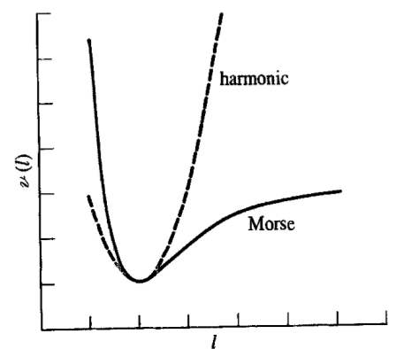

# Computer-Aided Material Science

## Random Stuff

**Definition Scalar Field**

> A scalar field is a function associating a single number to each point in a region of space.

**Lennard-Jones Potential**

> Lennard-jones potential is an intermolecular pair potential. Out of all potential functionals, Lennard-Jones potential is probaably the one that has been the most extensively studies.

General Form:

$V_{LJ}(r) = \frac{A_n}{r^n} - \frac{B_m}{r^m}$

Lennard-Jones-12-16:

$V_{LJ}(r) = 4\epsilon( (\frac{\sigma}{r})^{12} - (\frac{\sigma}{r})^6)$

+ Repulsive potential $\frac{1}{r^n}$ is combined with attractive potential $-\frac{1}{r^m}$

**London Dispersion Force**

Electron distribution around an atom or molecule undergoes fluctiations in time. These fluctuations create instantaneous electric fields which are felt by other nearby atoms and molecules, which in turn adjust the spatial distribution of their own electons.

**Buckingham Potential**

The Buckingham potential is a formula which describes the Pauli-Exlusion principle and the van der Waals energy for the interaction of two atoms that are not directly bonded as a function of the interatomic distance $r$.

$V_{Buck} = Ae^{-Br} - \frac{C}{r^6}$

**Morse Potential**

$V_{Morse} = V_0 (1- \exp(-a(r-r_0)))^2 - V_0$

Here $r$ is the distance between atoms $r_0$ is the equilibrium distance and $V_0$ is the well depth. The parameter a is related with the force constant

$a = \sqrt{\frac{k_e}{2D_e}}$

## Chapter 1 Molecular Mechanics

> Goal of computer-aided methods in chemistry and material design is to obtain information about chemical systems by modelling atoms, molecules and ions on the computer

Computational Methods can be useful to:

+ investigate properties difficult to obtain via experiment
+ Study systems that are expensive, hazardeous, not (yet) synthesized
+ complement experimental measurements

### Molecular Dynamics Loop

**Molecular Dynamics:** Description of the time evolution of chemical systems by propagation of Newtons equations of motions

### Energy and Forces

**Kinetic Energy:** In classical mechanics, the kinetic energy of a point object is dependent on the mass of the body as well as the speed

$E_k = \frac{1}{2}mv^2$

The kinetic energy of a moment is related to its momentum via

$E_k = \frac{p^2}{2m}$

**Potential Energy** Instead of force, often the mathematically related concept of a potential energy field is used. The potential scalar field is defined as that field, whose gradient is equal and opposite to the force produced at every point:

$F = - \nabla U$

We have two main methods to get our forces:

**Molecular Mechanics (MM)**

+ Based on parametrised potential functions
+ fast
+ difficult and time consuming parametrisation
+ limits in applicability, accuracy

**Quantum Mechanics (QM)**

+ Based on numerical solutions to Schrödingers equation to model the electron density of the system $\hat{H}\Psi = E \Psi$
+ Accurate, models polarization, charge transfer effects, many body effects
+ general
+ issues with the treatment of correlated motion of electrons

### Simple Functional Form of A Force FIeld

$V(r^N)= \sum_{bonds} \frac{k_i}{2} (l_i - l_{i,0})^2 + \sum_{angles}\frac{k_i}{2}(\theta_i - \theta_{i,0})^2 + \sum_{torsions} \frac{V_n}{2}(1+\cos(n\omega - \gamma)) + \sum_{i=1}^N \sum_{j=i+1}^N(4\epsilon_{ij}( (\frac{\sigma_{ij}}{r_{ij}})^{12} - ( \frac{\sigma_{ij}}{r_{ij}})^6) + \frac{q_i q_j}{4\pi\epsilon_0 r_{ij}})$

### Bond Stretching

The potential energy curve for a bond can be modelled by using a Morse potential

$V(l) = D_e \{ 1- \exp(-a(l-l_0))\}^2$

Again $D_e$ is the depth of the potential energy minimum and $a = \omega \sqrt{\mu / 2D_e}$ is related to the frequency of the bond vibration

Bonds normally do not deviate significantly from their equilibrium values due to the high force constants. Therefore we can model the bond potential by using a harmonic potential function

$V(l) = \frac{k}{2} (l - l_0)^2$

To model the potential energy curve more accurately higher order terms can be used

$V(l) = \frac{k}{2}(l-l_0)^2(1-k'(l-l_0)-k''(l-l_0)^2 - k'''(l-l_0)^3)$ 
### Angle Bending

A angle between three points can be calculated by using the euclidian dot product.

$\vec{a}\cdot \vec{b} = |a||b|\cos(\theta)$

This gives us $\cos(\theta) = \frac{r_{ij}r_{ik}}{||r_{ij}|| ||r_{ik}||}$ 

Similar to the bond stretching also the angle potential is described by a harmonic potential function

$V(\theta) = \frac{k}{2}(\theta - \theta_0)^2$ 

Less energy is required to disort an angle away from the equilibrium position than to compress a bond, still angle bending is regarded as a hard degree of freedom

### Torsional Terms

> Bond stretching and angle bending terms are often regarded as "hard" degrees of freedom, because quite substantial energies are required to cause significant deformations from their reference values. Most of the variation in structure and relative energies is due to the complex interplay between torsional and non-bonded contributions

Normally torsional potentials are modelled using cosine series expansions

$V(\omega) = \sum_{n=0}^N \frac{V_n}{2}(1+ \cos(n\omega - \gamma))$ 

Dihedral angles can be calculated using the cross product. For two vectors the cross product gives a vector $c$ that is perpendicular to both $a$ and $b$

The cross product is defined by the formula

$a \times b = ||a|| ||b|| \sin(\theta)n$

1. Determine two normal planes between vectors $r_{ij},r_{jk}$ and $r_{jk},r_{kl}$
2. Compute the angle in between these normal planes

$\theta = \arccos ( - \frac{(r_{ij} \times r_{jk}) (r_{ij} \times r_{kl})}{||r_{ij} \times r_{jk}|| || r_{jk} \times r_{kl}||})$

### Improper dihedrals

Consider as an example cyclobutanone. If we would model this using just bond and angle contributions we would get a $C-C=O$ angle of 120 °. This is not seen experimentally because the $\pi$ bonding energy stabilizes the planar conformation.

To achieve this desired geometry it is necessary to incoporate additional terms in the force field that keeps the $sp^{2}$ carbon and the three atoms bonded to it in the same plane.

## Chapter 2 Polarization and Many Body Potentials

All the interactions considered as far are pairwise additive. Chemical interactions are, however, influencing each other which is known as many-body effects

**Polarizable Models** Polarization corresponds to charge shifts within chemical systems

+ Charge on spring (cos) and shell model
+ Explicit polarization
+ Charge equilibration schemes

**Many-body potentials** The local electron density $\rho$ for each atom is determined to compute the interation

+ Embedded atom method (EAM)
+ Finnis-Sinclair Potential
+ Brenner-Potential

### Charge on Spring Model

> A spring particle (blue) with charge $q_s$ is attached to each atom (red) carrying the charge $q_A$ via a harmonic spring.

The atom charge is set in the following way $q_A = q_t - q_s$ 

+ If atom and spring particle are in same position $q_A = q_t$
+ If Electric field $E$ of neighbouring atoms acts on the system the spring particle is displaced and dipole is induced
+ The position of the spring particle is determined when the spring force $F_s$ is exactly canceling the force resulting from the electric field $F_E$
+ Because the dipoles of different particles influence each other as well the positions of the spring particles is determined via a cyclic (iterative) procedure

### Shell Model

> The only difference between cos and shell models is that the latter employ Gaussian charge distributions instead of point charges

For large distances the modified Coloumb law coincides with the Coloumb law of point charges

$V_{ij}= \frac{q_i q_j}{4\pi\epsilon_0r_{ij}}$

The differences of this approach is at close range, note howerer that the total force between a point charge and a Gaussian charge cloud is zero at $r_{ij}=0$

To get rid of this singularity at $r \to 0$ we use the gaussian error function

$V_{ij} = \frac{q_iq_j}{4 \pi \epsilon_0} \frac{erf(\sqrt{\alpha} r_{ij})}{r_{ij}}$

Here the value of $\alpha$ determines the slope of the error function.

Note that the erro function is related to the complementary error function via

$erfc(\sqrt{\alpha}x) = 1-erf(\sqrt{\alpha}x)$

### Explicit Polarization

Goal is again to model an induced dipole having a diple moment $\mu$, to do so the polarizability $\alpha$ of the atoms is used. 

The polarizability is a characteristic property of an atom or molecule determining the size of the induced dipole $\mu$ resulting from an electric field $E$

$\mu_i = \alpha_i E_i$

The electric field $E$ is dependent on the point charges $q$ ant the dipole moments of all other atoms. 

A cyclic scheme is emplyed to find all dipoles, afterwards the polarization energy can be obtained via

$V_{pol} = -\sum_{i=1}^N \mu_i E_i - \frac{1}{2} \sum_{i=1}^N \frac{||\mu_i||^2}{\alpha_i}$

Since in this scheme the polarizability $\alpha$ is a scalar, the dipole moment points always into the same direction than the electric field $\mu$, which is only a crude approximation.

Instead of a scalar polarisability a polarisation tensor $\mathbb{A}$ is used

$\mu = \mathbb{A} E$

Another short-coming of the polarisability $\alpha$ is the fact, that the dipole $\mu$ depends linearly on the electric field. higher order dependencies can be introduced by using the hyperpolarisabilities $\beta,\gamma$

$\mu = \alpha E + \beta E^2 + \gamma E^3$

This concept can also be extended to use the respective hyperpolarisability tensors to achieve a non-linear anistropic description of polarization

### Electronegativity Equilisation Method

A simple framework for the derivation of partial charges using:

+ Molecular geometry
+ Parameters for each element
+ Electronegativity $\chi$
+ Hardness $\eta$

For each atom we determine

$\chi_{mol} = \chi_i + \eta_i q_i + \sum_{j=1}^N \frac{q_j}{r_{ij}}$

We know $\chi_0, \chi_{H1} \chi_{H2}$ and want to compute the charges $q_O,q_H,q_H$ and $\chi_{mol}$

For this we reformulate into a system of linear equations which can be solved via LU decomposition

**EEM charges change whenever the geometry changes and provide a simple approach to compute charge distribution in classical simulation studies**

### Many Body Potentials - Finnis SInclair Potential

In a many-body potential the force of a particle depends in a non-additive way on the coordinates of all other atoms inside a cutoff

The force expression nicely shows the many body character. Many body contributions $S_i$ and $S_j$ are required before the force contributions can be evaluated

### Embedded Atom Method

> In this approach the force acting on a particle $i$ depends, in addition to a pairwise contribution $\phi$ on the location of anumber of nearby particles via evaluation of the local electron density $\rho_i$

$V = \sum_{i=1}{N-1}\sum_{j=i+1}^N \phi(r_{ij}) + \sum_{i=1}^N F_i(\rho_i)$

The electron density $\rho$ is determined via a pairwise sum over non-linear atomic density contributions $\rho_j$. Also embedding functions $F_i$ are non-linear. This non-linearity is responsible for the many body character of this potential model

1. Electron density $\rho_i$ for each atom has to be determined via a double loop over all atoms.
2. Next the embedding potential $F_i$ has to be computer for each atom

### Brenner-Potential

> The functional form of the Brenner-potential is more complex compared to the previous approaches. It is mainly used for the computational treatment of FUllerenes, Nanotubes and similar compounds

Some Important remarks:

+ $f_{ij}$ as a force field
+ $B_{ij}$ as a bond order parameter used many body character
+ If $s_{ij}=2$ we have similar functional form to morse potential

## Chapter 3 Potential Energy Landscapes

**Definition: Potential Energy Surface**

The potential energy $V$ of a system determines which structures are likely/unlikely to be observed. Because $V$ is a function of all coordinates of the system, we call it surface in the configuration space $Q$ with $\vec{Q}$ bein the configuration vector

In the description of chemical systems the total energy plays an important role

$E = T+V$

+ Total energy determines the accesible regions, for the one-dimensional case
+ If the potential equals $E$ the kinetic energy $T$ is zero
+ If the potential energy is lower the difference between the potential energy and the total energy is the kinetic energy $T = \frac{mv^2}{2} = \frac{3}{2}kT$
+ For isolated systems the total energy is conserved. which is similar to the first law of thermodynamics

In the case of one particle the energy is dependend on both the coordinate $r$ and the momentum $p$

$E = E(r,p) = E(q,p)$

### Determining Minima in Higher Dimensions

For this we consider the gradient

$\nabla F = (\frac{\partial V}{\partial x_1} … \frac{\partial V}{\partial x_n})^T$

In an Extremum the gradient is zero $\nabla F = 0$

and the Hessian matrix can be used classify the Extremum

+ If Hessian matrix is negative-definite → Maximum
+ If Hessian matrix is positive-definite → Minimum
+ If the Hessian is indefinity → Saddle point

### Taylor Series Expansion of the Potential Energy 

**First Order**

$V(Q + \Delta Q) \approx V(Q) + \Delta Q^Tg$

**Second Order**

$V(Q + \Delta Q) \approx V(Q) + \Delta Q^T g + \frac{1}{2}\Delta Q^T H \Delta Q$

### Steepest Descent

$Q' = Q + \alpha g$

The search direction is determined by the gradient $g$ but not the steplength $\alpha$

### Conjugent Gradient

$Q' = Q + \alpha g^{cg}_k$ 

Where $q_{k}^{cg} = g_k + \gamma g_{k-1}$

+ Fletcher Reeves $\gamma_{FR} = \frac{g_k^T g_k}{g_{k-1}^T g_{k-1}}$
+ Polak-Riberie: $\gamma_{Pr} = \frac{g_k^T(g_k - g_{k-1})}{g_{k-1}^Tg_{k-1}}$

### Line Seach for Step-size Prediction

> Line search is a strategy to guess the the step size $\alpha$ i nthe direction of the gradient.

1. After a small trial step into the direction of the gradient the energy $V_{trial}$ is evaluated
2. A quadratic function is fitted to $V_k,g_k$ and $V_{trial}$
3. The optimal step size is determined as the distance to the minimum of the parabolic fit

### Trust region to adjust step size

The TR method tests the "quality" of the chosen step length $\alpha$. Again $TR$ can be combined with SD and $CG$

1. The trust radius is estimated for instance via the ratio of the predicted and the actual change of the potential

$\rho = \frac{\Delta V_{actual}}{\Delta V_{predicted}}$

Based on the ratio $\rho$ the step size is dynamically adjusted to remain within the trust radius

### Second Order Approaches

$V(Q + \Delta Q) \approx V(Q) + \Delta Q^T g + \frac{1}{2}\Delta Q^T \mathbb{H} \Delta Q$

