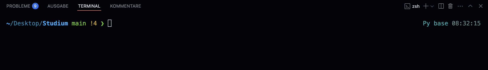
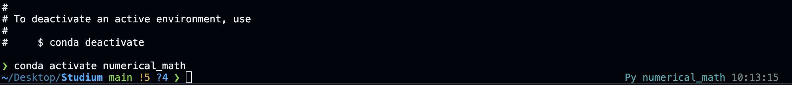

# How to setup virtual enviroments in python

## Install Anaconda

Install conda from the Anaconda website. Anaconda is a free and open-source distribution of Python for scientific computing. It basically it manages the packages and dependencies for you python projects.

https://www.anaconda.com/

## Setup a new conda enviroment

https://docs.conda.io/projects/conda/en/stable/user-guide/getting-started.html

The most easy way to do this is by using the command line. You can open your command line from VSCode by clicking this little button in the top right corner:


The command line then should look something like this




We now want to create a new conda enviroment. This virtual envi`r`oment can then be used in every jupyter or python script. Just put in a name next to the "-n" flag for example

```bash
conda create -n <name_of_your_env>
```

```bash
conda create -n numerical_math_2
```

You can see all of your active enviroments with the command

```bash
conda info --envs
```

Next we want to activate our enviroment, we have to do this now if we want to install some packages. (Note that you have to include your enviroment name)


```bash
conda activate numerical_math_2
```

On the right you can now see that the enviroment is activated


### Installing Packages

You can now install packages in your enviroment. This can be done using pip (python package manager) or conda (anaconda package manager). I would recommend using conda, because normally less issues with dependencies occure. 

```bash
conda install numpy
```
```bash
conda install matplotlib
```
```bash
conda install pandas
```
```bash
conda install scipy
```

I think these are all the packages needed for the PS.

Now we can deactivate the enviroment, we are finished with the whole procedure.

```bash 
conda deactivate
```


