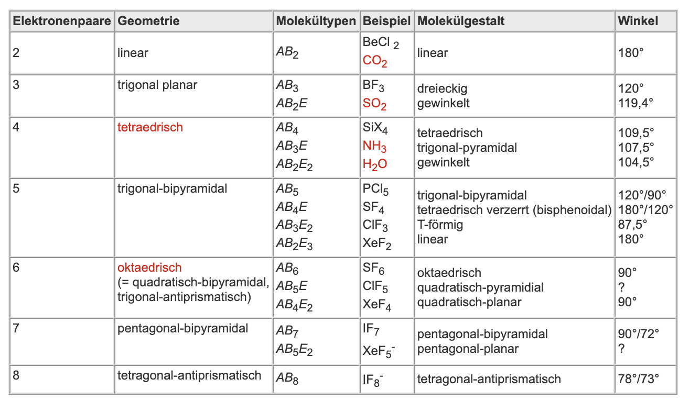

# Periodensystem

**Was zeigt uns das Periodensystem**

+ Ordungszahl gibt an wie viele Protonen und Elektronen ein Atom hat
+ Die Periode (Zeilen) zeigt die anzahl der bestetzen Elektronenschalen an
+ Die Gruppen (Spalten) gibt beispielsweise Information über chemische Eigenschaften und die Anzahl der Valenzelektronen bei den Hauptgruppen

**Was ist nochmal Elektronegativität**

+ Ist ein (empirischer) Wert der Anzeigt wie stark ein Element in einer Verbindung die gemeinsamen Elektronen anzieht. Je höher der EN-Wert desto stärker zieht das Element die Elektronen an sich.

> Wir können die Elektronegativität verwenden um abzuschätzen welche Art von Bindung vorliegt. Also man verwendet konkret die Elektronegativitätsdifferenz

+ [Folgende Seite zeigt uns welche Tendenzen im Periodensystem angezeigt werden](https://www.leifichemie.de/aufbau-der-materie/periodensystem/grundwissen/das-periodensystem-ist-mein-hilfsmittel)

**Atommasse**

Die Atommasse wird in der Einheit $u$ angegeben. Das Wasserstof atom wiegt $1u$ das entspricht  $0,000 000 000 000 000 000 000 001 674 g$

+ Man kann aus der Atommasse in $u$ die Anzahl der Neutronen berechnen dies geht durch die Formel

**Anzahl der Neutronen = Atommasse -  Ordnungszahl**

# Salze

**Vom Periodensystem der Elements zur Ladung**

+ Bei Einatomigen Ionen kann man die Ladung aus dem Periodensystem ablesen (Hauptgruppenelemente). **Ionen haben hier die gleiche Ladung wie die Nummer der Hauptgruppe**

Beispiel: Magnesium → $Mg^{2+}$

+ Atome der ersten drei Schalen geben die Elektronen ab und erhalten so Edelgaszustand
+ Für Ionen der Hauptgruppen von **V-VI** gilt die Regel **Ladung = 8-Hauptgruppennummer**

Beispiel: Chlor in Gruppe $VII$ kann ein Elektron aufnehmen $Cl^-$

+ Salze bilden ein Ionengitter, dies ist eine dreidimensionale Anordnung von positiv und negativ geladenen Ionen.
+ Wir betrachten eine Verhältnisformel da diese Ionengitter beliebig groß werden können

> Dies ist ein Unterschied zu einer Summenformel wie bei $H_2O$ hier sagt uns die Formel genau aus wie vielen Atomen ein Molekül besteht.

## Eine Liste an Wichtigen Molekül-Ionen

> Einige Salze wie Kaliumnitrat oder Calciumsulfat bestehen nicht nur aus einatomigen Ionen sondern aus geladenen Molekülen, folgende Tabelle ist eine gute Übersicht

**Übungsaufgaben**

+ [Übung zu den Verhältnisformeln](https://www.leifichemie.de/anorganische-verbindungen/salze/aufgabe/verhaeltnisformeln-von-salzen)

+ [Weitere Übungsaufgabe zu Verhältnisformeln](https://www.leifichemie.de/anorganische-verbindungen/salze/aufgabe/verhaeltnisformeln-von-salzen-0)

# Apolare Atombindng

+ Atome bestehen aus einen positiv geladenen Kern und Elektronen die um den Kern herumfliegen (fliegen nicht wirklich eher so eine Art Wolke :) )

> Werden die Elektronen ähnlich stark angezogen so handelt es sich um eine Elektronenpaarbindung. Beispiel ist $H_2$, dort hat man ein Elektronenpaar das sich beide Kerne teilen

Wir merken uns:

**Das Atom mit den größeren Elektronegativitätswert (EN) zieht die bindenden Elektronen stärker zu sich heran als das Atom mit dem kleineren Elektronegativitätswert.**

+ Polarität kann durch die unterschiede in der Elektronegativität entstehen, das ist im Grunde genommen dann auch der Effekt der Wasserstoffbrücken bindung und warum z.b. Wasser bei Raumtemperatur flüssig ist.

# Atomaufbau

> Schon die Griechen (Demokrit) hatten die Vorstellung das alle Materie aus kleinen Teilchen besteht (atomos, unteilbar) wichtig zu wissen ist das sich dieses Modell der Atome bis heute weiter entwickelt

**Wiederholen wir kurz das Bohrsche Atommodell**

+ Atome bestehen aus drei Bausteinen: Protonen, Neutronen und Elektronen
+ Protonen sind positiv geladen, Neutronen haben keine Ladung und Elektronen sind negativ geladen.

Nach dem Bohrschen Atommodell verteilen sich die Atomen auf verschiedenen Schalen die Anzahl der Elektronen welche auf eine Schale passen ergibt sich $2n^2$. Hierbei ist $n$ die Zahl der Schale

1. Schale (K-Schale) → 2 Elektronen
2. Schale (L-Schale) → 8 Elektronen
3. Schale (M-Schale) → 18 Elektronen

Zumindest in den Hauptgruppen ist dieses Modell brauchbar. Man kann soort die Schalen und die Besetzung aus dem Periodensystem ablesen. Dies wird nur in den Nebengruppen bisschen komplizierter

# VSEPR-Modell

Abkürzung für (Valence-shell-electron-pair-repulsion) oder auf Deutsch (Valenzschalen-Elektronenpaar-Abstoßung) für die **räumliche Gestalt** eines Moleküls auf die Abstoßenden Kräfte zwischen Elektronenpaaren in Valenzschale zurück

Es ergeben sich folgenden Regeln aus den VSEPR Modell

+ In Molekülen vom Typ $AB_n$ ordnen sich Elektronenpaare in Valenz-Energiestufe des Zentralatoms so an das Abstand so groß wie möglich wird
+ Die freien Elektronenpaare in Typ $AB_nE_m$ brauchen mehr Platz und verkleinern den Winkel $B-A-B$
+ Freie probieren immer den größten Abstand zueinander zu wählen
+ Elektronegative Substitutenten ziehen bindende Elektronenpaare näher an sich heran und verringern Raumbedarf
+ Mehrfachbindungen sind wie großes Elektronenpaar und brauchen mehr Platz

# Säure Basen Reaktionen

Nehme mal stark an man mach Säure-basen nach Brœnsted:

> Säure-Basen Elektronen sind chemische Reaktionen bei denen Wasserstoff-Kationen $H^+$ (Protonen) zwischen Molekülen oder Molekül-Ionen übertragen werden

Damit gilt für eine allgemeine SB Reaktion:

$HA + B \leftrightarrow A^- + HB^+$

## Typische Protolyse Reaktion

Säure-Basen Reaktionen lassen sich in zwei Teilreaktionen zerlegen die beide als Protolyse bezeichnet werden

+ Protonenabgabe: $HCl \to Cl^- + H^+$
+ Protonenaufnahme:  $H_2O + H^+ \to H_3O^+$

## Typische Neutralisations-Reaktion

> Man mischt hier eine saure Lösung und eine basische Lösung zu einer neutralen Lösung

Sieht dann so aus:

$H_3O^+ + OH^- \to 2H_2O$

Beispiel: Chlorwasserstoffgas reagiert mit Ammoniakgas zu Ammoniumchlorid

$HCl + NH_3 \to NH_4Cl$

## Übersicht wichtige Säuren und Basen

# Redoxreaktionen Grundlagen

> Bei Redoxreaktionen finden im allgemeinen Elektronenübergänge statt

Basic Facts:

+ Atom das Elektronen aufnimmt wird reduziert ist das Oxidationsmittel weil das andere Atom oxidiert wird
+ Atom das die Elektronen abgibt wird oxidier das ist das Reduktionsmittel

## Bestimmung von Oxidationszahlen

Oxidationszahlen sind super für Redoxreaktionen die Helfen und später die auszugleichen. Am einfachen kann die Oxidationszahl durch die Valenzstrichformel bestimmt werden

+ Man bestimmt das elektronegativere Atom das bekommt dan die Bindungselektronen.

+ Haben zwei Atom die gleiche Elektronegativität so werden die Elektronen fair verteilt

 
 

 

In der Praxis ist es dann oft besser sich einfach ein paar Regeln zu merken um die Oxidationszahlen anhand der Summenformel zu bestimmen

### Oxidationszahl anhand der Summenformel

1. Oxidationszahl von Element Atomen ist immer ± 0 → Beispiel $Fe = 0$
2. Oxidationszahl von Atom-Ionen entspricht der Ladungszahl → Beispiel $Al^{3+}=III$
3. Die Summer der Oxidationszahlen in einen Molekül entspricht der Ladungszahl → Beispiel $SO_{4}^{2-} = +VI - 4*-II = -2$
4. Die Oxidationszahl der Metall-Ionen der Hauptgruppenmetalle entspricht der Hauptgruppennummer → $NaCl$, $Na=+I,Cl=-I$
5. Fluor Atom hat immer $-I$
6. Sauerstoff hat immer $-II$ (außnahme Peroxide)
7. Halogene haben ebenfalls immer $-I$

### Aufstellen einer Redoxgleichung

Hierzu kann man mit den folgenden Verfahren vorgehen:

1. Identifizieren der Teilchen die Elektronen aufnehmen und abgeben
2. Aufstellen der Teilgleichungen für Oxidation und Reduktion
3. Ausgleich der aufgenommenen/abgegebenen Elektronen
4. Aufstellen einer Bruttoreaktionsgleichung und Raustreichen von Teilchen
5. Gesetz zur Erhaltung der Masse, Ladungsbilanz

**Beispiel: Permanganat $(MnO_4^-)$ reagiert in saurer Lösung mit Wasserstoffperoxid $(H_2O_2)$ zu Sauerstoff $(O_2)$ und Mangan-Ionen $(Mn^{2+})$

#### Bestimmen wer Elektronen aufnimmt / abgibt

+ Man schreibt Edukte und Produkte in Formelschreibweise hin und notiert die Oxxidationszahlen

+ Man sieht Mangan nimmt Elektronen auf, hier läuft die Reduktion ab
+ Sauerstoff hat zuerst $-I$ dann $0$ damit gibt es Elektronen ab

#### Aufstellen der Teilgleichungen

> Notiz: Im Saueren Milleu kann man die gleichung durch die Zugabe von $H_2O$ und $H^+$ einfach ausgleichen

Ich machs normalerweise immer so:

1. Zuerst schreib ich die Elektronen an
2. Dann gleiche ich die Ladung mit $H^+$ auf der einen Seite aus
3. Ich ergänze dann mit Wasser wenn nötig.
4. Dann füge ich noch Oxionium Ionen ($H_3O^+$)hinzu das $H^+$ Ionen so eigentlich nicht gibt (das wird manchmal weggelassen)

#### Ausgleichen der aufgenommenen und abgegebenen Elektronen

Um dann die Ladungsbilanz in der endgültigen Gleichung auszugleichen Multipliziert man so das man denn GGT erhält.

#### Aufstellen von Gleichung und Streichung

Man schreibt dann die Gleichung einfach zusammen und kürzt einfach alles weg was man kürzen kannn

Zuletzt überprüft man noch Masse und Ladungsbilanz

### Übungen

+ [Übung 1 zu Redoxgleichungen](https://www.leifichemie.de/redoxreaktionen-und-elektrochemie/redoxreaktionen-als-elektronenuebertragungen/aufgabe/redoxgleichung-von-eiseniiioxid-und-kohlenstoffmonoxid-0)

+  [Übung 2 zu Redoxgleichungen](https://www.leifichemie.de/redoxreaktionen-und-elektrochemie/redoxreaktionen-als-elektronenuebertragungen/aufgabe/redoxgleichung-von-oxalsaeure-und-kaliumpermanganat)

